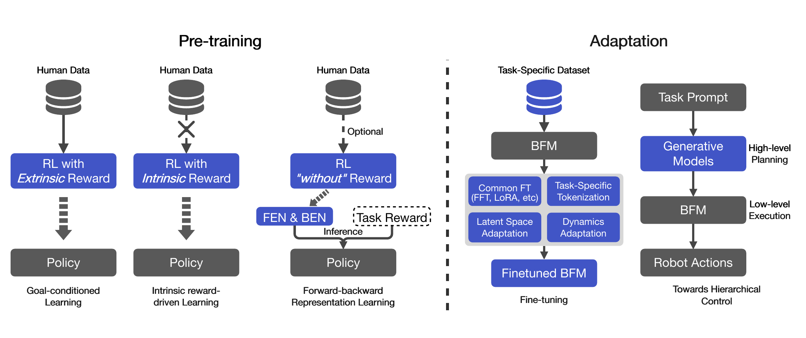

# BFM Survey：面向下一代人形全身控制的行为基座模型综述

“Behavior Foundation Model”目前仍是边界快速演化的概念。这篇综述给出了一个实用定义：它不是某个动作做得很好的单任务策略，而是从大规模、多样行为数据中学到可重用的原子技能和行为先验，并能通过目标、奖励、潜向量、少量微调或高层规划快速适配多个下游全身任务。评估BFM不能只看动作数量，还要看适配时是否真的少于重新训一个策略。

> **综述分类图：** Figure 3，PDF第4页。左侧将预训练分为目标条件、内在奖励与forward-backward表示三条路线；右侧将适配分为参数/潜空间微调与高层规划-低层执行的分层控制。来源：[原论文](https://arxiv.org/abs/2506.20487)。

## 三类预训练到底差在监督信号

目标条件学习直接告诉策略要跟哪段动作、到哪个目标或完成什么奖励，DeepMimic、ASE、CALM、PHC、HOVER、SONIC等工作都可沿这条线理解；优点是行为可控，代价是需大量人类动作或目标设计。内在奖励方法不给明确外部任务，鼓励新奇性、可区分技能或状态覆盖，能自主发现行为，但未必是人需要的行为。Forward-backward路线用无奖励转移学状态-动作的未来占据表示，测试时才将新奖励投影为任务向量，追求不重新RL就组成对应策略。

## 适配不只有“全量微调”

通用微调包括全参数更新和LoRA，适合目标数据明确、允许训练的场景；潜空间适配不改底层大量参数，通过寻找新的任务/奖励/潜技能向量调用已有行为先验，更能检验预训练的复用价值。分层控制则把BFM当作高频低层，由LLM、扩散规划器或其他高层模型产生子目标、接触链或潜技能。这时真正的瓶颈往往从“低层会不会动”转为“高层输出是否落在低层可达分布内”。

## 这个概念最需要防止被滥用

大数据、Transformer或一个漂亮的latent space都不足以证明是BFM。至少要检查：预训练行为是否跨任务/场景；新任务需要多少数据与梯度步；适配后是否仍保留原技能；未见扰动和实机误差下是否稳定；与同等预训练成本的多任务策略比是否真有优势。当前公开工作的本体、接触、安全和长时评测并不统一，因此“基座”应是待证明的能力结论，不是方法自报的产品名。

## 用同一张表比较不同BFM

阅读具体工作时，应把预训练输入、动作输出、数据来源、行为条件、任务奖励、运动先验和适配方式逐列拆开。目标条件tracker的正样本通常来自配对参考，AMP类判别器比较动作数据与策略转移，Forward-Backward方法则从无奖励环境交互估计未来占据；三者的“latent”含义不同，不能只按维度比较。部署侧还要注明是否需要逐帧参考、视觉、世界状态、高层规划器或在线搜索。

证据建议分为四层：仿真内重放覆盖、未见任务的零/少样本适配、跨动力学或跨本体迁移、真实机器人长时运行。每层都记录新任务数据量、训练步数、底层参数是否冻结、原能力遗忘和安全失败。综述提供分类，不替任何被引论文证明代码状态、真机范围和指标；引用时仍应回到原文与官方仓库核验。

## 原文与持续索引

[论文](https://arxiv.org/abs/2506.20487) · [Awesome BFM Papers](https://github.com/yuanmingqi/awesome-bfm-papers)
