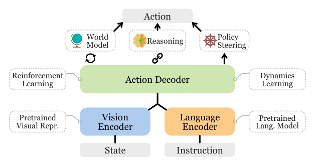

# VLA Survey：具身智能视觉语言动作模型综述

只要系统同时出现视觉、语言和机器人，就容易被统称为VLA。这篇综述的最大作用是把研究分成三条线：支撑VLA的组件，直接预测低层动作的control policy，以及把长指令拆成子任务的task planner。一个系统可以同时包含后两者，但评估指标、数据和实时性要求完全不同。

> **综述总览图：** Figure 1，PDF第1页。实线主干是语言编码、视觉编码和动作解码；虚线框表示可用的预训练视觉表示、推理、世界模型、动力学学习、RL和policy steering等组件。来源：[原论文](https://arxiv.org/abs/2405.14093)。

## “VLA组件”并不都会在部署时出现

视觉基础表示可以来自CLIP、DINO等预训练，语言编码与多模态对齐给出语义条件；动力学学习、世界模型和RL可以为数据生成、策略预训练或在线规划提供信号；推理和policy steering可以约束动作或生成中间目标。有的方法训练时用世界模型，部署时只保留策略；有的方法每个控制步都用模型规划。因此分类时应标清组件位于训练链还是在线执行链，不能只列模块名字。

## Control Policy最应该比的不是参数量

低层VLA可用非Transformer、自回归Transformer或扩散/flow matching生成动作，也可接入3D感知、点位动作或独立action expert。真正需要对齐的是：输出是末端、关节还是技能token；是单步还是action chunk；闭环更新频率和端到端延迟是多少；低层控制器承担了哪些跟踪与安全功能；评测时是否换物体、场景、任务和本体。不指明动作接口的“成功率更高”无法说明身体控制层的优势。

## Task Planner的成败取决于能否落地

高层规划可以端到端产生子任务，也可用模块化语言/代码规划器调技能库。语言模型给出语义上正确的步骤，不代表当前机器人能从所在状态完成它。可行的规划器必须读环境状态、技能前置/后置条件和失败反馈，并在技能执行后重新观测。对人形机器人，还需要一层明确的身体接口，把“拿起箱子”变成低层可跟踪、可中止、可恢复的条件，而不是让LLM直接跳到电机。

因此每篇VLA至少应登记六项：视觉、语言与本体输入；内部用动作token、连续latent还是世界状态；训练目标是行为克隆、扩散/flow、RL还是规划；向下输出末端、关节、身体token或技能；依赖什么低层控制器；新观测、记忆与失败码如何触发重试。缺少其中任何一项，都很难判断它是完整闭环还是只完成某个模块。

## 使用这篇综述的正确方式

它适合用来定位一项工作在系统哪一层，并查数据集、仿真器和benchmark索引；不适合把其表格当作永久排名。VLA更新极快，架构名字容易变，长期有效的仍是五个问题：数据从哪来？语义怎样接动作？动作接口是什么？真机闭环怎样评估？失败怎样回流与恢复？

对人形还应额外问“上层更新频率与身体控制频率怎样分开”。只要VLA低于平衡回路频率，它就必须调用Locomotion、Mimic或Loco-Manip底座；底座能力应从VLA贡献中单独说明。

## 原文与索引

[论文](https://arxiv.org/abs/2405.14093) · [Awesome VLA](https://github.com/yueen-ma/Awesome-VLA)
