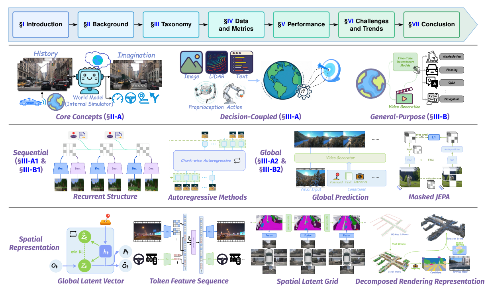

# Embodied World Model Survey：具身智能世界模型综合综述

“世界模型”已同时指向Dreamer式任务潜动力学、自动驾驶占据预测、视频生成模型和通用互动模拟器。这篇综述用三条互相独立的轴重新组织它们：是否与具体决策任务耦合，未来是逐步递推还是全局差分预测，世界状态又用什么空间表示。这比按“扩散/Transformer”列模型更能反映它们能否接入机器人闭环。

> **综述分类图：** Figure 1，PDF第3页。以功能、时间建模和空间表示三轴标定代表工作，同一模型应同时在三轴上找位置。来源：[原论文](https://arxiv.org/abs/2510.16732)。

## 第一轴：为某个决策服务，还是尝试模拟通用世界

Decision-coupled模型紧贴某个环境、奖励或策略，目标是为规划、价值估计或策略学习产生足够准确的可操作预测，PlaNet和Dreamer是典型例子。General-purpose模型强调跨场景、跨任务的高保真未来生成，可以是数据引擎、互动模拟器或下游agent的环境。前者可以画面不漂亮但控制有用，后者可以视频逼真但尚不保证动作-物理因果准确。评估时不能拿FVD代替任务成功率，也不能只用单任务回报宣称通用世界模型。

## 第二轴：逐步滚未来，还是一次猜整个差分

Sequential simulation/inference从当前状态生成下一状态，再将预测喂回继续展开；它天然适合MPC和任意时域，但每步偏差会累积。Global difference prediction直接从初始状态与时间/动作条件预测远期差分或多个未来，可并行、减少自回归漂移，但对任意长度及中间过程的表达弱。这两类选择与控制时域、计算预算和是否需要中间接触细节直接相关。

## 第三轴：一个向量、一串token、空间网格还是显式场景元素

Global latent vector最紧凑，适合快速想象，但容易丢几何和多物体结构；token feature sequence保留更丰富的对象/局部信息，可复用Transformer，计算随token数增长；spatial latent grid把2D/3D空间先验放进表示，更适合占据、遮挡和几何规划；decomposed rendering representation用物体、高斯、神经场等可渲染元素分解场景，提供明确3D结构，但建模与更新成本更高。对loco-manip，只有全局视觉向量往往不足以表示接触点、物体位姿与可通行空间。

## 世界模型的评估应该从“像不像”走向“能不能用”

综述把当前缺口归结为数据/评估、计算效率和建模策略。最重要的是缺少同时测量长时物理一致性、对动作的因果敏感度、规划价值和真机转移的统一benchmark。高质量视频如果对动作不敏感，对控制没有意义；短时状态预测如果无法在推理预算内滚动规划，也不是可部署模型。所以收录新世界模型时，应固定记录输入动作、输出表示、滚动时域、单步延迟和下游真实任务收益。

还要明确模型在系统中的在线位置。训练期数据引擎只生成或筛选轨迹，部署时可以完全移除；策略表示模型把预测作为辅助特征；MPC模型每一步接收当前状态、滚动候选动作并重规划；Agent级模型还需维护对象与任务记忆。四种用法即使共享同一个视频主干，对延迟、误差和安全的要求也完全不同。

面向人形的登记项应再增加低层接口：世界模型输出的是未来视频、物体状态、末端轨迹、全身motion token还是技能价值；谁把它转换成关节动作；接触与跌倒如何检查；预测失真时是否能退回已验证控制器。只有回答这些问题，世界模型才能与Locomotion、Mimic和Loco-Manip路线接起来。

## 原文与索引

[论文](https://arxiv.org/abs/2510.16732) · [Awesome World Models](https://github.com/Li-Zn-H/AwesomeWorldModels)
