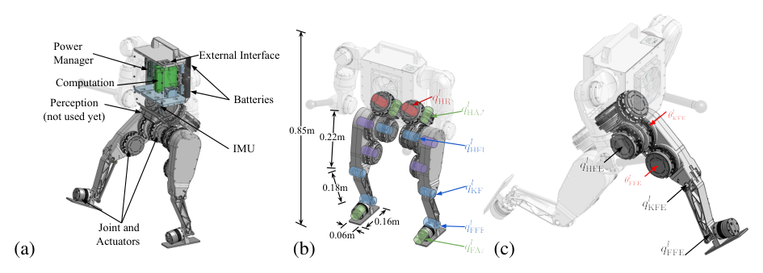

# Berkeley Humanoid：面向学习控制的人形机器人研究平台

这篇论文最重要的判断是：机器人不应该先按照机械指标单独设计，然后让算法团队用更宽的domain randomization为复杂传动、延迟和不可建模摩擦买单。Berkeley Humanoid从一开始就以“易建模、易摔倒、易复位、一人能试验”为约束联合设计硬件，使一个简单PPO行走策略用较轻的随机化就能真机部署。

> **主要设计图：** Figure 2，PDF第4页。平台高0.85 m、质16 kg，两条腿各6个自研执行器；图中展示了机身部件、拟人关节布置和四类执行器在腿部的分配。来源：[原论文](https://arxiv.org/abs/2407.21781)。

## 为什么执行器要尽量“像一个仿真关节”

机器人使用QDD行星齿轮执行器、交叉滚子轴承和空心轴布线，大部分电机直接作为关节；膝和踝的耦合也保持线性映射。这避免了闭链、复杂连杆和高摩擦传动在仿真中带来的小步长和难辨识参数；转子惯量可以通过armature直接加入质量矩阵。EtherCAT在1–4 kHz与外设通信，最大延迟约0.5–2 ms，力矩环设为1 kHz，使策略还可将执行器近似为低延迟力矩源。这是从硬件侧削减Sim2Real不确定性，不是训练时把它们全部随机化。

对学习控制最关键的接口资产包括URDF/惯量、关节零位与方向、力矩常数、armature、摩擦、总线周期、命令/状态时间戳和保护阈值。执行器台架辨识应先验证电流到力矩、带宽和延迟，再决定仿真模型与随机化范围。硬件“透明”不是没有误差，而是误差可以被测量、版本化并进入训练。

## 低成本与可试验性是控制系统的一部分

论文给出小批量、无手臂硬件成本约1万美元，使用低于1美元的ICM42688级IMU；轻量化后整机16 kg，摔倒对人和设备的能量更低，一个操作者可以3–5秒复位继续测试。作者报告密集摔倒测试中主体硬件未出现损坏，只有少量容易更换件失效。这些指标不像峰值力矩那样显眼，却直接决定策略迭代、失败数据收集和回归测试成本。

## 策略到底有多简单

策略用PPO在Isaac Lab训练，输出期望关节位置，再由PD转为力矩。输入不用长历史、相位信号或参考动作，训练重点是速度跟踪、站立、关节/力矩/动作平滑奖励和经硬件辨识后的精确随机化。真机展示了长距离行走、约20度未铺装坡道、楼梯、滑动恢复和单/双腿跳，支持“透明硬件可以降低策略补偿负担”的论点。但本文实验未安装设计中的手臂，不能将其行走结果直接外推为完整人形loco-manip平台能力。

从仿真到真机还要经过策略频率、PD增益、命令缩放、状态滤波和急停状态机。复现时应记录每次跌倒、复位时间、损坏件、热状态和策略版本；低成本平台的研究价值正来自允许大量失败可追溯，而不只是材料成本数字。

比较其他本体时应控制策略与训练预算，并把硬件可建模性、控制延迟、跌倒能量和维护成本一起纳入，不能只按速度或跳跃高度判断平台优劣。

## 原文

[论文](https://arxiv.org/abs/2407.21781) · [项目页](https://berkeley-humanoid.com/)
