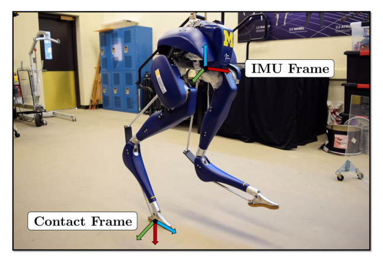

# Contact-Aided InEKF：面向腿式机器人状态估计的接触辅助不变扩展卡尔曼滤波

浮基腿式机器人没有固定在世界坐标系中的关节，编码器只能告诉你身体内部的相对姿态；IMU能传播姿态和速度，但积分会漂。本文利用一个非常物理的事实补观测：当脚可靠接触地面且没有滑动时，这个接触点在世界系里短时间近似静止，关节运动学因此能约束基座运动。

## 为什么不是普通EKF换个名字

普通EKF直接在欧氏坐标中对姿态、速度和位置线性化，误差动力学会随当前估计轨迹变化；大姿态误差下，一致性和收敛可能变差。InEKF把姿态、速度、位置以及接触点组织在矩阵Lie群上，采用与群结构匹配的左/右不变误差。对满足group-affine结构的系统，误差在对数坐标中具有更接近“与当前轨迹无关”的线性传播性质，这就是所谓log-linear error dynamics，而不是简单把四元数换成旋转矩阵。

IMU负责高频传播，足端正运动学在接触成立时提供更新。新脚落地时把接触状态增广进滤波器，离地时移除；接触切换因此不仅是控制状态机，也会改变估计器状态维度和观测模型。

滤波状态至少包含姿态、速度、位置、IMU偏置及当前接触点，输入是时间戳对齐的角速度、加速度与关节编码器。传播使用IMU，接触更新用正运动学构造足端相对基座观测；输出的基座姿态、速度和位置连同协方差交给WBC或RL策略。协方差不是附属数值，它告诉下游当前估计有多可信。

> **系统与坐标系图：** Figure 1，PDF第1页。论文没有独立流程总览，这张图标出Cassie上的IMU、接触和机器人坐标系，是理解传播与接触更新各使用什么量的必要上下文。来源：[原论文](https://arxiv.org/abs/1805.10410)。

## 接触辅助的前提一旦错了会怎样

滤波器把“接触点静止”当成可信约束；脚滑、柔软地面、脚尖滚动或接触误判时，这条伪观测会把错误信息强行灌进基座速度与位置。实机系统因此需要接触概率、迟滞、创新检验、噪声自适应或滑移检测，而不是一个固定力阈值。IMU偏置、运动学参数和足端柔顺也会决定长期漂移。

接触丢失或创新异常时，应提高观测噪声、拒绝更新或移除接触状态，并把不确定度传给控制器；继续把滑动脚当世界锚点，策略会误以为基座朝相反方向运动。起身、跳跃和双脚腾空还要验证无接触传播多久会失控，以及何时借外部里程计重新对齐。

这篇对运动控制的意义在接口处：策略或WBC依赖的基座速度、重力方向和接触状态并非仿真真值，而是一个带假设和延迟的估计。部署时应同时记录原始IMU、编码器、接触判定、滤波创新和控制动作，才能区分“策略不稳”与“状态给错了”。

复现应在静止、正常步行、脚滑、软地面和腾空五类工况比较普通EKF与InEKF，报告漂移、创新一致性、重置时间和控制稳定性，而不只看离线轨迹图。

## 原文与代码

[论文原文](https://arxiv.org/abs/1805.10410) · [Invariant EKF实现](https://github.com/RossHartley/invariant-ekf)
