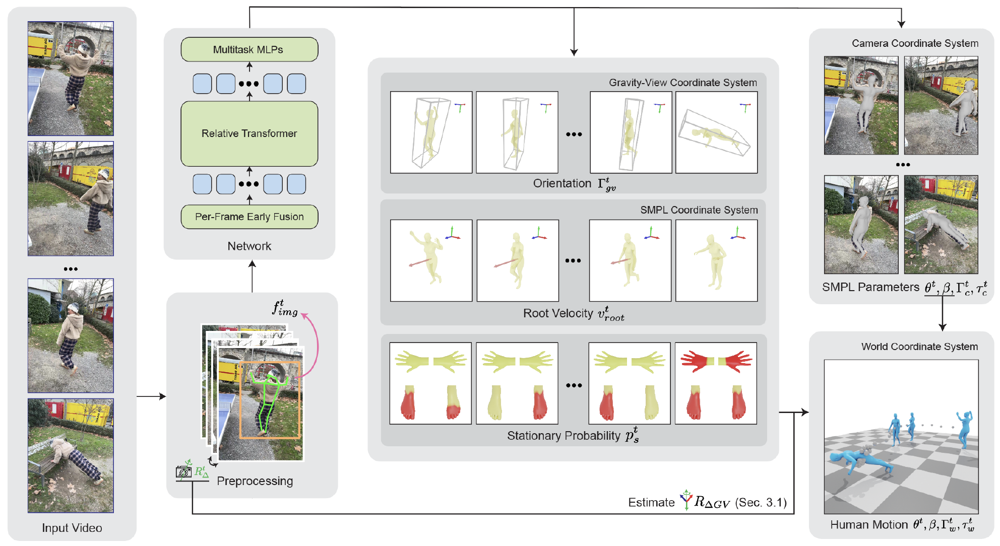
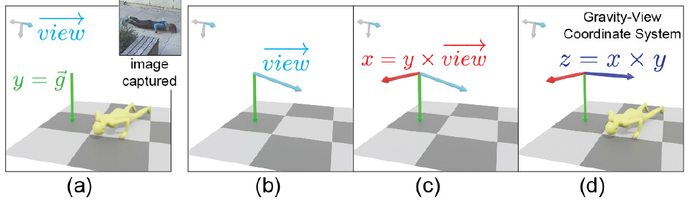
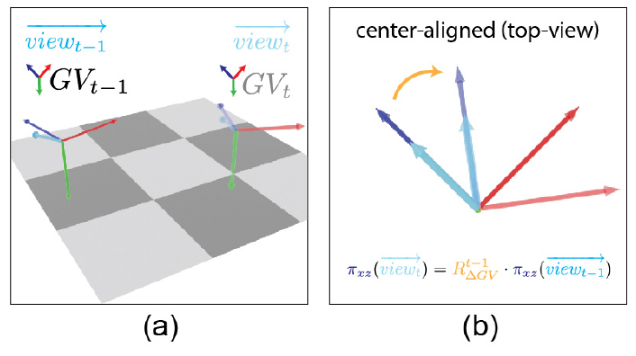
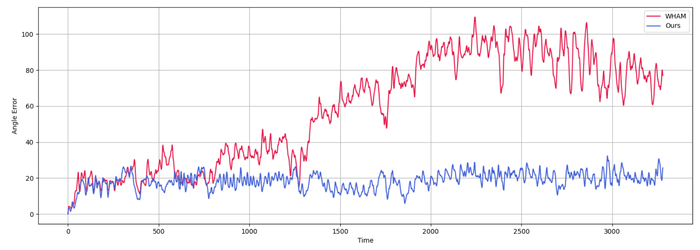

# GVHMR：重力视角坐标下的世界坐标人体运动恢复

从单目视频恢复人体运动，最容易被忽略的问题不是“每一帧的人体姿态像不像”，而是**相机动了以后，这个人在世界里到底怎样移动**。如果只在相机坐标系估计人体，拍摄者一边走一边转手机，人体会跟着镜头倾斜、漂移；如果先估计相机再把每帧人体硬变换到世界坐标，尺度、平移和旋转误差又会随时间累积。GVHMR瞄准的正是这个数据入口：从野外单目视频恢复重力对齐、带全局轨迹的SMPL-X人体运动。

它不做人体到机器人的关节映射，也不输出机器人控制策略。在完整技术链中，GVHMR位于“视频人体运动恢复”，后面还要接GMR、NMR、OmniRetarget等目标本体重定向。把它直接称为机器人运动控制方法，会跳过形态映射、接触修复、动力学可行性和跟踪策略四层问题。

[](论文原图/P075_figure.png)

> **主要方法图：** 原论文Figure 3，PDF第3页。左侧是人体框、二维关键点、图像特征和相机相对旋转预处理；中间网络预测Gravity-View方向、根速度和静止概率；右侧分别恢复相机坐标与世界坐标人体。来源：[原论文](https://arxiv.org/abs/2409.06662)。

## 这篇论文真正拆开了哪两个运动

一段手持相机视频里同时存在两种运动：人体相对世界的运动，以及相机相对世界的运动。图像只提供二者耦合后的投影。传统camera-space HMR可以把人体网格贴在画面中的人身上，却不保证人在真实世界里竖直、不漂移；SLAM可以估相机轨迹，却不直接给出人体根节点的尺度与位移。

GVHMR的思路不是端到端凭空猜一个固定世界坐标系，而是把问题拆成：

1. 每一帧建立一个由重力和相机视线决定的Gravity-View坐标系，在这个局部但重力一致的坐标系里预测人体朝向；
2. 用相邻帧相机旋转恢复不同GV坐标系之间仅绕重力轴变化的相对旋转，再把所有帧对齐到第一帧的GV坐标系；
3. 在人体自身坐标系预测根速度，并在统一世界方向下积分得到全局平移。

这把原来任意三维旋转的问题压缩成更稳定的结构：重力方向固定，帧间主要只需求绕重力轴的一维旋转。网络仍会受相机旋转估计和单目尺度影响，但不再让roll、pitch误差无限污染人体竖直方向。

## Gravity-View坐标系怎样定义

在相机坐标系中，令重力方向为$\vec g$，相机视线方向为$\overrightarrow{view}=[0,0,1]^T$。GV坐标轴定义为：

$$
\vec y=\vec g,\qquad
\vec x=\vec y\times\overrightarrow{view},\qquad
\vec z=\vec x\times\vec y.
$$

于是从相机坐标到GV坐标的旋转为：

$$
R_{c\rightarrow GV}=[\vec x,\vec y,\vec z]^T,
\qquad
\Gamma_{GV}=R_{c\rightarrow GV}\Gamma_c.
$$

$\Gamma_c$是人体在相机坐标中的朝向，$\Gamma_{GV}$是网络要学习的重力对齐朝向。相机即使发生roll或pitch，GV的$y$轴仍指向重力，所以画面里的“人倾斜”不会被直接当成人在世界里的倾斜。

[](论文原图/P075_figure_2.png)

> **坐标表示：** 原论文Figure 4，PDF第4页。图从重力方向和相机视线依次构造$y/x/z$三轴：$y$轴对齐重力，$x$轴由重力与视线叉乘得到，$z$轴再按右手系补全。来源：[原论文](https://arxiv.org/abs/2409.06662)。

## 从每帧GV方向恢复整段世界轨迹

论文把第0帧GV坐标系当作世界参考$W$。对静态相机，各帧GV完全一致；对移动相机，先由相机相对旋转和每帧的相机/GV人体朝向计算$R_{\Delta GV}^t$。世界朝向写成：

[](论文原图/P075_figure_3.png)

> **帧间旋转：** 原论文Figure 5，PDF第4页。左图是相邻两帧各自的GV坐标系，右图将两组视线投影到水平面；由于两帧共享重力轴，需要恢复的相对旋转只绕$y$轴发生，直接对应下面的$R_{\Delta GV}$连乘。来源：[原论文](https://arxiv.org/abs/2409.06662)。

$$
\Gamma_w^t=
\begin{cases}
\Gamma_{GV}^0, & t=0,\\
\left(\prod_{i=1}^{t}R_{\Delta GV}^{i}\right)\Gamma_{GV}^{t}, & t>0.
\end{cases}
$$

根平移不是直接逐帧回归绝对坐标，而是把人体自身坐标中的根速度$v_{root}^i$旋转到世界方向后累加：

$$
\tau_w^t=
\begin{cases}
[0,0,0]^T, & t=0,\\
\sum_{i=0}^{t-1}\Gamma_w^i v_{root}^i, & t>0.
\end{cases}
$$

这里要区分两个“累积”：平移仍然通过速度积分，当然可能漂移；作者主要避免的是用自回归网络逐帧预测三维全局朝向所造成的重力轴误差累积。GV几何让每一帧都独立得到重力对齐人体方向，再用相机相对旋转对齐偏航，长序列更稳，但不是从数学上消除了所有漂移。

## 网络输入、输出和训练目标

视频先被转换成四类逐帧特征：

- 人体包围框$b_{box}$，提供人在完整图像中的位置和尺度；
- ViTPose二维关键点$f_{kp2d}$，提供人体几何投影；
- 冻结视觉编码器的图像特征$f_{img}$；
- 视觉里程计或陀螺仪提供的相机相对旋转$f_{R_\Delta}$。

四类特征分别过MLP后相加成512维token。主干是12层Transformer，每层8个注意力头，隐藏维度512。多任务输出包括弱透视相机参数、相机坐标人体朝向$\Gamma_c$、SMPL-X 21个局部关节姿态与10维shape、手/脚静止概率$p_s$、GV朝向$\Gamma_{GV}$和根速度$v_{root}$。

训练数据混合AMASS、BEDLAM、Human3.6M和3DPW。AMASS没有原始图像，作者模拟静态/动态相机、生成bbox与二维关键点，并把图像特征置零；其他带视频数据使用冻结编码器。训练窗口$L=120$，batch size 256，论文报告500 epoch、2张RTX 4090约13小时。官方README中的公开checkpoint说明为2×4090训练420 epoch，复现实验时应以具体checkpoint和配置为准，不能把论文训练轮数与发布权重混为同一次运行。

损失不是RL奖励。除静止概率使用BCE外，预测目标主要使用MSE；另外对三维关节、二维投影、mesh顶点、相机坐标平移和世界坐标平移施加L2监督。若把这一页写成“观测、动作、奖励”，会混淆监督式人体恢复网络与机器人控制策略。

## RoPE为什么与长视频有关

人体动作片段的“第0帧、第100帧”没有固定语义，真正有意义的是两帧相隔多久。绝对位置编码只在训练长度内见过固定位置，测试时遇到更长视频容易外推失败。GVHMR用RoPE把相对时间差直接写进query-key内积：

$$
a_{ts}=(W_qf_t)^T R(p_s-p_t)(W_kf_s).
$$

推理时再加局部注意力mask：

$$
m_{ts}=
\begin{cases}
0, & -L<t-s<L,\\
-\infty, & \text{otherwise}.
\end{cases}
$$

每个token只看训练窗口范围内的邻居，因此整段视频可以并行处理，不必像自回归RNN逐帧滚动，也不必把长视频硬切成互不连续的窗口。论文称其可处理任意长序列，工程上更准确的说法是：网络结构不受固定绝对位置长度限制，但显存、预处理速度、VO漂移和长时速度积分仍然限制实际视频长度。

## 静止概率与IK后处理在补什么

网络预测手、脚尖和脚跟的静止概率。某个关节被判定静止时，后处理逐帧修正全局平移，让其世界位置尽可能固定；随后用CCD IK调整局部姿态。它专门缓解脚滑和接触漂移。

这仍不是完整物理约束：没有摩擦锥、接触力、碰撞或人体动力学。一个脚在几何上固定，并不代表姿态具有真实受力平衡。对机器人数据链而言，GVHMR输出后仍要做重定向和物理可行性检查，不能把接触后处理当成可直接执行的控制轨迹。

## 实验怎样证明GV表示有效

世界坐标实验使用RICH静态相机与EMDB-2移动相机。WA-MPJPE100表示每100帧整体对齐后的关节误差，W-MPJPE100只用开头帧对齐，更能暴露全局漂移；RTE是根平移相对误差，另有Jitter和Foot-Sliding。

| 数据集/方法 | WA-MPJPE100 ↓ | W-MPJPE100 ↓ | RTE ↓ | Jitter ↓ | Foot-Sliding ↓ |
|---|---:|---:|---:|---:|---:|
| RICH · WHAM + DPVO | 109.9 | 184.6 | 4.1 | 19.7 | 3.3 |
| RICH · GVHMR + DPVO | **78.8** | **126.3** | **2.4** | **12.8** | **3.0** |
| EMDB · WHAM + DPVO | 135.6 | 354.8 | 6.0 | 22.5 | 4.4 |
| EMDB · GVHMR + DPVO | **111.0** | **276.5** | **2.0** | **16.7** | **3.5** |
| EMDB · GVHMR + GT gyro | 109.1 | 274.9 | 1.9 | 16.5 | 3.5 |

EMDB上GVHMR从GT gyro换成DPVO后，W-MPJPE100只下降1.6 mm、RTE下降0.1个百分点；WHAM对应差异为19.5 mm和1.9个百分点。这个结果支持作者的核心判断：GV坐标系对相机旋转误差更不敏感，而不是说明DPVO本身没有误差。

[](论文原图/P075_figure_4.png)

> **长序列方向误差：** 原论文Figure 9，PDF第11页。WHAM曲线随时间明显积累，GVHMR维持在较低区间。图没有给出所有序列的置信区间，因此应与表格和消融一起看，而不是单凭一条曲线下结论。来源：[原论文](https://arxiv.org/abs/2409.06662)。

消融实验更直接地说明各模块作用：

| RICH消融 | WA-MPJPE ↓ | W-MPJPE ↓ | RTE ↓ | Jitter ↓ | Foot-Sliding ↓ |
|---|---:|---:|---:|---:|---:|
| 不使用GV表示 | 162.6 | 278.9 | 5.9 | 9.7 | 7.5 |
| 不直接预测$\Gamma_{GV}$ | 101.2 | 177.5 | 4.5 | 14.9 | 3.0 |
| 不用Transformer | 85.8 | 138.9 | 2.7 | **7.6** | 3.3 |
| 不用RoPE | 191.5 | 304.4 | 6.3 | 22.8 | 11.5 |
| 不做静止后处理 | 89.3 | 145.2 | 3.0 | 14.5 | 6.8 |
| 完整模型 | **78.8** | **126.3** | **2.4** | 12.8 | **3.0** |

“不用Transformer”的Jitter反而更低，提醒我们不能把每项指标都包装成全面胜出；卷积输出可能更平滑，但全局位置准确性更差。RoPE移除后的退化最大，说明长序列位置表示是性能关键。去掉后处理时脚滑从3.0升到6.8，也证明接触修复不是只改善视觉效果。

运行时间方面，论文在RTX 4090上处理1430帧、约45秒视频：YOLOv8 4.9秒、ViTPose 20.0秒、图像特征10.1秒、DPVO 11.0秒，预处理共46.0秒；GVHMR核心网络仅0.28秒。WHAM核心为2.0秒，SLAHMR优化超过6小时。真正系统瓶颈在前端检测、关键点、视觉特征和VO，不在主Transformer。官方仓库后来默认引入更高效的SimpleVO，这属于代码版本演进，论文表格仍基于其声明的DPVO/gyro设置。

## 代码结构：入口、主干与后处理

截至2026-07-14核验的官方仓库提交为`6ec3ca39336c50492c0fae65fba2fb831fc7d866`。关键路径如下：

```text
GVHMR/
├── tools/
│   ├── demo/demo.py                  # 单视频推理入口
│   ├── demo/demo_folder.py           # 文件夹批处理
│   └── train.py                      # Hydra训练/评测入口
├── hmr4d/model/gvhmr/
│   ├── pipeline/gvhmr_pipeline.py    # 网络前向与多任务输出组织
│   ├── gvhmr_pl.py                   # 训练、损失和优化流程
│   ├── gvhmr_pl_demo.py              # Demo推理封装
│   ├── utils/endecoder.py            # 姿态/轨迹编码解码
│   ├── utils/postprocess.py           # 静止关节与IK后处理
│   └── callbacks/                    # 3DPW、RICH、EMDB指标
├── hmr4d/configs/                    # Hydra配置与发布设置
├── docs/INSTALL.md
└── README.md
```

做机器人数据管线时，`tools/demo/demo.py`只是入口，真正需要核对的是输出坐标约定、fps、相机内参和`postprocess.py`。GMR仓库已经提供`gvhmr_to_robot.py`，但跨仓库对接前应先检查root translation、旋转表示、SMPL/SMPL-X关节定义和单位，否则“脚滑”可能只是坐标或帧率误配。

## 源码检查与复现边界

| 项目 | 实际记录 |
|---|---|
| 日期 | 2026-07-14 |
| 环境 | macOS 26.5.2，Apple Silicon arm64，Python 3.12.13 |
| 仓库 | `zju3dv/GVHMR@6ec3ca39336c50492c0fae65fba2fb831fc7d866` |
| 静态检查 | `python -m compileall`覆盖`hmr4d/`与`tools/`，通过；两处docstring旧式转义产生`SyntaxWarning` |
| CLI探测 | 运行`tools/demo/demo.py --help`，检查环境在导入阶段因未安装`cv2`停止 |
| 完整视频推理 | 未执行；检查环境未配置项目CUDA、checkpoint、SMPL/SMPL-X授权模型与完整预处理依赖 |

官方静态相机示例命令是：

```bash
python tools/demo/demo.py \
  --video=docs/example_video/tennis.mp4 \
  -s
```

`-s`表示确认相机静止并跳过视觉里程计；移动相机不能为了省依赖随意加这个参数。论文Benchmark复现还需要RICH、EMDB、3DPW数据和发布checkpoint：

```bash
python tools/train.py \
  global/task=gvhmr/test_3dpw_emdb_rich \
  exp=gvhmr/mixed/mixed \
  ckpt_path=inputs/checkpoints/gvhmr/gvhmr_siga24_release.ckpt
```

当前结果只覆盖源码版本、语法、入口与依赖边界检查，并未复现论文表格。要形成可审计的完整复现，应额外保存输入视频hash、相机静/动态设置、VO类型、checkpoint hash、输出`hmr4d_results.pt`、渲染视频、耗时和世界坐标指标；再接机器人时，还要保存重定向配置和质量指标。

## 局限与工程边界

1. 单目尺度、遮挡、模糊和二维关键点错误仍会影响结果；GV坐标减少方向歧义，不会凭空补回被遮挡的动作细节。
2. 世界平移由根速度积分，长时间仍可能漂移；论文相应实验主要证明方向误差得到改善，不等于全局位置永不累积。
3. 静止关节后处理是几何IK，不包含碰撞、接触力和人体动力学。
4. 输出是SMPL-X人体，不是目标机器人动作。关节数量、肢体比例、关节限位、脚底几何和执行器能力都要在后续重定向处理。
5. 官方代码许可证仅允许教育、研究和非营利用途；基于其修改的代码要求开源，商业使用需要联系作者。它不是无条件的标准开源许可证。
6. 论文速度中的0.28秒只指核心网络，完整前端约46秒。产品评估必须看端到端延迟和失败率。

## 放在完整技术栈中的位置

GVHMR把互联网视频变成可进一步加工的人体动作，是数据入口而不是最终技能：

```text
单目视频
  -> 人体检测 / 2D关键点 / 图像特征 / 相机相对旋转
  -> GVHMR：世界坐标SMPL-X人体运动
  -> GMR / NMR / OmniRetarget：目标本体重定向
  -> 接触、碰撞、关节限位与动力学修复
  -> Mimic策略训练与Sim2Real
```

如果只需要普通人体运动，GVHMR提供稳定的世界坐标入口；如果视频包含箱体、门、平台等交互，还必须同步恢复物体和场景，单独的人体轨迹不足以构造Loco-Manip数据。最有价值的保存方式也不是只留一个最终PKL，而是把原视频、前端置信度、VO设置、SMPL-X结果、重定向版本和机器人可跟踪性串成可追溯链路。

## 原文、项目与代码

[论文原文](https://arxiv.org/abs/2409.06662) · [官方项目页](https://zju3dv.github.io/gvhmr/) · [官方代码](https://github.com/zju3dv/GVHMR)
