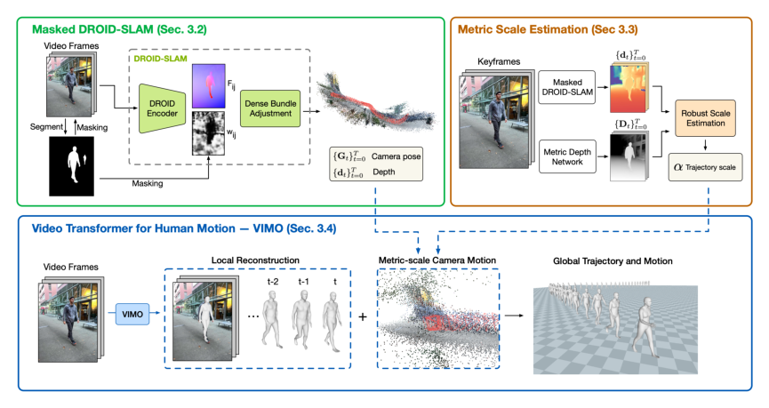

# TRAM：野外视频中的三维人体全局轨迹与动作恢复

野外视频中的人体全局运动不能只靠“看人”恢复：镜头自身在动，单目SLAM没有绝对尺度，人体还会遮住大量背景。TRAM把问题拆成相机、尺度和人体三条链，再把它们合成世界坐标下的完整人体运动。它的价值在于把公开视频变成可继续处理的动作数据，而不是直接控制人形机器人。

> **主要方法图：** Figure 2，PDF第5页。上半部分用双重遮罩稳定DROID-SLAM，并以单目深度预测对齐公制尺度；下半部分用VIMO恢复相机坐标中的人体，再合成为世界轨迹。来源：[原论文](https://arxiv.org/abs/2403.17346)。

## 第一条链：别让运动的人破坏相机SLAM

TRAM以DROID-SLAM估计相机位姿和场景深度，但不是直接把原视频送进去。人体区域一方面从输入图像中遮掉，另一方面也从dense bundle adjustment的重投影误差中剔除。只做其中一步仍可能让动态人体进入特征或优化；双重遮罩的目标是让相机运动主要由静态背景决定。

单目SLAM得到的轨迹只有相对尺度。TRAM再用单目场景深度网络提供公制深度线索，在多个关键帧上用鲁棒最小二乘求SLAM深度到公制深度的比例，并取跨帧中位数。它刻意依靠背景而不是人体身高估尺度，因此对不同体型更稳，但也依赖背景深度质量和可见静态区域。

## 第二条链：VIMO恢复局部人体运动

VIMO建立在预训练HMR2.0之上。作者保留其强单帧人体表征，在图像token域和人体运动域各加入一个时间Transformer：前者让相同图像位置跨帧交换信息，后者让SMPL姿态序列保持时序一致。输出是SMPL局部姿态、形状以及人体相对相机的根位姿。最后使用已经恢复到公制尺度的相机轨迹，把人体从相机坐标变换到世界坐标。

这是一套监督式视觉恢复系统，没有控制动作和RL奖励。训练损失服务于人体重建与时间一致性；机器人侧的观测空间、PD目标和接触奖励都不在论文范围内。其输出仍是人体SMPL运动和全局轨迹。

## 与GVHMR的差别以及进入机器人前的检查

TRAM显式依赖SLAM、背景深度与尺度对齐，GVHMR则把重力对齐坐标和人体轨迹表示更多地放进一个时序网络。两者都属于“人体动作恢复”，不能仅凭最终有世界轨迹就归为机器人重定向。实际数据管线可按视频类型选择，并用同一段长视频比较相机漂移、脚部速度和全局尺度。

送入GMR、NMR或其他重定向模块前，应检查人物跟踪是否串ID、尺度是否突变、根轨迹是否穿地、脚接触段是否滑移、SMPL关节是否出现跳变。动态背景、低纹理环境、长期遮挡和错误深度预测仍会传导到全局轨迹；若这些错误不留置信度，后续RL会把视觉估计问题误当成控制问题。

## 输出怎样交给重定向器

TRAM最终交付的是按帧对齐的人体参数和相机轨迹：人体侧包含SMPL体型、局部关节姿态以及相对相机的根位姿，相机侧包含恢复到公制尺度的世界位姿；二者合成后得到世界坐标中的人体根轨迹和全身运动。它没有输出目标机器人的关节角、关节速度、接触力或控制动作，也没有给出可直接用于机器人训练的碰撞标签。工程接入时应把视频帧率、米制单位、旋转约定、世界坐标原点和人物track ID与结果一起保存，再统一重采样到重定向器所需频率。

误差会沿三条路径进入机器人数据：人体检测或VIMO错误主要表现为局部关节跳变；动态区域进入SLAM会污染相机旋转和全局方向；背景深度偏差会把整个人体轨迹按错误比例缩放。重定向前不能只看渲染视频，应分别检查根速度连续性、足端静止段速度、身体尺度、地面高度和长序列闭环漂移。若视频包含手持物体或场景接触，还需要单独恢复物体与场景，TRAM的人体输出本身不足以保持交互关系。

## 原文、项目与代码

[论文原文](https://arxiv.org/abs/2403.17346) · [官方项目页](https://yufu-wang.github.io/tram4d/) · [官方代码](https://github.com/yufu-wang/tram)
