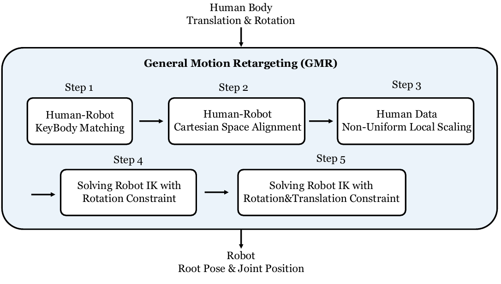
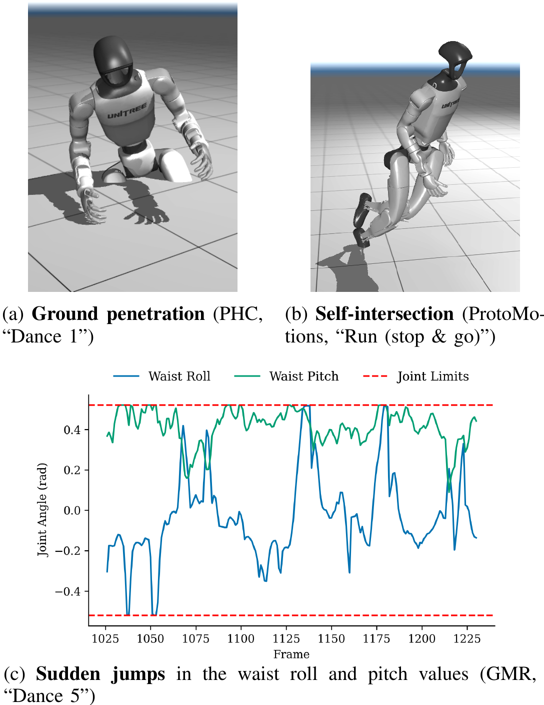
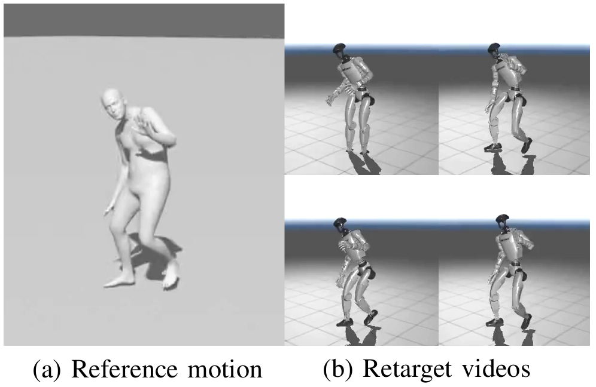
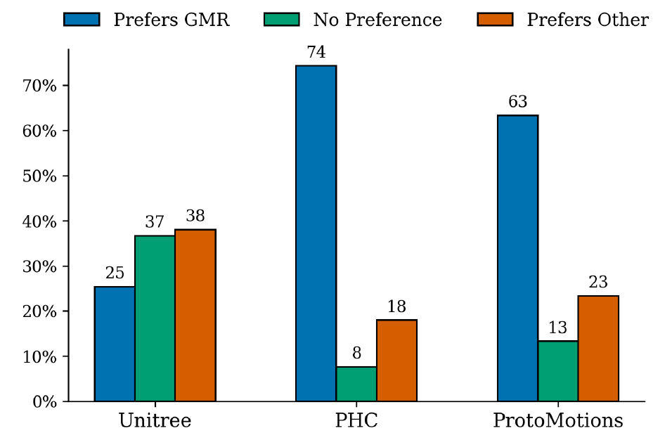

# GMR：面向人形运动跟踪的通用运动重定向

GMR要解决的并不是“怎样把人形机器人策略训练出来”，而是更靠前、也经常被低估的一步：**同一段人体动作，究竟应该怎样变成目标机器人可跟踪的参考轨迹**。论文真正有价值的地方，是把重定向质量和下游motion tracking成功率放在同一套实验里比较。它说明了一个很工程化的事实：策略训练失败，不一定是PPO、奖励或域随机化的问题，参考动作里的穿地、自碰撞、脚滑和关节突跳，本身就可能把学习问题变成坏问题。

论文输入是人体骨架运动，可以来自BVH、SMPL/SMPL-X或实时MoCap；输出是目标人形机器人的浮动基座位姿与关节角序列。GMR本身不输出力矩、不处理动力学，也没有直接把策略部署到真机。它属于“人体动作数据 -> 机器人参考动作”的数据入口，后面通常再接BeyondMimic、SONIC一类跟踪器。

[](论文原图/P077_figure.png)

> **主要方法图：** 原论文Figure 2，PDF第4页。图里五步并不是五个互不相关的模块，而是一条逐步缩小优化难度的链路：先确定对应关系和坐标系，再处理形态尺度，最后用两阶段IK求机器人姿态。来源：[原论文](https://arxiv.org/abs/2510.02252)。

## 一句话看懂方法

GMR可以概括成：**把人体和机器人之间的差异拆成“语义对应、静态坐标偏置、局部尺度、粗IK、精IK”五个问题，逐帧求解，并用上一帧结果给下一帧热启动。**

这比“把人体关键点统一乘一个身高比，再最小化关键点距离”更可靠。人体和机器人并不是均匀缩放关系：腿长比例、躯干长度、肩宽、手臂长度都可能不同；同名link的局部坐标轴也可能完全不同。如果尺度和静态朝向没有先处理好，后面的优化器即使把位置误差降得很低，也可能得到脚滑、内八、腰部翻折或自碰撞。

## 五步流程到底做了什么

### 1. 人体与机器人关键体映射

用户先定义人体骨架与机器人link之间的映射 $\mathcal{M}$，典型关键体包括骨盆、躯干、头、上臂、前臂、手、大腿、小腿和脚。映射不仅决定“谁跟谁”，也允许给不同身体的位置误差、旋转误差分配权重。脚和手通常比普通中间link更重要，因为它们承担支撑或任务接触。

这一步无法完全自动化。机器人URDF里的link命名、关节轴和零位姿没有统一标准；同样叫`torso_link`，也不保证其坐标轴与人体胸腔一致。GMR把这些本体相关知识显式放进JSON配置，而不是藏进代码分支，这是它能扩展到多种机器人的关键。

### 2. 静止姿态笛卡尔对齐

人体与机器人都处于rest pose时，GMR为对应body补一个固定旋转偏置，必要时再补局部位置偏置。它解决的是“人体手臂自然下垂，但机器人零位手臂朝前”“人体脚尖方向与机器人足部link轴不一致”这类坐标约定问题。若省略这一步，优化器会把静态坐标误差误当成每一帧都要追踪的动作变化。

### 3. 局部非均匀缩放

设人体源骨架高度为 $h$，配置标定时的参考高度为 $h_{ref}$，关键体 $b$ 的局部缩放为 $s_b$，根节点缩放为 $s_{root}$。GMR先把body相对根节点的位置做局部非均匀缩放，再把根的全局平移单独处理：

$$
p_b^{target}=\frac{h}{h_{ref}}s_b\left(p_j^{source}-p_{root}^{source}\right)
+\frac{h}{h_{ref}}s_{root}p_{root}^{source}.
$$

根节点自身退化为：

$$
p_{root}^{target}=\frac{h}{h_{ref}}s_{root}p_{root}^{source}.
$$

这里最重要的不是公式复杂度，而是**局部肢体比例和全局位移不能混着缩放**。局部比例用于把人的腿、臂、躯干适配到机器人；根平移必须保持统一尺度，否则一段脚本来应当钉在地面的动作，会因不同身体部位使用不同缩放而产生系统性脚滑。论文认为许多传统重定向伪影恰恰从这一步开始。

### 4. 先对齐旋转与末端位置的粗逆运动学

GMR没有一开始就同时追踪所有body的位置与旋转，而是先追踪所有映射body的朝向，只对手脚等末端追踪位置：

$$
\min_q \sum_{(i,j)\in\mathcal{M}} w^R_{ij}\left\|R_i^h\ominus R_j(q)\right\|_2^2
+\sum_{(i,j)\in\mathcal{M}_{ee}}w^p_{ij}\left\|p_i^{target}-p_j(q)\right\|_2^2,
$$

$$
\text{s.t.}\quad q^-\le q\le q^+.
$$

$q$包括浮动基座平移、旋转和机器人关节角；$R_i^h\ominus R_j(q)$用$SO(3)$上的对数映射表示旋转差。这个阶段先把整体姿态放进合理吸引域，避免所有位置约束同时拉扯导致局部极小值。

底层使用Mink的微分IK。它实际求的是能让当前误差下降的广义速度：

$$
\min_{\dot q}\left\|e(q)+J(q)\dot q\right\|_W^2,
\qquad
q^-\le q+\dot q\Delta t\le q^+.
$$

每个阶段最多迭代10次；目标值变化小于0.001时提前停止。这里的$\Delta t$是IK积分步长，并不等同于动作帧间隔。

### 5. 加入全部关键体位置的精细逆运动学

粗解得到后，第二阶段把所有映射body的位置约束也加入目标，并使用另一组权重做细化。处理整段动作时，第$t-1$帧的机器人姿态作为第$t$帧初值。最后通过前向运动学计算整段运动的最低body高度，并统一修正root高度，处理整体悬空或穿地。

这是一种**逐帧优化**，而不是整段轨迹优化。优点是速度快、格式兼容性好，缺点是它没有显式的跨帧加速度、接触时序和动力学可行性约束。上一帧热启动能提供连续性，但不能从理论上阻止关节突跳。

## 论文为什么强调“Retargeting Matters”

作者不是只展示几段视觉效果，而是固定下游跟踪算法：对21段LAFAN1动作，分别用PHC、GMR、ProtoMotions和Unitree公开参考数据生成四套轨迹，再用同一套BeyondMimic配置训练单动作策略。评测分三层：Isaac Sim无随机化`sim`各100次、带域随机化`sim-dr`各4096次，以及通过ROS状态估计与控制链在MuJoCo里运行的`sim2sim`各100次。

下表摘录了最能说明差异的结果。数值是策略完整跟到动作结束的成功率，不是单纯IK误差：

| 动作与环境 | PHC | GMR | ProtoMotions | Unitree |
|---|---:|---:|---:|---:|
| Dance 1，sim2sim | 0% | 100% | 100% | 100% |
| Dance 2，sim2sim | 0% | 100% | 100% | 100% |
| Run (stop & go)，sim2sim | 74% | 100% | 26% | 100% |
| Dance 5，sim2sim | 100% | 51% | 100% | 100% |

GMR并不是每段都最好。`Dance 5`只有51%，后面的伪影分析正好指出GMR在极少数片段会出现腰部roll/pitch突跳。这个反例很重要：它说明“位置和朝向误差低”不等于“参考轨迹一定好跟”。运动跟踪对局部不连续、初始帧和接触事件非常敏感。

论文还统计了100次`sim`轨迹中的平均跟踪误差：

| 重定向来源 | 全局body位置误差 Eg-mpbpe (mm) | 根相对body误差 E-mpbpe (mm) | 关节角误差 E-mpjpe ($10^{-3}$ rad) |
|---|---:|---:|---:|
| PHC | 247.8 | 40.2 | 778.5 |
| GMR | 104.1 | 28.1 | 561.7 |
| ProtoMotions | 139.7 | 33.2 | 641.8 |
| Unitree | 77.2 | 23.2 | 483.0 |

GMR在三项均优于另外两套开源基线，但仍落后于Unitree数据。合理的结论是：GMR把公开工具的可用性向前推了一大步，而不是“已经解决重定向”。

[](论文原图/P077_figure_3.png)

> **失败案例：** 原论文Figure 3，PDF第7页。(a)是PHC在`Dance 1`中的明显穿地，(b)是ProtoMotions在`Run (stop & go)`中的双腿自碰撞；(c)给出GMR在`Dance 5`中的腰部roll/pitch突跳，红色虚线是关节限位。作者报告PHC个别动作的地面穿透可达约60 cm；GMR的突跳片段虽占数据集不到2%，仍使对应`sim2sim`成功率降到51%。三类伪影放在一起，正好说明几何穿透、自碰撞与时序不连续都可能让后续跟踪失败。来源：[原论文](https://arxiv.org/abs/2510.02252)。

## 用户研究回答的是“像不像”，不是“能不能跑”

20名参与者完成45组双盲比较：每次先看5秒人体参考动作，再比较GMR与另一种重定向结果，允许选择“无明显差异”。GMR相对PHC获得74%的偏好，相对ProtoMotions获得63%；与Unitree相比，GMR为25%、无偏好37%、Unitree为38%。

[](论文原图/P077_figure_2.png)

> **评测流程：** 原论文Figure 1，PDF第4页。参与者先看人体参考动作，再在匿名、随机顺序的两段机器人重定向视频中选择更接近参考的一段；允许回答“无明显差异”。这张图解释的是实验协议，不能与下面的偏好统计图混为一谈。来源：[原论文](https://arxiv.org/abs/2510.02252)。

[](论文原图/P077_figure_4.png)

> **主观对比：** 原论文Figure 4，PDF第7页。它补上了策略成功率无法回答的问题：一个动作可以被策略稳定跟踪，却仍可能和人体原动作不够像。Unitree数据在视觉忠实度上略占优，但大量“无偏好”说明GMR已经接近可用水平。来源：[原论文](https://arxiv.org/abs/2510.02252)。

这两组实验应当合起来看：策略成功率评价“可跟踪性”，用户研究评价“语义与视觉忠实度”。公开重定向系统至少要同时报告这两类指标，再加上穿透、脚滑、关节限位和接触保持，才不容易被单个好看的Demo误导。

## 代码结构：从配置到批处理

截至2026-07-14核验的官方仓库版本为`bb1bbe40774794fceb2a7c579a3464a28e68c844`。核心结构如下：

```text
GMR/
├── general_motion_retargeting/
│   ├── motion_retarget.py       # 两阶段Mink IK与逐帧求解主逻辑
│   ├── params.py                # 机器人模型、配置与路径注册
│   ├── data_loader.py           # BVH、SMPL-X等输入读取
│   ├── kinematics_model.py      # 前向运动学封装
│   ├── robot_motion_viewer.py   # MuJoCo结果查看与录制
│   ├── ik_configs/              # 人体-机器人映射、缩放、权重JSON
│   └── utils/                   # LAFAN1、SMPL、Xsens等格式工具
├── scripts/
│   ├── smplx_to_robot.py
│   ├── bvh_to_robot.py
│   ├── gvhmr_to_robot.py        # 可直接承接GVHMR结果
│   ├── *_to_robot_dataset.py    # 数据集批处理
│   └── vis_robot_motion.py
└── assets/                      # URDF/MJCF、mesh与示例资源
```

`ik_configs/*.json`比主算法文件更值得认真读。新增机器人时，真正决定结果的往往是key-body映射、rest-pose偏置、局部缩放、位置/旋转权重和关节范围。仓库当前提供多种SMPL-X/BVH到G1、H1、T1、Kuavo、TienKung等本体的配置；README给出的CPU参考速度为Threadripper 7960X约60–70 FPS、i9-13900K约35–45 FPS，但这只是作者机器上的公开数据，不应直接外推到所有动作格式和可视化配置。

## 源码检查与复现边界

以下结果来自对官方代码的可重复静态检查：

| 项目 | 实际记录 |
|---|---|
| 日期 | 2026-07-14 |
| 环境 | macOS 26.5.2，Apple Silicon arm64，Python 3.12.13 |
| 仓库 | `YanjieZe/GMR@bb1bbe40774794fceb2a7c579a3464a28e68c844` |
| 静态检查 | `python -m compileall`覆盖核心包和`scripts/`，通过；LAFAN1 vendor脚本有3处旧式正则转义`SyntaxWarning` |
| CLI探测 | 设置仓库`PYTHONPATH`后运行`smplx_to_robot.py --help`，在导入阶段因检查环境未安装`rich`而停止 |
| 完整动作复现 | 未执行。官方声明测试环境为Ubuntu 20.04/22.04、Python≥3.10；完整运行还需Mink、MuJoCo、QP solver、SMPL-X依赖、机器人资源和输入动作 |

当前结果覆盖**源码版本、入口、语法和依赖边界检查**，不包含论文表格的数值复现，macOS上的静态检查也不能代表Ubuntu上已成功运行动作重定向。完整复现时建议先用仓库自带机器人配置跑一段短SMPL-X/BVH，逐项保存：源动作、配置JSON、输出PKL、脚底速度、最低body高度、关节限位命中帧和可视化视频。确认单段无穿透与突跳后，再批量处理数据集。

推荐的最短执行入口是：

```bash
python scripts/smplx_to_robot.py \
  --smplx_file <motion.npz> \
  --robot unitree_g1 \
  --save_path <retargeted.pkl>
```

如果数据来自视频，仓库已经提供`gvhmr_to_robot.py`，但“GVHMR能恢复人体”与“GMR能正确重定向机器人”仍应分两段验收，不能只看最终视频。

## 局限与使用边界

1. 论文主实验只用LAFAN1和Unitree G1，源数据与目标本体的覆盖有限；仓库后来支持更多本体，不等同于论文已逐一完成同等级评测。
2. 逐帧运动学优化没有显式动力学、力矩、摩擦锥或碰撞硬约束。输出“看起来合理”仍可能超出执行器能力。
3. 论文刻意排除了爬行、起身等复杂环境交互。涉及物体、地形和持续接触时，应考虑OmniRetarget这类交互保持方法，或在GMR结果后做物理化精修。
4. 初始参考帧会影响策略从默认站姿进入动作的成功率；动作头尾应可安全到达并可安全退出。
5. 开源仓库采用MIT许可证，但其中第三方机器人资产可能有各自许可证，发布数据集或商业使用前应逐项检查。

## 放在完整技术栈中的位置

GMR位于“人体动作恢复/动作捕捉”与“机器人Mimic策略训练”之间。一个完整链路可以是：

```text
视频或MoCap
  -> GVHMR / 光学动捕得到人体运动
  -> GMR完成目标本体重定向
  -> 质量审计与必要的接触/动力学修复
  -> BeyondMimic / SONIC等跟踪策略训练
  -> Sim2Real与真机安全验证
```

它最适合做通用、快速、多格式的机器人动作入口；它不替代交互保持重定向、物理可行性优化和低层控制。真正可复用的资产也不只是输出动作，而是“源格式 + 本体模型 + 映射配置 + 质量指标 + 下游跟踪结果”这一整套可追溯记录。

## 原文、项目与代码

[论文原文](https://arxiv.org/abs/2510.02252) · [官方项目页](https://jaraujo98.github.io/retargeting_matters) · [官方代码](https://github.com/YanjieZe/GMR)
