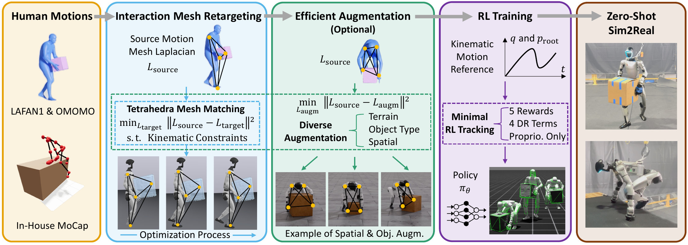
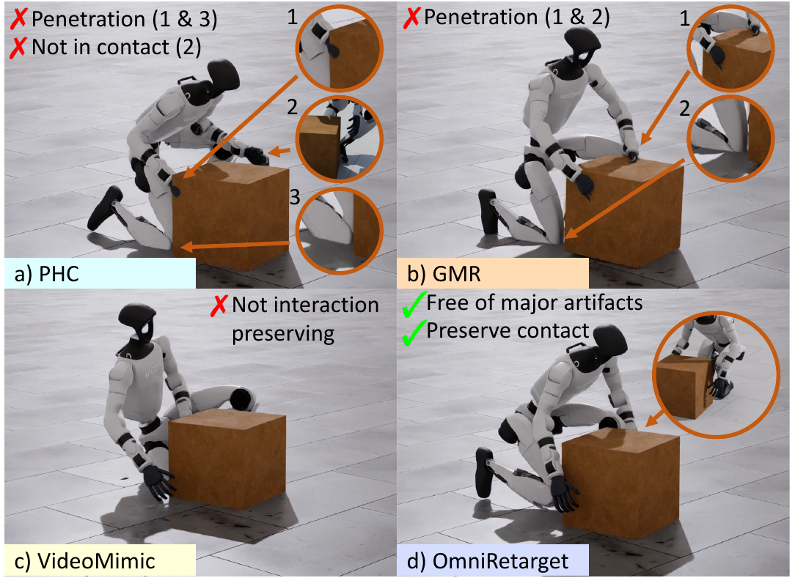
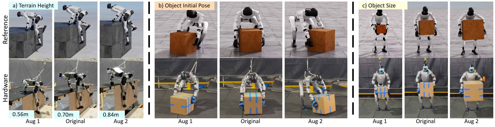
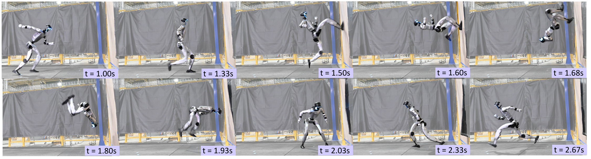

# OmniRetarget：保持交互的人形全身移动操作与场景交互数据生成

普通动作重定向关心“机器人的手脚能不能跟到人的手脚”，OmniRetarget进一步追问：**如果人正在搬箱子、扶物起身、翻墙或踩平台，机器人和物体、地形之间的相对关系能不能一起保留下来？** 这正是Loco-Manip数据最容易坏掉的地方。只拟合人体关键点，可能得到手穿进箱子、膝盖穿地、脚在支撑期滑动，或者人原本在接触物体而机器人已经脱离接触的轨迹。

OmniRetarget的核心产物不是一个通用控制策略，而是一套交互保持的数据生成引擎：输入人体、物体和场景的时序几何关系，输出满足关节限位、速度限制、非穿透和支撑脚锁定等约束的机器人运动；还可以改变物体位置、形状和地形高度，重新求解出成组的训练参考。论文后半段的RL和真机实验，是在证明这些参考动作确实能用于低层跟踪，并不是主分类从“数据入口与重定向”变成“控制策略”。

[](论文原图/P079_figure.png)

> **主要方法图：** 原论文Figure 2，PDF第3页。人类示范先经过交互网格约束优化，得到机器人运动；可选的数据增广会对每个新场景重新求解；最后才用简化的RL跟踪器把运动学参考变成可在真机执行的策略。来源：[原论文](https://arxiv.org/abs/2509.26633)。

## 为什么关键点匹配不足以表达“交互”

假设人体双手抬着箱子。只对齐手腕位置，会遗漏至少四类关系：两只手与箱子的接触位置、箱子相对躯干的距离、膝盖与箱子的避碰关系、脚与地面的支撑关系。更麻烦的是，人和机器人形态不同，不能简单要求每个点的绝对坐标完全一致。我们真正想保留的是一个局部几何结构：谁靠近谁、谁包围谁、接触边界如何变化。

OmniRetarget把人体关键点、机器人关键点、物体表面点和地形点放进同一个**交互网格**。通过Delaunay四面体化建立邻接关系后，每个顶点不再只看自己的绝对位置，而是看它相对邻居的局部差分。这使得“手围住箱子”“脚踩住平台”“身体绕开墙面”能以统一形式进入优化目标。

## 交互网格与Laplacian坐标

对时刻$t$的顶点$p_{t,i}$，其Laplacian坐标定义为：

$$
L(p_{t,i})=p_{t,i}-\sum_{j\in\mathcal{N}(i)}w_{ij}p_{t,j},
\qquad
w_{ij}=\frac{1}{|\mathcal{N}(i)|}.
$$

它表达“点$i$相对周围邻居处在什么位置”。如果人体手部、箱子和躯干形成的局部几何在机器人结果中仍然相近，两边的Laplacian坐标就应接近：

$$
E_L=\sum_i\left\|L(p_{t,i}^{source})-L(p_{t,i}^{target})\right\|_2^2.
$$

这里的关键不是用了一个新的距离公式，而是**邻接图同时跨越机器人、物体和环境**。PHC/GMR主要在人体与机器人关键体之间建立对应；OmniRetarget把“交互对象”也纳入表示，因此能区分“手到了相同位置”与“手仍在箱子正确一侧并保持接触”。

## 约束优化：软惩罚和硬边界的区别

每一帧的目标可以写成：

$$
q_t^*=\arg\min_{q_t}
\sum_i\left\|L_i^{source}-L_i^{target}(q_t)\right\|_2^2
+\left\|q_t-q_{t-1}\right\|_Q^2,
$$

同时满足：

$$
\phi_k(q_t)\ge 0,\quad
q^-\le q_t\le q^+,\quad
\dot q^-\le\frac{q_t-q_{t-1}}{\Delta t}\le\dot q^+,
$$

以及支撑脚锁定：

$$
p_t^F=p_{t-1}^F.
$$

$\phi_k$是机器人与物体、地形或自身之间的有符号距离；非负表示不穿透。论文用源动作脚部水平速度低于1 cm/s判断支撑阶段。第二项约束相邻帧变化，既给序列连续性，也让上一帧成为当前帧的warm start。

优化使用顺序SOCP形式求解，基于Drake自动微分处理浮动基座四元数所在的$S^3$流形。碰撞约束在当前点附近线性化，所以它并非数学上永不违反：大步长或很差的初值下仍可能出现轻微穿透。但相较“把碰撞写成一个权重很难调的软惩罚”，硬约束把可接受边界明确放进求解器，也减少了关键点损失与碰撞损失彼此拉扯。

[](论文原图/P079_figure_3.png)

> **基线对比：** 原论文Figure 7，PDF第7页。PHC和GMR在箱体附近出现穿透或接触错误，VideoMimic没有保持原交互，OmniRetarget同时维持手-箱接触并避免主要穿透。该图是典型案例，不应替代下文的全数据量化结果。来源：[原论文](https://arxiv.org/abs/2509.26633)。

## 数据增广不是把整段轨迹刚性搬过去

论文的第二个关键点是：改变箱子位置或平台高度后，不能把机器人和物体一起平移就算“新数据”。那样只改变世界坐标，没有产生新的身体协调。

OmniRetarget会改变物体初始位姿、形状或地形尺度，在新的几何条件下重新构建交互网格并求解。对于搬箱任务，物体周围的身体部位会随新物体变形，但下肢仍通过额外项尽量靠近名义轨迹：

$$
\left\|q_t-\bar q_t^*\right\|_W^2,
$$

其中$W$对下肢给更高权重；初始双脚位置也锚定在名义轨迹上。这样，箱子横移时上半身会重新伸手和转体，而不是双脚、骨盆、箱子一起平移。

地形增广则在新地面表面采样网格点并加入约束，让平台高低变化真正改变跨步和支撑动作。

[](论文原图/P079_figure_2.png)

> **数据增广：** 原论文Figure 4，PDF第5页。(a)把0.70 m名义平台扩展到0.56 m和0.84 m，(b)改变箱体初始位姿，(c)改变箱体尺寸。每组上排是重新优化的运动学参考，下排是对应真机结果。三类变化共享同一套结论：不是把整段轨迹刚性平移或缩放，而是在新几何条件下重新求解身体、物体和环境之间的关系。来源：[原论文](https://arxiv.org/abs/2509.26633)。

## 为什么后面的RL反而做得很简单

作者有意用简化策略验证“好数据能否减少奖励工程”。观测只包含三组信息：参考关节位置/速度与骨盆误差，机器人本体感觉（骨盆线/角速度、关节位置/速度），以及上一时刻动作。敏捷动作在状态估计不可靠时，还会屏蔽骨盆线位置误差和速度。策略不看显式场景或物体视觉，它必须沿着参考轨迹把交互做出来。

奖励只有五类：身体跟踪、适用时的物体跟踪、动作变化率、软关节限位、自碰撞。域随机化也刻意压缩到四项机器人扰动，并对物体质量、质心、惯量和形状随机化。这个设计不是说五项奖励能解决所有Loco-Manip，而是在做控制变量：如果同一套简单跟踪器对不同重定向数据产生明显不同成功率，差异更可能来自参考质量。

## 实验：先看几何质量，再看下游能否学会

论文比较PHC、GMR、VideoMimic与OmniRetarget。公开数据规模包括OMOMO箱体交互2.78小时、内部MoCap 1小时和LAFAN1 4.6小时。量化指标包括穿透持续比例与最大深度、支撑脚滑持续比例与最大速度、接触保持比例，以及相同RL配置的成功率。

### 机器人-物体交互（OMOMO）

| 方法 | 穿透持续比例 ↓ | 最大穿透深度 (cm) ↓ | 接触保持 ↑ | RL成功率 ↑ |
|---|---:|---:|---:|---:|
| PHC | 0.68±0.21 | 5.11±3.09 | 0.96±0.09 | 71.28%±22.55% |
| GMR | 0.83±0.14 | 8.50±3.94 | 0.99±0.04 | 50.83%±23.89% |
| VideoMimic | 0.60±0.27 | 7.48±4.95 | 0.77±0.25 | 3.85%±8.41% |
| OmniRetarget | **0.00±0.01** | **1.34±0.34** | 0.96±0.09 | **82.20%±9.74%** |

GMR的接触保持数值很高，但穿透也最严重，这正说明单看“是否接触”不够：手进入箱体内部也可能被统计为接触。VideoMimic的软碰撞代价与关键点目标冲突，交互保持下降，后续策略几乎学不起来。OmniRetarget的优势来自把接触几何和非穿透同时表达。

### 机器人-地形交互（内部MoCap）

| 方法 | 最大穿透深度 (cm) ↓ | 最大脚滑速度 (cm/s) ↓ | 接触保持 ↑ | RL成功率 ↑ |
|---|---:|---:|---:|---:|
| PHC | 7.74±4.53 | 2.03±1.83 | 0.45±0.28 | 52.63%±49.93% |
| GMR | 5.72±3.84 | 1.75±3.01 | 0.67±0.26 | 78.94%±40.77% |
| VideoMimic | 5.97±3.58 | 1.85±1.38 | 0.47±0.25 | 51.75%±49.23% |
| OmniRetarget | **1.37±0.18** | **0** | **0.72±0.19** | **94.73%±22.33%** |

机器人纯动作的LAFAN1对比中，OmniRetarget与Unitree参考都达到100%下游成功率，但最大穿透深度从Unitree的3.22 cm降至1.07 cm。更重要的是，完整增广数据训练并在增广任务评估得到79.1%，只在名义动作评估为82.2%；覆盖范围扩大后没有出现灾难性退化。

真机展示包括4.6 kg椅子搬运、约0.9 m平台交互和高动态蹬墙翻转。蹬墙动作报告峰值线速度3.5 m/s、角速度15 rad/s。它们证明数据链能接到Unitree G1硬件，但不代表所有公开轨迹都经过同样数量的重复试验，也不能从公开视频推导长期可靠性。

[](论文原图/P079_figure_4.png)

> **真机证据：** 原论文Figure 6，PDF第7页。连续帧覆盖助跑、蹬墙、空中翻转和落地恢复，作者报告峰值线速度3.5 m/s、角速度15 rad/s。该结果证明所生成参考可以接入低层RL跟踪并迁移到G1，但单次序列不能替代多次成功率、安全边界和长期稳定性统计。来源：[原论文](https://arxiv.org/abs/2509.26633)。

## 代码结构：OmniRetarget现在位于Holosoma

截至2026-07-14，官方实现已经集成到Amazon FAR的[Holosoma](https://github.com/amazon-far/holosoma)，不应继续把旧的`omniretarget/OmniRetarget`地址当成当前代码入口。源码检查使用的提交为`79d728c2c40e7f9ce8c28f9d9cab117ed2350bb5`。

```text
holosoma/src/holosoma_retargeting/
├── holosoma_retargeting/
│   ├── src/
│   │   ├── interaction_mesh_retargeter.py  # 网格构建、约束和逐帧求解主逻辑
│   │   ├── utils.py                        # Laplacian与几何工具
│   │   └── mujoco_utils.py                 # 机器人/场景运动学接口
│   ├── config_types/                       # robot、task、retargeter配置结构
│   ├── config_values/                      # 默认机器人与数据格式注册
│   ├── examples/
│   │   ├── robot_retarget.py               # 单条动作入口
│   │   └── parallel_robot_retarget.py      # 数据集并行处理
│   ├── evaluation/eval_retargeting.py      # 穿透、脚滑、接触保持评测
│   ├── data_conversion/                    # MuJoCo等格式转换
│   ├── demo_data/OMOMO_new/                # 小型OMOMO示例
│   └── models/                             # G1、H1、T1与箱体模型
└── pyproject.toml
```

`interaction_mesh_retargeter.py`是算法入口，`examples/robot_retarget.py`负责把数据格式、机器人配置和任务类型组装起来。`evaluation/eval_retargeting.py`同样重要：如果只生成视频、不计算穿透、脚滑和接触保持，就很难知道优化器是在真正保存交互还是只做出“看起来像”的姿态。

## 源码检查与复现边界

| 项目 | 实际记录 |
|---|---|
| 日期 | 2026-07-14 |
| 环境 | macOS 26.5.2，Apple Silicon arm64，Python 3.12.13 |
| 仓库 | `amazon-far/holosoma@79d728c2c40e7f9ce8c28f9d9cab117ed2350bb5` |
| 静态检查 | `python -m compileall`覆盖`holosoma_retargeting`，通过 |
| CLI探测 | 在包目录运行`examples/robot_retarget.py --help`，因检查环境未安装`tyro`而在导入阶段停止 |
| 完整求解 | 未执行；检查环境未安装项目锁定的NumPy 2.3.5、MuJoCo、CVXPY、libigl、viser、SMPL-X等完整依赖 |

官方仓库提供OMOMO小样本和G1/H1/T1模型，完整环境建立后可从下面的对象交互入口开始：

```bash
cd src/holosoma_retargeting/holosoma_retargeting
python examples/robot_retarget.py \
  --data_path demo_data/OMOMO_new \
  --task-type object_interaction \
  --task-name sub3_largebox_003 \
  --data_format smplh \
  --retargeter.debug \
  --retargeter.visualize
```

现有记录只能证明2026-07-14的官方源码可被Python编译，且入口和依赖边界已确认；它不代表优化求解或真机复现已完成。在Ubuntu完整复现时，至少应保存代码commit、数据样本hash、机器人URDF、solver状态、每帧约束残差、输出轨迹和评测脚本结果。

## 局限与判断边界

1. 交互网格依赖合理的关键点、物体姿态和场景几何。视觉恢复或物体跟踪有误时，优化器会忠实地保存错误关系。
2. 碰撞约束经过局部线性化，论文也承认结果仍有轻微穿透；“硬约束”不能理解为任意初值下绝对无穿透。
3. 当前方法主要是离线、逐帧优化。大规模生成时要关注求解速度、失败重试和异常帧修复，而不是只看单条Demo。
4. 支撑脚由源动作速度阈值识别，不等价于真实接触力。复杂滚动、滑动接触或多点支撑需要更细的接触语义。
5. 下游策略是参考跟踪器，并没有解决在线视觉理解、目标选择和长时任务规划。VLA可以调用这些技能，但不能替代这层接触可执行性。
6. Holosoma代码采用Apache-2.0；公开轨迹数据的许可需按项目页分别检查，人体数据集、机器人mesh和原始动作还可能受各自条款约束。

## 放在完整技术栈中的位置

OmniRetarget连接的是“人类交互示范”和“机器人Loco-Manip技能训练”：

```text
人体 + 物体/地形示范
  -> 人体与场景运动恢复
  -> OmniRetarget交互保持重定向与几何增广
  -> 穿透/脚滑/接触保持质量审计
  -> Mimic/RL低层跟踪
  -> 真机状态估计、保护与任务评测
  -> VLA/Agent在上层选择和串联技能
```

它和GMR不是简单的替代关系。纯机器人动作、实时遥操作和多格式快速转换，GMR更轻量；箱体、地形和持续接触数据，OmniRetarget的交互网格与硬约束更合适。分类时应看核心产物：这篇论文首先是**交互数据引擎**，标签可以包含Loco-Manip和Sim2Real，但primary track仍是动作数据入口与重定向。

## 原文、项目与代码

[论文原文](https://arxiv.org/abs/2509.26633) · [官方项目页](https://omniretarget.github.io/) · [官方代码（Holosoma）](https://github.com/amazon-far/holosoma)
