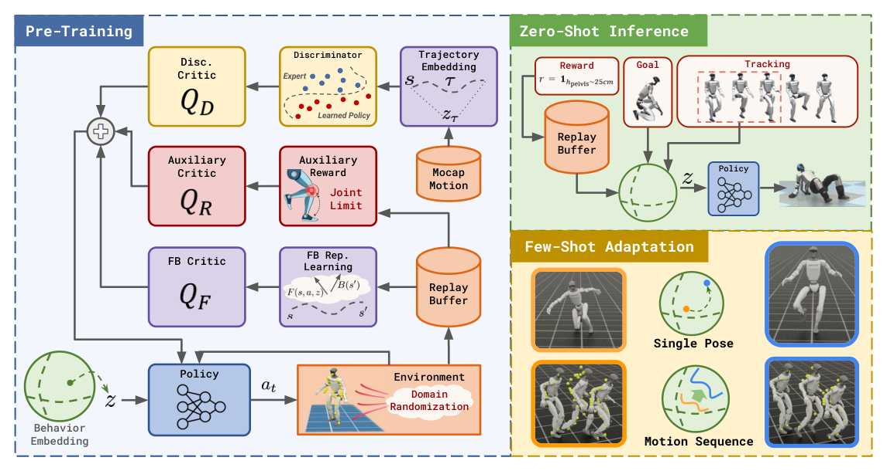

# BFM-Zero：基于无监督强化学习的可提示人形行为基座模型

普通motion tracker的接口是“给参考帧，输出关节动作”。BFM-Zero想把接口往前推进一步：先用无奖励在线交互和无标签动作数据学出一个行为潜空间，同一策略再通过不同latent完成轨迹跟踪、单姿态到达、奖励优化，并可在latent上少量搜索适配难任务。它的主贡献是可提示的行为模型，不是把参考窗口换一种编码后继续跟踪。

> **主要方法图：** Figure 2，PDF第4页。左侧是无任务奖励预训练：仿真交互进入replay buffer，无标签动作进入判别器，Forward-Backward价值、风格价值和安全价值共同训练条件策略。右侧展示如何把轨迹、单姿态或奖励投影为潜在提示，以及零样本结果不足时的潜空间适配。来源：[原论文](https://arxiv.org/abs/2511.04131)。

## 论文框架：无奖励交互如何形成可提示策略

预训练期没有一个固定的“跟踪某段动作”或“以某速度行走”任务奖励。数千个仿真环境使条件策略不断收集状态、动作和下一状态，存入replay buffer。Backward映射把某个状态压成特征，Forward映射则根据当前状态、动作和潜变量`z`，预估这个策略以后更可能访问哪些状态特征。两者在replay transition上用时序差分信号学习，其结果相当于对条件策略的长期状态访问分布做低秩分解。

`z`在这里不是一个预先命名的技能编号。它与Backward状态特征的内积定义了一类线性奖励，而Forward输出与`z`的内积则是该奖励下的长期动作价值。因此不同`z`会让同一Actor趋向不同未来状态，而训练前不需要人工列出“走路、蹲下、抬手”等任务标签。

仅靠这个目标，策略可能找到能覆盖新状态、但动作机械甚至伤害硬件的探索方式。因此无标签LAFAN1动作还会经Backward特征求平均，得到每段专家轨迹的行为嵌入。条件判别器把动作数据中与该嵌入匹配的状态当作正样本，把Actor在线交互产生的状态当作负样本，学出一个风格奖励。对应的判别器Critic累积这个奖励，安全Critic则累积关节限位等惩罚。Actor同时追求FB任务价值、人体运动风格价值和安全价值，所以这里的“无监督”指没有下游任务奖励，不是没有动作数据与物理约束。

## 观测、动作和训练接口

G1有29个受控自由度，动作是29维PD目标。可部署actor读取关节位置相对默认姿态、关节速度、根角速度、投影重力以及观测/动作历史，再与latent prompt一起输出动作；训练critic和FB模块还能读取根高度、身体姿态、旋转和线/角速度等特权状态。仿真以200 Hz运行，控制频率50 Hz，并对质量、摩擦、关节偏置、躯干质心、扰动和传感噪声做随机化。

训练是在线、off-policy、replay-buffer驱动，而不是常见的PPO批量rollout。运动数据为判别器和轨迹embedding提供参照，环境交互则学习可到达状态及其长期关系。这个组合解释了`无监督强化学习`、`Forward-Backward`和`条件对抗运动先验`为何必须同时作为标签。

## 三种零样本提示与少样本适配

给定单个目标姿态，可直接用Backward编码该状态得到goal prompt；给定轨迹，则按前瞻窗口聚合沿途状态embedding，逐时刻切换prompt；给定任意奖励函数，可在replay buffer样本上用奖励加权Backward特征，估计对应latent。网络参数都不变，改变的是策略条件。

若零样本prompt覆盖不足，作者不立刻微调整个模型，而是在latent或latent序列上用CEM、零阶轨迹优化做少样本适配。这保留了预训练行为先验，也把搜索维度从完整网络参数降到任务表示。但奖励提示依赖抽样状态分布，稀疏奖励和分布外状态会使embedding不稳定；latent搜索也仍需要仿真交互和任务判据。

## 真机证据与边界

论文在Unitree G1展示跟踪、姿态到达、奖励优化和大扰动后的自然恢复，并给出Booster T1扩展。它证明off-policy无监督RL也能形成可迁移的全身控制，但不代表模型已经理解视觉场景或自动拆解长任务：上层VLA/Agent仍需把目标转成奖励、姿态、轨迹或latent提示。

工程复现应同时测prompt稳定性、任务覆盖、关节安全、Sim2Sim、不同机器人个体和真实扰动恢复，不能只看一组舞蹈。官方代码已公开，使用时还需核对动作数据重定向、G1执行器配置和安全层。

## 原文、项目与代码

[论文原文](https://arxiv.org/abs/2511.04131) · [官方项目页](https://lecar-lab.github.io/BFM-Zero/) · [官方代码](https://github.com/LeCAR-Lab/BFM-Zero)
