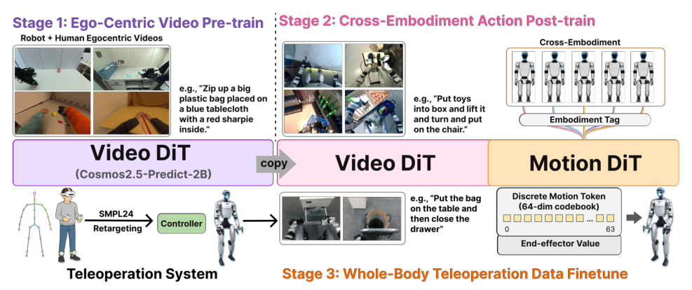

# MotionWAM：面向实时人形移动操作的基座世界动作模型

视频世界模型能提供场景动力学先验，但若每次控制都迭代生成高分辨率未来帧，人形机器人等不起。MotionWAM的关键取舍是：Video DiT只做一次前向，在高噪声时刻截取中间denoising feature；Motion DiT用这份“未来趋势”连同本体状态生成统一全身motion token，再交给低层身体控制接口实时执行。

> **主要方法图：** Figure 3，PDF第5页。Video DiT先用第一视角视频预训练；Motion DiT随后用异构G1动作数据做跨数据格式后训练；最后以全身遥操作示范微调，输出统一motion token。来源：[原论文](https://arxiv.org/abs/2606.09215)。

## 输入和动作接口怎样统一上下半身

模型读取头部单目第一视角图像、语言条件和机器人本体状态。传统层级方案常让上肢接收关节目标、下肢只接收基座速度和高度，因此腿只能维持平衡，很难主动踢球或踩踏板。MotionWAM把动作表示成两部分：SONIC的64维离散motion token承载移动、躯干、身高、足部交互等全身意图，连续通道补充夹爪或灵巧手命令。上层因此在同一动作空间决定手、脚和身体，而不是分别调用互不一致的接口。

这仍不是直接输出电机力矩。motion token由SONIC式全身控制器解码并结合实时本体反馈执行，低层继续负责平衡、接触和扰动恢复。MotionWAM属于上层视觉条件动作序列生成，所以主分类在`世界模型VLA与Agent`；`Loco-Manipulation`和`统一全身Motion Token`是secondary tags。

## Dual-DiT如何把世界模型接到动作模型

Video DiT初始化自Cosmos-Predict2.5-2B，将当前第一视角图像编码为时空latent。在推理时，它不把未来latent从噪声逐步去噪到画面，而是在接近纯噪声的固定flow timestep执行一次网络，并从某个Transformer block抓取隐藏状态。作者把这个状态视为“场景接下来如何变化”的视觉动力学特征。

Motion DiT通过交错的self/cross-attention读取该特征、机器人本体状态和带噪motion latent，学习动作侧的flow field，积分后得到motion token。多数据源训练时，每种动作标注格式使用独立输入/输出投影器，共享Motion DiT主干；部署时保留G1对应投影器。这样异构数据可以共享动力学主干，又不必假设所有数据原本就在同一动作空间。

## 三阶段数据和训练目标

第一阶段汇集约2136小时第一视角人类与人形视频，只训练Video DiT的未来帧生成，使视觉先验适配头戴视角。第二阶段混合不同末端和动作标注的Unitree G1数据，联合更新视频与动作网络，用joint flow-matching把视觉变化接到机器人动作。第三阶段采集目标任务的全身遥操作示范，切换到统一motion token输出并做任务微调。

这里没有RL reward设计，核心监督来自视频未来建模和示范动作flow matching。执行层的稳定性来自低层SONIC接口，而不是WAM自身学会了全部接触控制。

## 真机证据、失败模式与开放状态

论文在Unitree G1上设置9项全身loco-manip任务，每项20次测试，涵盖踢球、踩踏板、推车、取放和身体高度变化。作者报告同示范微调条件下平均成功率高于所比较VLA基线，并展示实时闭环。论文自己的失败分析指出，单头部相机看不到离开视野的物体、视角偏离训练分布时，视觉grounding会成为主要失败源。

这组结果仍是特定G1、相机、低层tokenizer和任务数据的系统证据，不等于任意本体上的foundation能力。截至2026-07-13未发现官方代码仓库，因此模型权重、数据配比、接口实现和实时预算尚不能完整复现。

## 原文

[论文原文](https://arxiv.org/abs/2606.09215)
