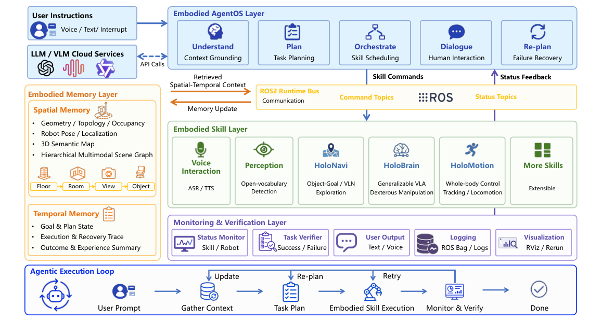

# HoloAgent-0：具备三维空间记忆的统一具身智能体框架

语言模型调用软件工具时，函数通常有明确输入、返回值和失败码；机器人技能却会执行很久、部分完成、观察不全，还可能改变不可逆的物理状态。HoloAgent-0解决的是这个系统层问题：用AgentOS、三维空间记忆、具身技能和运行时监控，把异构机器人能力组成可反馈的长任务闭环。它不是新的低层locomotion或manipulation策略。

> **主要方法图：** Figure 1，PDF第1页。用户指令进入AgentOS，空间/时间记忆提供上下文，技能经ROS2命令与状态总线执行，监控层验证结果并触发更新、重试或重规划。来源：[原论文](https://arxiv.org/abs/2606.23565)。

## AgentOS管理的不是关节，而是技能生命周期

Embodied AgentOS负责理解上下文、生成任务计划、把计划编成skill graph、调度机器人资源、处理中途对话，并根据执行状态重规划。技能通过有类型的命令/状态接口暴露，例如导航目标、全身动作、目标搜索或抓取；ROS2 runtime bus负责下发命令和回传状态。低层控制频率、关节动作和接触奖励仍封装在各自技能内部。

这层抽象的重点是让“执行中”成为一等状态。Agent不能只在调用函数后假设成功，而要接收started、running、success、failure等反馈，由task verifier判断任务条件是否满足，再决定继续、重试、询问用户或改计划。日志、ROS bag、RViz/Rerun也进入同一监控层，便于回放失败。

## 三维空间记忆怎样服务长任务

空间记忆保存几何、拓扑、占据、机器人位姿、三维语义地图和持久对象实例；层级多模态场景图按楼层、房间、视角和对象组织检索，使语言目标先缩小到区域，再落到可导航或可操作实例。时间记忆另外保存目标、计划状态、执行/恢复轨迹和结果摘要。

当场景变化时，系统不是重建全部地图，而是定位当前观察、更新受影响的几何和对象实例，再修订对应场景图节点。这样“咖啡机上次在哪里”“抽屉是否已经打开”“前一步为什么失败”可以成为下一轮规划上下文，而不是每次从一张当前图像重新猜。

## 输入输出、训练和部署接口

系统输入包括语音/文本指令、VLM/LLM服务、RGB-D感知、定位与各技能状态；输出是技能图、ROS2命令、对话和重规划决策。论文重点是系统编排，没有一个统一的低层观测、动作和reward，也不能把AgentOS描述成端到端策略训练。HoloNavi、HoloBrain、HoloMotion等技能保留自己的模型、控制器和安全边界。

部署覆盖Unitree G1、R1人形和轮式双臂平台。量化评估主要落在可重复的三维语义映射与长程导航，使用mIoU/mAcc、SR/SPL和目标到达率；全身动作、跨机器人协作和移动操作更多是系统执行轨迹与定性演示。论文也明确这些异构任务没有被压成一个统一端到端Benchmark。

## 真正的边界在“技能契约”

Agent层能否可靠，取决于每个技能是否报告进度、失败原因、可重试条件和副作用。若底层只返回一个模糊布尔值，三维记忆再丰富也难以正确恢复。安全关键动作还需要独立的本体保护、资源锁、超时与人工接管，不能只依赖LLM重规划。

截至2026-07-14，官方仓库包含导航组件和部署资料，但HoloAgent-0核心代码尚未发布。因此可以核验框架、接口和部分组件，尚不能按公开代码完整重建论文全栈。

## 原文、项目与代码

[论文原文](https://arxiv.org/abs/2606.23565) · [官方项目页](https://horizonrobotics.github.io/robot_lab/holoagent) · [官方代码仓库与发布状态](https://github.com/HorizonRobotics/HoloAgent)
