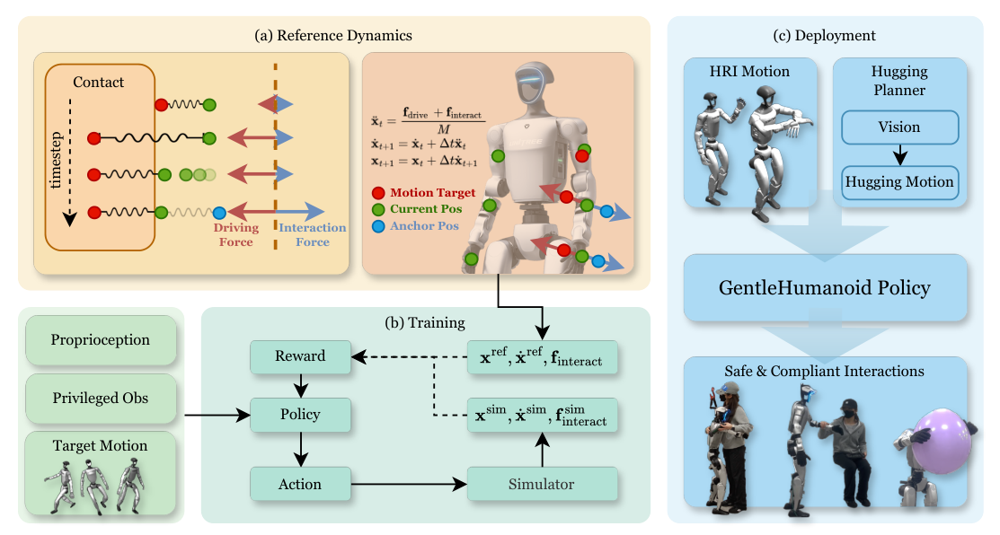

# GentleHumanoid：面向富接触人机与物体交互的上半身柔顺学习

人形机器人拥抱、扶人起身或搬柔性物体时，接触可能同时发生在肩、肘和手。只给末端一个顺应目标，会忽略整条上肢链的受力关系；普通motion tracking又会把任何偏离参考都当成误差，越推越往回顶。GentleHumanoid用多link参考阻抗动力学生成“遇到外力后应该怎么偏离”的目标，再训练全身策略复现这种响应。

> **主要方法图：** Figure 2，PDF第4页。目标动作产生driving force，人或物体接触产生interaction force；参考动力学积分出肩、肘、手的期望位置/速度，RL策略据此学习，部署时接到拥抱规划、人体辅助等上层接口。来源：[原论文](https://arxiv.org/abs/2511.04679)。

## 参考动力学怎样表达“跟踪”和“让步”

每个关键link在机器人根坐标系中都有三维位置和速度。driving force由目标位置/速度与当前状态之间的弹簧-阻尼项产生，把身体拉向参考动作；interaction force表示人与环境施加的推、拉或抵抗。虚拟质量、刚度和临界阻尼共同决定偏离幅度和恢复速度，策略要协调多个关节，让真实仿真身体跟随参考link动力学，而不是直接把外力除以一个常数后改手的位置。

作者区分两类接触。抵抗接触模拟机器人主动压向物体后受到反力；引导接触模拟人推动或牵引机器人。为了让多link外力仍像自然上肢姿态，锚点从人体动作数据中的相近姿态采样，并随机激活双臂、单臂或单link。这样肩、肘和手的目标不是互相矛盾的独立扰动。

## 策略接口、奖励与安全阈值

训练时策略读取本体状态、目标动作以及仿真特权信息，输出由低层关节PD执行的关节空间动作。奖励比较仿真机器人和参考动力学在关键link上的位置、速度，并保留全身运动跟踪与稳定约束。这里的外力用于产生训练目标和特权监督；部署并不要求手腕力传感器直接输出同样的参考状态，策略从本体反馈中形成响应。

普通虚拟弹簧的误差越大，恢复力越大，可能在人体接触时超过安全范围。GentleHumanoid加入任务可调的force threshold，对driving force做上限控制。这个阈值给了“拥抱要软、扶站要能支撑”之间的接口，但它是训练/控制层的力限制机制，不等同于经过形式化认证的碰撞安全保证。

## 真机证据和适用边界

论文在Unitree G1上展示握手、拥抱、坐站辅助和气球/大柔性物体处理，并用力计与定制压力垫测量接触。它证明多link顺应可在真实交互中降低峰值力，同时保留任务能力。本库将柔顺、抗扰和接触安全视为物理交互的基础能力，因此主分类并入`LocoManip与物理交互`；但页面会明确标注其首要贡献是安全、可调的接触响应，不会把它夸大成自主物体任务规划。

局限在于参考外力分布、接触link和人体动作先验都由训练设计；未见接触部位、快速冲击、复杂摩擦和传感延迟仍可能越界。复现时要同时记录力阈值、实际接触力、跟踪误差、触发link、任务成功和安全保护介入，不能只看机器人动作是否自然。截至2026-07-14，作者官方项目页未提供代码入口，当前明确记录为“未开源”。

## 原文与项目

[论文原文](https://arxiv.org/abs/2511.04679) · [官方项目页](https://gentle-humanoid.axell.top/)
