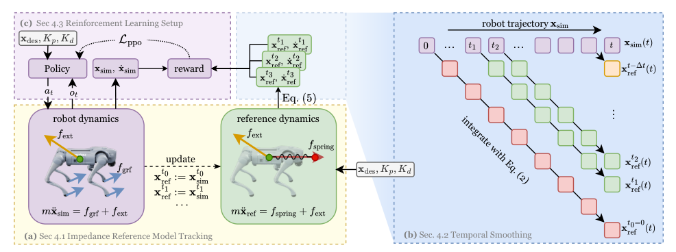

# FACET：基于阻抗参考跟踪的腿式机器人力自适应控制

速度跟踪策略面对外力时通常只知道“我偏离命令了”，于是尽力顶回去；这对抗扰站立可能有效，对人牵引、碰撞缓冲和负载拉动却会显得很硬。FACET先定义一个虚拟质量-弹簧-阻尼系统，外力作用后它应该怎样移动，再让RL策略使真实腿式机器人跟随这套参考动力学。刚度、阻尼和目标位置因此成为可调的力交互接口。

> **主要方法图：** Figure 2，PDF第4页。相同外力同时作用于机器人和参考质量-弹簧-阻尼模型；参考状态从机器人轨迹的多个起点积分，形成位置/速度跟踪目标，策略学习复现该响应。来源：[原论文](https://arxiv.org/abs/2505.06883)。

## 为什么要从多个起点积分参考模型

理想参考满足`m*x_ddot = Kp*(x_des-x)+Kd*(v_des-v)+f_ext`。若整段episode只从初始时刻开环积分，一次模型偏差会不断累积，参考状态逐渐远离机器人。FACET在机器人实际轨迹上的多个时刻重新初始化参考模型，向后积分短时目标；策略学习的是局部一致的阻抗响应，而不是追一个已经漂走的长轨迹。

指令`u=(x_des,Kp,Kd,m)`直接描述期望位置和虚拟阻抗。低刚度时，轻微外力就能牵引机器人；高刚度时，策略能对负载施加更大恢复力。扩展到带机械臂的腿式系统时，可分别给基座和末端定义参考体，实现“身体让步但手保持”“全身共同发力”等组合。

## 观测、动作、奖励和Sim2Real

student actor读取阻抗命令、关节位置/速度、投影重力和最近动作，输出关节位置目标交给PD。teacher额外看到身体速度/加速度、力矩、外力和接触等特权量。奖励核心是参考模型与机器人质心位置、速度的跟踪，并配合腿式稳定与正则项。训练第一阶段同时学习特权encoder和历史估计器，第二阶段以teacher参数初始化student，再用PPO继续优化，而不是只做行为克隆。

部署时真实机器人无法直接获得精确外力和完整基座状态，history estimator从本体观测推断特权特征；critic在训练中仍可看特权状态。这个接口比直接力命令更容易在无力传感器腿式平台上使用，但实际力只由运动响应间接形成，不能当成高精度末端力控。

## 证据范围要按本体拆开

论文在Go2四足上给出真实牵引、碰撞缓冲和拉载荷，在仿真中扩展到G1人形与B1+Z1腿式操作平台。也就是说，论文有真机证据，但主要真机量化来自四足；“框架能用于人形”目前更多是仿真外推，不能写成人形真机已经同等验证。

FACET适合表达外力下的整体顺应和可调刚度，不负责识别物体语义、规划接触序列或保证任意接触稳定。刚度范围、估计误差、PD增益和地面接触会共同决定真实闭环；评测应同时报告外力/冲量、位移、恢复时间、任务成功和碰撞峰值。截至2026-07-14，作者官方项目页未提供代码入口。

实际部署还应把虚拟阻抗命令与关节力矩、速度和支撑边界联动；参考模型允许的位移并不自动意味着机器人在该姿态下仍有足够摩擦和关节余量。

## 原文与项目

[论文原文](https://arxiv.org/abs/2505.06883) · [官方项目页](https://facet.pages.dev/)
