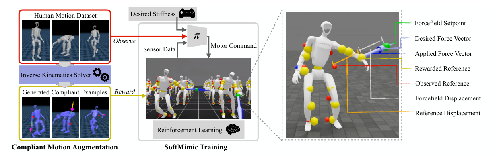

# SoftMimic：从示例学习柔顺全身控制

直接给motion tracking加随机推力，奖励却仍要求机器人回到原轨迹，最容易学出的就是更硬地抵抗。SoftMimic反过来先生成柔顺响应示例：指定外力、作用link和期望刚度，离线IK求出既偏离参考、又保持整体姿态与可行性的全身动作；RL阶段奖励策略跟踪这条增广动作，而部署时只给原始参考和刚度命令。

> **主要方法图：** Figure 2，PDF第2页。左侧离线Compliant Motion Augmentation把原动作、外部wrench与刚度转换成可行的柔顺目标；右侧策略只观察原参考和本体反馈，却按增广目标获得奖励。来源：[原论文](https://arxiv.org/abs/2510.17792)。

## 增广数据为什么比奖励权重更明确

训练先采样作用时间、手部link、刚度、位移方向和外力时序。对低刚度命令，相同外力应产生更大位移；对高刚度命令，目标更接近原参考。IK同时协调根、腿、躯干和双臂，使单手让步时机器人仍保持平衡和动作风格，并对不满足位移、力或几何约束的结果做可行性过滤。

这样“手可以偏多少、身体要不要跟随、何时回到参考”已经写进目标轨迹，不必让多个位置、力和稳定reward在训练中现场争夺。代价是离线生成管线复杂，IK定义的顺应风格和约束会成为策略上限。

## 策略实际看到什么、输出什么

策略观测包含关节位置/速度、根投影重力和角速度、最近三步动作、原始非柔顺参考姿态以及用户给定刚度。它不直接看到外部wrench或增广参考；要从关节误差、速度变化和历史动作中隐式推断自己是否被推。动作是中等PD增益下的关节位置目标，使策略可通过位置误差间接调节输出力矩。

奖励以增广轨迹的全身运动和link响应为主要跟踪对象，并加入平滑、稳定与物理正则。训练同时施加外力场和动力学/观测随机化。部署时仍输入原参考与刚度，机器人遇到未计划接触后产生类似训练示例的让步；teleoperator也可在线调刚度，而无需切换两个独立策略。

## 它解决的不是“所有接触操作”

论文在仿真和真实人形上展示碰撞吸收、不同尺寸箱体适应、负载牵引、被人推拉和柔顺倒液体。主能力是可调的力—位移响应和安全接触，不是主动决定抓哪个物体或规划开门步骤。在新框架中，它作为“安全接触”子线并入`LocoManip与物理交互`，主要贡献仍由“柔顺、抗扰、接触安全”次级标签区分。

未见link、冲击速度、柔性接触和大质量负载可能超出增广分布；低刚度也会牺牲姿态精度与力传递。使用时要画出命令刚度、实测等效刚度、接触峰值、位移和恢复时间，而不是只比较成功视频。截至2026-07-14，官方仓库已公开训练、评估和部署相关实现，并采用MIT许可证。

接触解除后的回归过程同样要验收：机器人应平滑回到原参考，而不是因增广轨迹结束突然反弹。对持续接触任务，还要检查柔顺位移是否让末端离开有效工作区。

## 原文与项目

[论文原文](https://arxiv.org/abs/2510.17792) · [官方项目页](https://gmargo11.github.io/softmimic/) · [官方代码（MIT）](https://github.com/Improbable-AI/softmimic)
