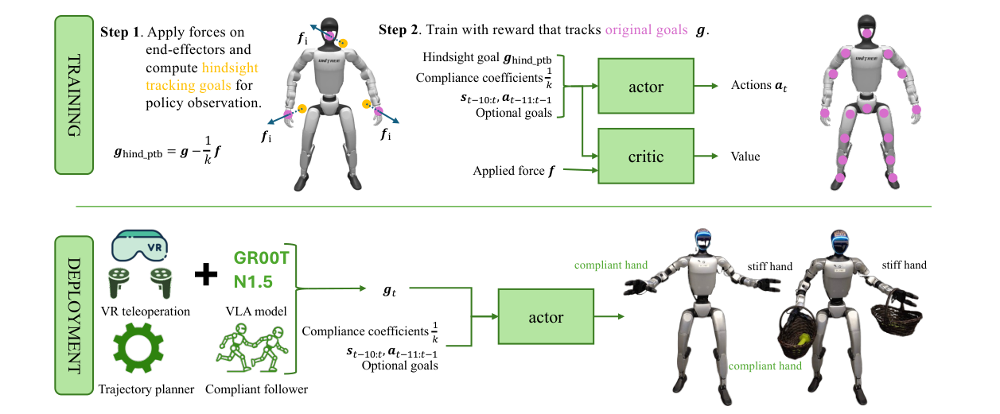

# CHIP：基于后见扰动的人形自适应柔顺控制

SoftMimic要先离线生成柔顺动作，GentleHumanoid要在reward侧积分参考动力学。CHIP找了一个更轻的切入点：训练时给末端施加外力，根据`位移=柔顺系数×力`反推出一个hindsight tracking goal，让当前受力偏移看起来像是在正确追这个新目标；reward仍对原始参考动作计算，因此无需重写密集全身目标。

> **主要方法图：** Figure 2，PDF第4页。训练侧用外力和柔顺系数在线构造hindsight关键点目标，原参考继续提供tracking reward；部署侧同一策略可接VR、运动规划器或GR00T类VLA，并在线调节双手柔顺。来源：[原论文](https://arxiv.org/abs/2512.14689)。

## Hindsight perturbation的逻辑

设原始关键点目标为`g`，施加在末端的扰动力为`f`，刚度为`k`。CHIP给策略观察的目标近似写成`g_hind = g - f/k`。策略在外力下产生偏移时，看到的是一个被反向移动过的目标；要继续获得原参考的密集tracking reward，它必须学会根据柔顺系数让出相应位移，而不是一味提高抵抗力。

关键在于只修改稀疏输入目标，不去同步编辑关节姿态、link速度、接触和全身参考。训练仍可沿用已有的motion-tracking reward，hindsight目标按当前扰动在线计算，也不需要预先存一套增广动作。与SoftMimic相比更容易扩展到大动作库，但真实柔顺响应不再由离线IK显式检查，合理性更多依赖RL探索和原跟踪框架。

## 观测、动作和三种部署接口

策略输入三点目标（头和双手）、双末端连续柔顺系数、本体与最近动作历史；local tracking版本还接收SONIC式运动规划器产生的下肢参考。策略不直接使用力传感器，而从历史本体响应和命令误差中隐式估计外力，输出关节控制动作。global三点版本用于多机器人在世界坐标下协同抓持，local版本更适合VR遥操作和相对身体命令。

部署时上层可以是VR头显、轨迹/运动学规划器或VLA。柔顺系数是显式任务参数：擦拭要持续贴面，开弹簧门需要更硬地传力，双手搬箱又需要吸收接触误差。CHIP允许左右手设置不同刚度，也能在任务过程中连续切换，而不是只提供“软/硬”两个模式。

## 为什么主分类不是LocoManip

论文展示开门、擦白板、推车、搬箱、多机器人协作和VLA任务，这些应用确实改变物体状态；但CHIP本身新增的可复用能力是末端自适应柔顺和强力接触接口，任务计划与物体目标来自外部。新框架把柔顺接口视为物理交互能力的子线，因此它归入`LocoManip与物理交互`，再用`Door Opening`、`VLA`、`Multi-Robot`与“柔顺”标签保留边界。

局限包括柔顺命令仍需人或上层模型选择，隐式外力估计会受延迟、摩擦和模型偏差影响，过软会失去负载能力，过硬会破坏接触稳定。论文与项目页有多项真机任务和量化，但截至2026-07-13官方页仍写`Code Coming Soon`，不能把项目页当成已开源实现。

开门或擦拭是否完成仍要由视觉、物体状态或任务判据反馈给上层；CHIP只保证命令给定后末端以指定柔顺性执行，不能凭本体历史判断物体语义和最终状态。

## 原文与项目

[论文原文](https://arxiv.org/abs/2512.14689) · [官方项目页与代码状态](https://nvlabs.github.io/CHIP/)
