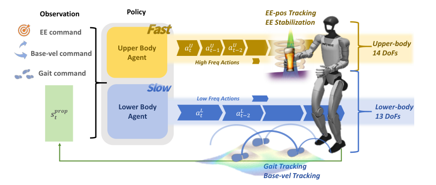

# Hold My Beer / SoFTA：柔和人形运动与末端稳定控制学习

行走时足底碰撞会把加速度一路传到手上。单个whole-body PPO既要容忍慢时标、离散接触的步态变化，又要对末端做快速精细补偿；两组reward方向和时间尺度不同，容易互相干扰。SoFTA把上肢稳定与下肢移动拆成两个共享全身观测、但动作空间、critic、reward和频率独立的agent。

> **主要方法图：** Figure 2，PDF第4页。上肢agent以高频控制14个手臂自由度，优化末端位置与加速度；下肢agent以较低频率控制13个腿/腰自由度，优化速度、步态和平衡。来源：[原论文](https://arxiv.org/abs/2505.24198)。

## 为什么“Slow-Fast”不只是工程多线程

腿式移动依赖离散落脚，动作变化太快会放大Sim2Real误差；手臂是全驱系统，可以高频连续修正末端。SoFTA让上肢策略运行在100 Hz，下肢策略运行在50 Hz，分别输出不重叠的关节位置目标。两者都能看到全身状态，因此上肢知道脚落地造成的冲击，下肢也能感知上肢补偿对身体的影响，但不会争夺同一个动作维度。

更重要的是reward和value分开。上肢关注末端位置、线/角加速度、接近零加速度以及末端坐标中的重力倾斜；下肢关注基座速度、朝向、步态和稳定。两个agent有独立actor/critic，不共享参数，只共同获得终止相关信号，避免一个critic用同一时间尺度解释“杯子瞬时晃动”和“几十步后仍没摔倒”。

## 观测、动作和命令

共同观测包含最近5步关节位置/速度、根角速度、投影重力和历史动作。目标包含平面基座速度、yaw角速度、朝向、站立/行走与步频命令，以及末端是否启用稳定、期望位置和容差等参数。总动作是27维关节目标，但14维上肢与13维下肢由两个策略在不同频率更新，再由低层执行。

这种结构不是loco-manip任务规划：它不知道杯子是什么，也不决定把杯子交给谁。它形成的是移动中的末端稳定和扰动抑制。新框架将这类“为交互提供稳定与安全接触”的能力并入`LocoManip与物理交互`；`Locomotion`、“末端稳定”和“抗扰”用次级标签标出，不把它误解为自主任务规划。

## 实机结果和适用边界

论文在Unitree G1与Booster T1展示端液体行走、末端抗推、长曝光光轨和移动相机稳定，并比较不同控制频率。作者报告相对基线的末端加速度明显下降，说明主动上肢补偿不只是“走慢一点”。评测应同时观察末端加速度、基座速度跟踪、步态质量和外力恢复，否则只优化手稳可能把移动能力牺牲掉。

上下肢硬拆也有边界：需要腰臂共同发力的搬运、手部大负载显著改变质心、或双手接触反过来支撑身体时，两个动作子空间之间耦合更强，仅靠共享观测未必够。100/50 Hz也不是通用常数，应按执行器带宽、推理延迟和本体重新验证。官方代码已公开，可检查训练配置与本体适配，而不应只复用展示参数。

若末端实际抓着物体，系统还应把夹爪状态、负载变化和任务成功交给上层；SoFTA的稳定命令本身并不知道杯中液体是否已经洒出，也不会在抓取松脱后自动重抓。

## 原文、项目与代码

[论文原文](https://arxiv.org/abs/2505.24198) · [官方项目页](https://lecar-lab.github.io/SoFTA/) · [官方代码](https://github.com/LeCAR-Lab/SoFTA)
