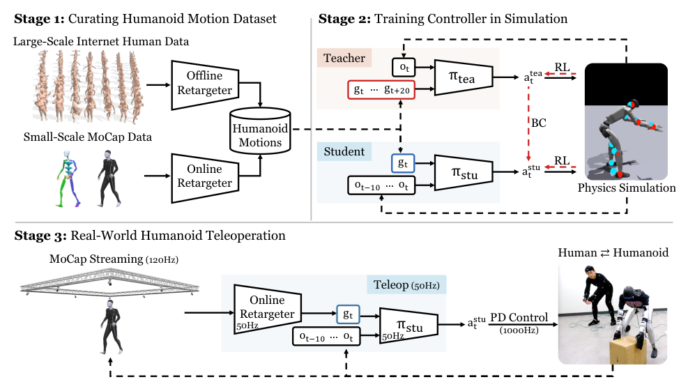

# TWIST：全身遥操作模仿系统

全身遥操作最容易被低估的地方，是把它理解成“MoCap坐标映射到机器人关节”。人体动作经过重定向以后仍可能踩不稳、关节越限或跟不上实时输入；而一个只在离线参考动作上表现良好的跟踪器，也未必扛得住在线输入的抖动、延迟和突然切换。TWIST解决的是这条完整入口链：先把人体动作整理成适合机器人学习的数据，再训练能在线跟随当前人体动作的控制器，最后把它接到真实机器人上采集全身操作数据。

> **主要方法图：** Figure 3，PDF第4页。左侧是互联网人体动作与自采MoCap数据的重定向，中间是仿真中的全身控制训练，右侧才是在线MoCap遥操作真机。来源：[原论文](https://arxiv.org/abs/2505.02833)。

## 数据先解决“机器人该学什么”

作者没有直接拿实时人体姿态训练。离线部分先将约1.5万段人体动作转成机器人参考动作，再补充约150段自采MoCap动作，让训练分布里出现在线遥操作常见的姿态、噪声和转换。重定向目标同时包含位置和朝向，而不是只对齐少数关键点；这样手臂朝向、躯干姿态和脚的方向不会在映射后丢失。这里得到的仍是参考动作，不等于动力学上已经可执行，真正的物理可行性由后面的控制策略学习。

但TWIST的主要技术产物并不是一份离线重定向动作集，而是一个在线接收人体参考、并在物理约束下实时执行的全身跟踪控制器。数据重定向是训练与在线目标生成的上游，遥操采集是它开放的下游用途。按“主要替代哪一段系统”判断，TWIST归入`Mimic动作跟踪与全身控制`，“遥操”和“数据采集”保留为次级标签。

## 为什么教师能看未来，学生却只能看现在

教师策略在PPO训练时可以观察未来约2秒的参考片段，因此有时间提前准备重心和落脚。目标中包括局部坐标系下的关节/关键刚体位置、根部速度和朝向等运动信息；本体观测包含机器人姿态、关节状态和历史动作。策略输出关节位置目标，再由PD层执行。

但在线遥操作没有可靠的未来人体动作。TWIST因此训练一个只看当前参考帧与本体状态的学生策略，并将强化学习目标和行为克隆目标合在一起：一边继续通过环境奖励学会站稳和恢复，一边用KL约束逼近有未来信息的教师。这个设计的实质不是普通蒸馏，而是把“未来不可见”当成部署接口约束，在训练阶段主动消掉。

奖励分两组。跟踪项约束关键刚体位置、关节姿态与速度、根部姿态和线/角速度；正则项限制力矩、关节速度、动作变化和脚底滑动，并用腾空时间等项维持合理步态。只提高姿态跟踪权重会让机器人更像人，却可能在迟到的参考输入下更容易失稳；只保平衡则会把上肢细节抹平，二者需要一起看。

## 真机链路里，延迟比网络结构更硬

论文中的在线链路大致是：OptiTrack以120 Hz采集人体姿态，重定向与目标更新约50 Hz，策略约50 Hz推理，底层PD约1000 Hz执行。Unitree G1完成真机遥操作，Booster T1用于仿真迁移测试。系统能覆盖行走、蹲起、手臂动作和带移动的全身模仿，并能从一部分失衡中恢复。

论文同时给出了很实际的边界：整条人体到机器人目标生成存在明显延迟，其中目标生成占据主要部分；电机连续高强度运行数分钟后会发热；系统依赖外部MoCap，尚未利用机器人第一视角或触觉来校正操作结果。它能回答“人怎样实时控制身体”，不能单独回答“物体是否抓稳”“视觉任务是否成功”。因此，TWIST采到的数据若要训练VLA或操作策略，还需同步第一视角、物体状态和任务结果，并做时间对齐与质量筛选。

## 原文、项目与代码

[论文原文](https://arxiv.org/abs/2505.02833) · [官方项目页](https://humanoid-teleop.github.io/) · [官方代码](https://github.com/YanjieZe/TWIST)
