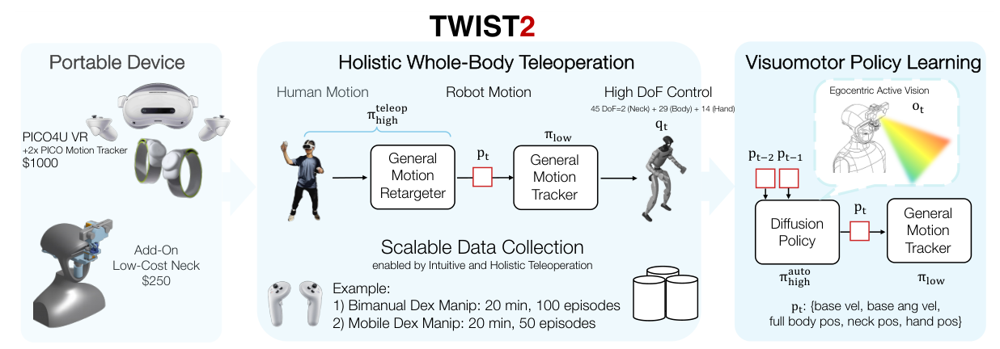

# TWIST2：可扩展、便携、全身式人形数据采集系统

TWIST证明了全身遥操作能跑起来，但外部光学MoCap决定了采集地点、布置成本和活动范围。TWIST2把问题往前推进一步：操作者只携带PICO 4 Ultra、两枚小腿追踪器等便携设备，机器人头部再加主动视觉机构，使同一套系统既能遥操作Unitree G1，也能记录与机器人视角严格同步的全身示范。它不是端到端VLA。按论文最终形成的系统能力，本库把它放入`Mimic动作跟踪与全身控制`：在线人体输入、重定向、低层tracker和真机执行构成主链，便携采集与第一视角数据是这条控制链同时产生的重要资产。

> **主要方法图：** Figure 2，PDF第4页。图中应连着看四件事：便携人体追踪、在线重定向与低层执行、机器人第一视角采集、由采集数据训练的层级视觉策略。来源：[原论文](https://arxiv.org/abs/2511.02832)。

## 便携不是少几个传感器，而是要补回不可观测状态

头显和手柄能提供头手位姿，小腿追踪器补足腿部运动，但它们不像MoCap那样直接给出完整人体骨架。系统先恢复操作者的全身姿态，再用GMR在线映射到G1，生成相对根部变换、基座线/角速度以及全身、颈部和手部目标。机器人头部采用两自由度颈部与ZED Mini，使摄像头能跟随操作者视线；论文给出的这套主动视觉硬件成本约250美元。

低层是一个通用全身跟踪器。训练数据由约7000段GMR重定向动作、约1.3万段TWIST动作以及73段PICO采集动作组成，PPO奖励同时约束目标动作跟踪、平衡与动作变化。策略输出关节位置目标并通过PD执行。这里需要分清：在线GMR解决“人体命令是什么”，RL跟踪器解决“机器人怎样在物理约束下完成命令”，二者任何一个不稳，最终数据都会带着系统性偏差。

## 采完的数据怎样进入视觉策略

作者用约15分钟收集100次成功示范，再训练层级视觉运动策略。高层Diffusion Policy读取224×224第一视角RGB和命令历史，预测全身命令块；论文设置约2秒、64步的预测区间，并在部署时以ONNX约20 Hz运行，分段执行其中一部分命令。低层跟踪器仍以约50 Hz把这些命令转成稳定关节运动。

因此，扩散模型在这里是“示范数据的消费者”，不是TWIST2的主分类依据。TWIST2最稀缺的系统价值，是让操作者的当前动作能够通过可部署tracker稳定落到机器人身上，并在同一时间轴记录操作者意图、机器人本体状态、第一视角视频和实际执行结果。这里以**Mimic全身跟踪与实时执行**为主分类，Teacher-Student、在线遥操作、主动视觉和数据采集作为技术标签；采得的数据可继续服务模仿学习、VLA或失败分析。

## 真正扩展规模前还要看三类误差

第一类是人体追踪与重定向误差：便携追踪器遮挡、漂移或腿部估计错误，会被低层策略合理化成另一种机器人动作。第二类是主动视觉误差：头部视角虽然更接近操作者意图，但快速转头会带来模糊、时延和颈部运动对全身平衡的扰动。第三类是数据质量误差：一次“任务成功”并不意味着轨迹适合学习，仍要筛查抓取滑移、碰撞、延迟和低效绕行。

论文展示了G1上的便携采集与视觉策略闭环，但没有证明系统已经覆盖任意本体、任意场景或长时任务。电机热、设备标定和传感器同步仍是持续采集的工程上限。截至2026-07-13，官方仓库已发布遥操作、控制器、部署资料和数据，仓库说明高层策略代码将单独发布，不能把当前状态写成全链路代码已齐全。

## 原文、项目与代码

[论文原文](https://arxiv.org/abs/2511.02832) · [官方项目页](https://yanjieze.com/TWIST2/) · [官方仓库](https://github.com/amazon-far/TWIST2)
