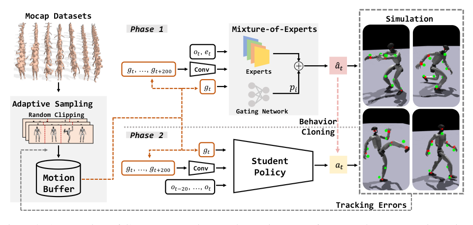

# GMT：面向人形全身控制的通用动作跟踪

全身动作库里既有缓慢站姿，也有翻滚、下蹲和快速转向。把所有动作均匀丢给一个PPO，训练预算会被大量简单片段占满，真正导致跌倒的短片段反而看得不够；再把网络做大，又会遇到不同运动风格在同一策略里互相干扰。GMT同时动了采样、策略容量和部署蒸馏三处，目标是得到一个能在Unitree G1上连续执行大范围参考动作的通用跟踪器。

> **主要方法图：** Figure 3，PDF第4页。左侧是动作数据切片和根据跟踪失败反馈的自适应采样，中间是同时读取本体、特权状态与未来参考的Motion MoE教师，右侧是使用本体历史模仿教师动作的可部署学生。来源：[原论文](https://arxiv.org/abs/2506.14770)。

## 论文框架：难片段采样、多专家跟踪与部署蒸馏

AMASS和LAFAN1动作首先经过规则筛选和预训练策略的完成率筛选，剩余8925段、约33.12小时参考。超过10秒的长动作被带随机偏移地重新切片，跟踪误差和片段完成程度再反向更新采样概率。因此数据不是均匀进入PPO：某个翻滚或急转片段一直失败时，它会被更频繁地重置和练习；已经完成的平稳站立不再长期占用大量仿真步。

每个控制周期，教师读取根部角速度、roll/pitch、23个关节的位置与速度和上一动作，还能使用仿真中的根线速度、根高度、关键身体位置、足接触、随机化参数和电机强度。参考命令包含关节位置、根部速度与roll/pitch、根高度和heading对齐后的局部关键体位置。立即下一帧保留精确短时目标，未来约2秒、101帧参考则经卷积编码成128维特征，让策略既知道“下一步要追哪里”，也知道“整段动作正在走向什么趋势”。

这些输入同时进入多个专家网络和门控网络。每个专家都给出一个23维关节目标分布，门控输出对专家的软权重，最终动作是各专家动作的加权结果。软混合让站立、下蹲、旋转和翻滚可以分享网络容量，又避免硬切换技能标签造成过渡不连续。PPO用关节、根部、关键身体位置与速度跟踪奖励训练教师，足滑、关节速度与加速度、动作变化率等惩罚抑制难以上机的拖脚和高频动作。

教师完成后，学生只读取当前与过去20步本体观测、以及相同参考命令，用DAgger在自己真正访问的状态上模仿教师的23维关节目标。历史信息用身体连续响应补偿真机不能直接获得根线速度、接触与动力学参数的缺口。部署时Motion MoE教师和特权信息退出，学生以50 Hz输出关节位置目标，由PD控制器在500 Hz仿真/底层动力学节拍上执行。

## Adaptive Sampling专门追着“学不会的片段”跑

训练动作来自AMASS和LAFAN1，先经过可执行性筛选。长动作被切成不超过约10秒的片段，并随机改变切片起点，避免困难过渡总落在固定边界。每个片段根据近期跟踪误差、失败率等训练表现调整采样概率：容易动作降低频率，难动作被反复抽到。这样做比只按动作类别平衡更直接，因为同一个动作内部也可能只有一秒真正困难。

作者以4096个并行环境累积约68亿训练样本。这个规模不能简单理解为“数据越多越好”：Adaptive Sampling的价值正是把仿真步数从重复成功动作转向失败边界，否则再多并行环境也可能只是在放大数据偏置。

## Motion MoE和学生策略分别解决什么

教师采用软路由的Motion Mixture-of-Experts。门控网络根据当前运动目标与状态对多个expert加权，最终动作是各expert输出的加权组合，而不是先把动作硬分成若干类别。这样不同动态模式可以拥有局部容量，过渡区又能平滑混合。教师用PPO训练，并可读取仿真中的特权信息。

参考目标包含23个关节位置、基座线/角速度、基座roll/pitch、根部高度，以及heading对齐后的局部关键刚体位置；未来约2秒的参考帧被压成128维latent，再与当前参考和本体观测共同输入。策略输出关节位置目标，由PD层执行。奖励围绕关节、根部和关键刚体跟踪，并配合稳定、能耗、平滑和接触正则；训练失败不只看单帧姿态误差，还要看动作片段是否持续可跟踪。

部署端不保留所有教师特权信息。GMT通过教师—学生蒸馏，让学生根据可获得的本体状态和参考命令复现教师行为，最终在G1上执行。这里的“行为克隆”不是从人类示范直接学关节动作，而是把仿真教师压到可部署观测接口。

## 它是通用执行器，不是自动生成动作的上层模型

GMT可以串联较长的技能序列，也能覆盖多种敏捷动作，但参考运动仍由外部提供。它不从语言、图像或物体目标决定下一步动作，也不解决人体到机器人重定向是否正确。完整系统中，它位于“动作数据与目标已经准备好”之后，负责把参考稳定变成真实机器人行为，所以主分类为`Mimic动作跟踪与全身控制`。

可复现性还应按组件拆开看。截至2026-07-26，官方仓库提供推理、检查点和MuJoCo/Sim2Sim入口，数据处理与重定向代码尚未发布。论文中的训练规模、动作筛选和自适应采样若没有完整数据管线，不能仅凭已发布checkpoint反推完整训练结果。方法也依赖经过筛选的物理可行动作；面对带物体约束、场景接触或从未见过的极端动力学，仍需要新的目标表示和训练覆盖。

## 原文、项目与代码

[论文原文](https://arxiv.org/abs/2506.14770) · [官方项目页](https://gmt-humanoid.github.io/) · [官方仓库](https://github.com/zixuan417/humanoid-general-motion-tracking)
