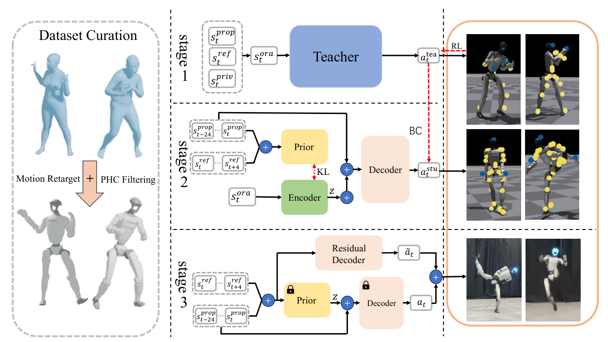

# UniTracker：面向人形机器人的通用全身动作跟踪器

训练一个“覆盖所有动作”的跟踪器有两个不同问题：其一，仿真教师能看到完整根状态，但真机只能依赖部分观测；其二，即使完成蒸馏，少量快速、倒地或强耦合动作仍可能被统一策略平均掉。UniTracker没有把这两件事混成一次训练，而是拆成特权教师、CVAE-DAgger蒸馏和残差适配三阶段。

> **主要方法图：** Figure 2，PDF第3页。左侧动作先经重定向和PHC可行性过滤，然后进入高质量特权教师；中间用CVAE与DAgger把教师动作蒸馏到部署观测；右侧在通用策略上增加轻量残差解码器，处理仍然失败的高动态参考。来源：[原论文](https://arxiv.org/abs/2507.07356)。

## 论文框架：特权教师、部分观测蒸馏和困难动作适配

动作数据来自AMASS。系统先排除人体—物体交互和过短片段，再用PHC规则过滤不适合物理执行的序列，最终保留8179段动作。人体动作通过16个人机对应身体做两步重定向：先调整SMPL体型使静态肢体比例接近G1，再逐帧优化机器人根位移、根旋转和关节角，并用正则项抑制激进变化和时间抖动。因此后续策略跟踪的是机器人参考，不是直接把SMPL角度送入Actor。

oracle教师用goal-conditioned PPO训练，能读取仿真中每个刚体的位置、方向、线速度和角速度，以及关节状态与上一动作。目标是当前状态与下一帧参考的局部差值。这种输入让教师可以直接看到哪个身体偏离了多少，用关键点、足位置、身体旋转、关节位置与速度、身体线/角速度跟踪奖励建立动作质量上限。动作变化率、力矩和足滑惩罚随课程逐步加入，避免训练初期在还不会跟踪时就被强正则压制。

策略输出23维目标关节位置，经PD执行。原始G1配置中的部分手腕自由度在实验设置中固定，因此不能把“23维策略”直接当成所有G1全身配置的统一接口。第一阶段追求的是运动质量上限，不等于已经可以无修改部署。

## CVAE不是用来凭空生成动作，而是保存被遮住的运动意图

第二阶段的关键困难是部分观测会丢掉全局平移、朝向和未来趋势。UniTracker用条件VAE做教师—学生对齐：训练时，encoder看到完整观测，prior只看到部署时可获得的部分观测；KL约束让两者潜变量分布靠近，decoder再由潜变量和当前状态产生动作。论文报告64维latent取得较好折中。

数据不是一次性由教师离线生成。DAgger让学生在自己的状态分布里滚动，再请求教师给出纠正动作，减少学生稍微偏离以后越走越远的问题。训练时的CVAE encoder读取与教师相同的完整观测，让潜变量保留全局运动意图；conditional prior只读取真机可得的25步本体历史和5步未来参考，KL损失迫使它逼近encoder的潜分布。decoder再用潜变量和当前可部署观测输出23维关节目标，动作重建损失直接对齐教师动作。

真机部署时，看到特权状态的encoder和oracle教师都退出，只保留conditional prior和action decoder。prior从部分观测估计64维潜在运动意图，decoder将它转为关节位置目标，PD控制器再驱动G1。这样，latent承载的是“从当前部分观测推断接下来怎样保持运动意图”，而不是上层语言动作token。论文未明确披露真机策略与PD的运行频率，不应根据相邻工作补写。

## 第三阶段到底算不算“快速适配”

对统一策略仍跟不住的动作，作者冻结通用prior和decoder，只用与部署策略相同的本体与参考输入训练一个残差decoder。它不再读取CVAE latent，而是直接对固定通用动作加一个关节目标修正，并使用与教师阶段相同的跟踪奖励做强化学习。它能在较少更新中补偿特定困难序列，比从头训练一个专用策略快，同时冻结主体避免原有大范围能力被新序列覆写。

但这里的适配要准确理解：它是针对选定困难序列或小批运动继续优化，不是遇到任意新动作都能零样本完成。真实部署仍需要参考动作、状态估计、关节PD和本体安全层。论文在Unitree G1上展示仿真与真机动作跟踪，并声称覆盖大规模动作集；截至2026-07-26，作者官方项目页未提供代码入口，因此当前结论是“未开源”。

UniTracker最终输出的是稳定全身跟踪行为，故归入`Mimic动作跟踪与全身控制`。PHC过滤负责上游参考的物理可行性，CVAE和残差适配是执行层内部方法；它没有解决物体接触语义、任务规划或从视频恢复人体动作。

## 原文与项目

[论文原文](https://arxiv.org/abs/2507.07356) · [官方项目页](https://yinkangning0124.github.io/Humanoid-UniTracker/)
