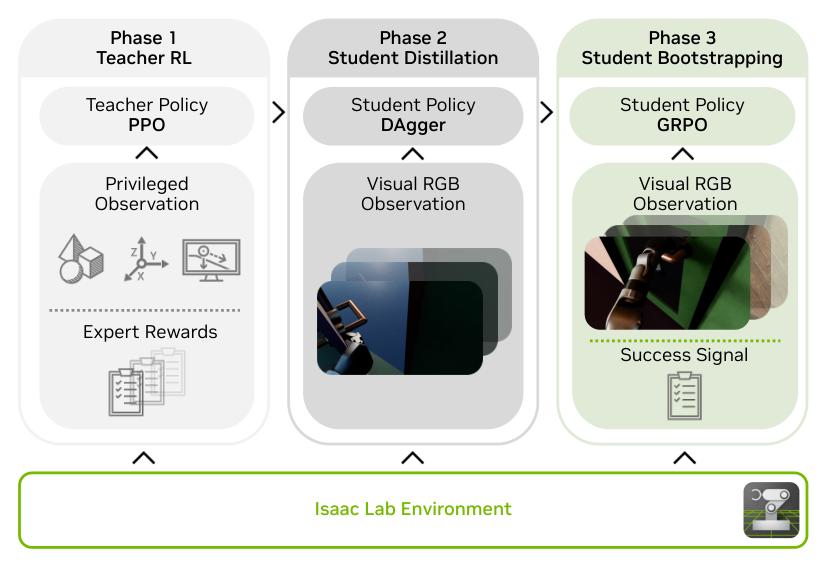

# DoorMan：面向人形像素到动作策略Sim2Real迁移的开门系统

门任务把视觉Sim2Real的薄弱环节集中到一起：把手小、门型多，抓住以后还要开锁、推或拉、侧身通过；机器人自身动作又会遮住把手，门板运动还会反过来改变接触力。DoorMan的目标不是给现成开门轨迹做跟踪，而是从机载RGB直接闭环输出全身与手部控制目标，让G1完成陌生门体上的完整交互。

> **主要方法图：** Figure 2，PDF第4页。特权教师解决探索，RGB学生通过DAgger接管可部署观测，最后再用GRPO和二值成功信号补上视觉闭环中的主动观察与恢复行为。来源：[原论文](https://arxiv.org/abs/2512.01061)。

## 第一阶段：用任务阶段和重置快照把探索拆开

教师策略能看到门体位姿、铰链/锁舌状态、接触力、根速度等仿真特权状态，并通过PPO学习。门任务被拆成接近、抓取、转把手、解锁、推拉、穿门等阶段，各阶段使用对应距离、姿态、接触与进度奖励。训练还保存中间成功状态作为staged-reset快照，使策略不必每次从门外重新探索到最难的后半段。

教师输出全身和手部目标，经预训练whole-body controller接到底层关节执行。论文正文对高层动作维数的表述存在算术不一致，因此这里不引用该可疑数字；可以确认的是接口同时覆盖身体与手部目标，而稳定站立、移动和关节PD仍由WBC承担。

## 第二阶段：RGB学生学的不是图像分类，而是闭环接触动作

学生只接收RGB与可在真机获取的本体状态，例如关节位置/速度、根角速度和历史信息，并用LSTM保留短期上下文。训练采用DAgger：学生按自己的预测在仿真中执行，教师在学生实际到达的状态上提供监督。这样当视觉误差让手偏离把手时，数据里会出现“怎样从偏离状态回来”，而不是只有完美专家轨迹。

环境随机化覆盖门型、把手和锁舌、铰链方向、材质、灯光、相机和动力学参数。它的目的不是让图像看起来多样，而是迫使策略从视觉中识别与动作真正相关的结构，并减少特定门模型泄漏。

## 第三阶段：为什么还要GRPO

模仿教师容易学到“能开门”的平均动作，却未必会主动侧头保持把手可见，也不一定能从短暂丢失目标后恢复。DoorMan继续在交互仿真中使用GRPO，以任务是否完成为主要信号，并保留关节速度、加速度和动作变化等正则。相对同组样本的比较让稀疏成功信号可以继续改善学生策略，重点补足视觉闭环行为，而不是重新发明低层平衡。

部署时，视觉策略约50 Hz运行并给WBC/关节控制发送目标，底层PD负责高频执行。论文在多类真实门上报告约83%的总体成功率，并给出人在相同WBC接口下的遥操作基线；这说明策略不只是复现一个门，但仍不能外推到任意把手、受损门或拥挤场景。真实失败还可能来自手部摩擦、相机曝光、门铰链参数和遮挡，而这些变量在仿真里很难完全覆盖。

DoorMan最终改变了铰接物体状态并穿过门，所以主分类为`LocoManip与物理交互`。RGB、DAgger、GRPO和Sim2Real只是形成这项物理能力的路径。截至2026-07-13，论文、项目页与NVIDIA官方代码仓库均可核验。

## 原文、项目与代码

[论文原文](https://arxiv.org/abs/2512.01061) · [官方项目页](https://doorman-humanoid.github.io/) · [官方代码](https://github.com/NVlabs/GR00T-VisualSim2Real)
