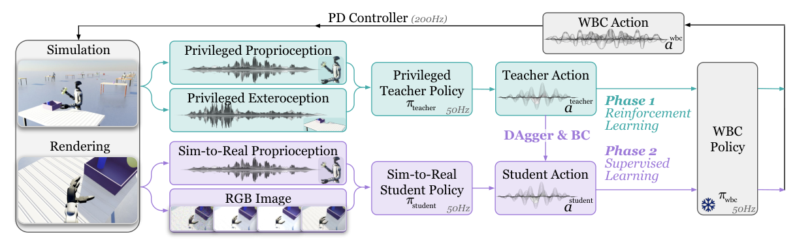

# VIRAL：面向人形移动操作的大规模视觉Sim2Real

从RGB直接学人形移动操作，最危险的做法是让视觉网络同时承担目标识别、抓取阶段判断、全身平衡和每个关节的快速控制。VIRAL把职责切开：特权教师在仿真里用完整任务状态学会搬运，视觉学生只模仿教师的中层命令，已有WBC继续负责稳定身体。这样可以把大量视觉交互训练留在仿真中，并把真机接口控制在WBC已经验证过的命令空间内。

> **主要方法图：** Figure 2，PDF第2页。教师读取对象和任务的完整状态，学生只看RGB与可部署本体状态；二者输出相同的WBC命令，因此DAgger和BC监督不需要直接对齐高频关节力矩。来源：[原论文](https://arxiv.org/abs/2511.15200)。

## 教师怎样把长任务拆成可学习进度

教师观测包含基座线/角速度、投影重力、关节状态、上一步动作、指尖力，以及物体、桌面和任务阶段等特权信息。动作是平面移动与转向增量、双臂关节增量和手指命令，再交给HOMIE whole-body controller。也就是说，教师决定“朝哪走、手臂怎样靠近和抓放”，WBC决定“怎样保持平衡并执行”。

训练用PPO，奖励按任务阶段组织：接近目标、放置身体、抓取与抬起、运输、放下或转向分别提供进度信号。作者还从约200条仿真遥操作示范中抽取参考状态初始化，让并行环境能够直接从任务中段开始，减少从零探索抓取接触的浪费。这个示范只帮助初始化与分布覆盖，并没有把方法变成纯行为克隆。

## 学生为何同时用DAgger和BC

视觉学生读取RGB和真机可获得的本体观测，视觉编码器提取场景信息，再输出与教师同构的WBC命令。BC利用已有专家轨迹学习基本行为；DAgger让学生在自己的闭环轨迹上运行，并由教师给学生已经偏离后的状态标注动作。前者提高样本效率，后者专门处理视觉误差累积和接触后状态偏移。

规模化训练依赖大量并行渲染和计算资源。论文报告教师训练使用多GPU，视觉学生进一步扩展到更多GPU，并通过平铺渲染提高吞吐。随机化包括材质、光照、相机外参、动力学、控制延迟和执行噪声；手部参数还经过系统辨识。这里的“at scale”主要指仿真视觉数据和并行交互规模，不等于收集了同规模真实数据。

## 部署接口与证据边界

教师和学生策略约50 Hz更新WBC命令，WBC约50 Hz运行，底层PD约200 Hz执行。论文在Unitree G1上展示拣取、搬运和放置，并报告连续最多54个任务循环，且不使用真实数据微调。长时连续运行很有价值，因为它暴露的不是一次成功率，而是视觉误差、抓取偏差和身体漂移是否会累计。

但闭环并没有消除上游假设：物体与场景类型仍受训练分布约束，真实相机标定、手指摩擦和任务布置需要与仿真假设接近；策略还依赖成熟WBC和稳定手部硬件。它也没有语言层的开放任务推理。VIRAL之所以归入`LocoManip与物理交互`，是因为最终能力是持续改变外部物体状态；视觉Sim2Real、教师—学生和大规模仿真都是实现手段。

## 原文、项目与代码

[论文原文](https://arxiv.org/abs/2511.15200) · [官方项目页](https://viral-humanoid.github.io/) · [官方代码](https://github.com/NVlabs/GR00T-VisualSim2Real)
