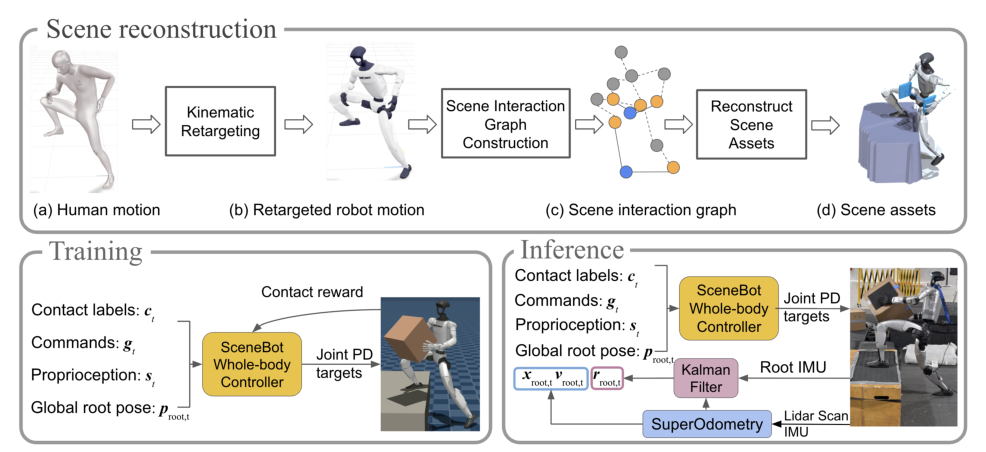

# SceneBot：接触提示的场景交互人形全身跟踪

普通motion tracking只告诉机器人身体应到什么姿态，却没有说明脚应踩台阶还是跨过去、手是经过箱子旁边还是要把它托住。仅凭人体运动学轨迹，场景接触存在多解。SceneBot从人—场景运动中恢复接触关系，把接触标签作为prompt交给全身跟踪策略，使同一控制器既能处理地形支撑，也能处理搬箱等物体交互。

> **主要方法图：** Figure 2，PDF第4页。流程从重定向运动建立机器人—场景交互图，反推地形与物体，再用动作和接触共同训练；真机侧依赖SuperOdometry与IMU提供根状态。来源：[原论文](https://arxiv.org/abs/2606.27581)。

## 先从运动里反推场景，而不是手工搭每个任务

数据来源包括AMASS、OMOMO、BEHAVE/Bones类交互数据和LAFAN等人体运动。人体动作先重定向到机器人，再根据手腕、脚、骨盆与候选场景节点之间的相对距离、速度、加速度和时间连续性，建立robot-scene interaction graph。持续接近且相对运动一致的部位被判断为可能接触。

场景随后按接触关系重建：脚部接触可形成2.5D高度地形，手部和身体接触可放置板状或箱状物体。这个过程不是精确恢复原始三维场景，而是构造一个能解释动作接触的物理训练环境。它把大量只有运动或粗场景信息的数据，转换为“动作参考 + 接触提示 + 可交互资产”。

## 接触prompt怎样进入控制器

策略输入当前接触标签、参考命令、本体状态和根状态。参考中包含下肢目标关节/速度、头部与手腕在根坐标系下的目标位姿，以及全局根误差；本体观测包含关节位置/速度、投影重力和根角速度等。策略输出关节动作并通过低层控制执行。

奖励不只追踪动作，还按接触prompt检查应该接触的身体部位是否在正确场景位置形成接触，从而区分“姿态很像但脚悬空”和“手经过箱子但没托住”。接触标签是条件，不是策略自己从语言或视觉推断出的任务计划；上层系统仍需决定什么时候携物、踩哪里以及接下来切换什么动作。

## 真机不是只靠关节编码器

SceneBot真机部署在Unitree G1上，论文展示复杂地形通过和携箱场景，并报告约7.5小时动作数据。为了计算全局根误差和场景相对位置，系统使用SuperOdometry与机载LiDAR/IMU估计根位置、朝向和线速度。若定位漂移或场景几何与重建训练环境差别过大，接触prompt再准确也可能指向错误位置。

它的主分类放在`LocoManip与物理交互`，是因为代表实验不止生成身体动作，而是通过场景接触跨越地形并搬动物体；`Motion Tracking`和`复杂地形`保留为标签。局限也很明确：场景资产与接触模型是简化重建，高层仍要提供接触标签，动态物体和精细手部接触没有被统一解决。截至2026-07-14，官方项目页将代码和数据明确标为`Coming Soon`，当前尚未开源。

评测应把接触标签准确率、目标部位接触率、物体终态、全局定位误差和整段成功率一起报告。否则即使跟踪分数较高，也可能只是身体贴近场景而没有形成正确支撑或搬运结果。

## 原文与项目

[论文原文](https://arxiv.org/abs/2606.27581) · [官方项目页](https://ericcsr.github.io/scenebot/)
