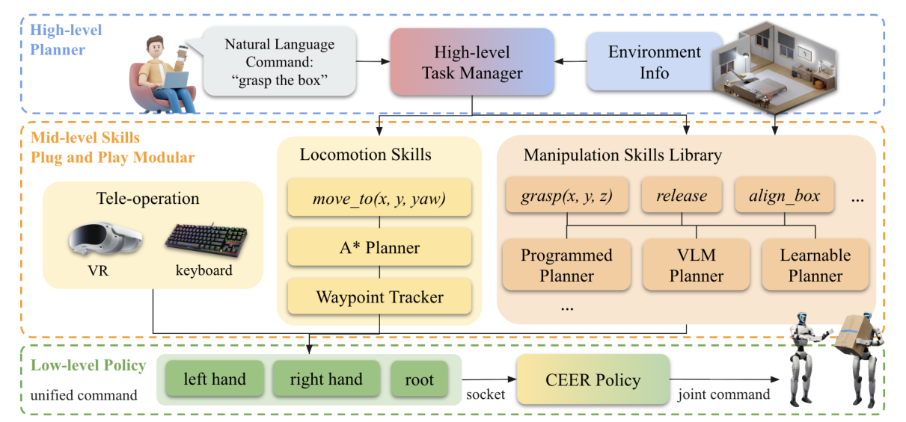

# CEER：面向分层人形移动操作的柔顺末端与根部统一控制接口

长时loco-manip系统通常由语言规划、导航、操作策略和低层控制拼起来。最脆弱的接口，是每个上层模块都输出不同格式，甚至直接生成整套关节轨迹：本体一换、接触刚度一变，所有技能都要重做。CEER提出统一的EE-root命令，把根部运动与双末端位姿作为中层协议，再由一个带柔顺性的全身策略转换成关节动作。

> **主要方法图：** Figure 2，PDF第4页。高层LLM技能管理器只负责组合任务，中层遥操作、脚本、规划器、VLM或扩散技能都输出同一种EE-root命令，CEER在低层统一执行。来源：[原论文](https://arxiv.org/abs/2605.19981)。

## 这个接口具体保留了什么

EE-root命令由根部平移与yaw，以及左右末端的位置和朝向组成，总计16维任务空间目标。它不要求上层知道每个关节怎样配合，也不会把根部移动和手臂动作彻底割裂。对上层而言，同一个技能可以来自VR遥操作、解析脚本、路径规划、VLM或diffusion policy；对下层而言，输入格式不变，策略统一解决可达性、平衡与全身协调。

这种设计比“任意目标都能执行”保守得多。命令仍应位于机器人可达范围，碰撞、视野和任务逻辑仍由中高层负责。CEER只是把容易跨模块复用的意图压到一个较低维、物理可解释的接口。

## 柔顺性怎样进入跟踪目标

作者先从AMASS动作构造全身跟踪数据，并在训练中施加外力。末端目标根据期望阻抗关系修正：外力越大，允许的位姿偏移由刚度决定，从而让策略学会接触时让步，而不是死追几何目标。教师可观察完整关节目标、执行器状态和外力等特权信息；学生只看投影重力、根角速度、关节与历史动作，以及EE-root命令。

教师—学生蒸馏把特权接触信息压入可部署策略，额外的关节目标估计器帮助学生形成中间结构。最终输出仍是关节动作。奖励需要同时看根部和末端跟踪、全身姿态、平衡、接触响应、动作平滑和能耗；只追末端精度会把策略推回高刚度，只有柔顺又会牺牲任务完成。

## 三层系统中，CEER能修复什么、不能修复什么

高层根据语言和环境信息选择技能，中层模块产生EE-root轨迹，低层CEER执行。论文在Isaac Lab训练，经RoboJudo部署，并支持PICO遥操作；真机实验展示接触遥操作和末端控制，论文报告约3.3 cm末端误差与较低jerk。房间级长任务组合更多在仿真中评估，成功率最高约70%，说明统一接口减少了模块不兼容，但不会自动修复感知错误、路径规划失败或错误技能选择。

CEER同时具有柔顺控制属性，但主分类仍是`LocoManip与物理交互`：它最终服务的是上层技能如何稳定改变环境，并把多种中层模块接到同一个全身执行器。若研究问题只关心外力响应和人体安全，而不涉及物体任务，才应以柔顺抗扰为主轨。截至2026-07-14，官方仓库只公开定制G1的最小Sim2Sim部署路径，没有完整训练管线，因此标为“部分开源”。

## 原文与项目

[论文原文](https://arxiv.org/abs/2605.19981) · [官方项目页](https://robotproject8.github.io/ceer_page/) · [最小Sim2Sim部署代码](https://github.com/stevenryanrobot/ceer_deploy)
