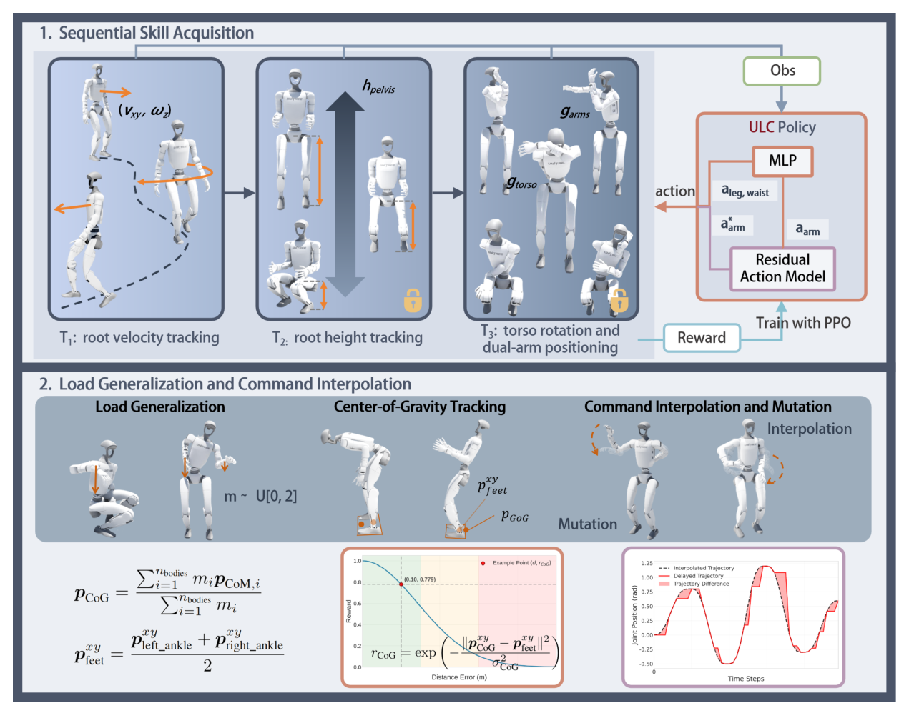

# ULC：面向人形移动操作的统一细粒度控制器

人形操作经常把腿和手臂拆成两个控制器：腿按速度走，手臂按关节目标动。轻载时勉强可用，一旦机器人弯腰、转体、举重物或边走边操作，上下身会共同改变质心与角动量，独立控制器开始互相打架。ULC用单一策略同时接收根部速度、高度、躯干朝向和双臂命令，让全身协调在同一强化学习目标中形成。

> **主要方法图：** Figure 2，PDF第5页。图中四块分别是统一命令空间、顺序技能课程、双臂残差动作，以及面向负载和真机时延的训练增强。来源：[原论文](https://arxiv.org/abs/2507.06905)。

## 论文框架：用单一策略逐步学习根运动、躯干与双臂命令

ULC把上层可下发的全身目标整理成统一命令空间。根部命令包含平面线速度、偏航角速度和身体高度，躯干命令描述身体旋转，双臂命令给出目标关节姿态。策略同时读取当前与历史本体观测，包括关节位置与速度、基座角速度、投影重力和上一时刻动作。当前观测说明机器人此刻姿态，历史观测帮助策略判断负载变化、控制延迟和身体运动趋势；论文没有披露一个可核验的固定历史维度，因此不根据图示之外的信息推算。

Actor输出所有驱动关节的目标位置，底层控制器使用PD并加入前馈力矩补偿。双臂动作不是完全覆盖上层命令，而是在基础手臂目标上叠加策略学习的残差。基础目标保留“上层希望手臂摆到哪里”的语义，残差允许策略在搬运负载、身体倾斜或行走扰动下做小幅动力学修正。若策略直接自由生成全部手臂动作，可能为了平衡而偏离任务；若完全照抄上层目标，又无法补偿手臂运动对质心和支撑的影响。

训练没有从一开始同时随机所有命令。第一阶段先学习根速度跟踪，策略稳定移动后再加入身体高度，随后逐步解锁躯干姿态和双臂动作。每一阶段达到设定的奖励门槛才进入下一阶段，并在后续训练中继续保留已经学过的命令。这样的顺序避免速度、高度、躯干和手臂奖励在策略尚未学会站立时互相竞争，也减少新命令引入后对已有步态的破坏。

PPO根据各类跟踪奖励和稳定性约束更新同一个Actor。速度、高度、躯干和手臂分别有目标误差，投影重力、足端接触、动作变化和关节状态限制异常姿态与高频控制。负载训练随机改变物体质量和质心，并加入机器人整体质心靠近支撑区域的奖励。这个质量加权质心目标让策略在双臂前伸或负载偏置时主动移动骨盆和脚步，而不是只把手臂拉回参考。

上层命令在送入策略前使用一秒的五次多项式插值，起止速度与加速度为零，避免关节目标瞬间跳变。训练还会为不同关节随机注入并累积控制延迟，使策略见过命令到达时间不一致的情况。真实系统中的通信和执行器延迟因此不会被简化成所有关节同时滞后一个固定周期。PD执行后的关节与机身反馈重新进入历史观测，构成“全身命令 → Actor与手臂残差 → 关节目标 → PD及机器人 → 本体历史”的闭环。

## 物理交互能力与上层系统的边界

ULC的输入已经是结构化全身命令，不包含原始图像、物体检测结果或自然语言。遥操作、视觉规划器或VLA可以生成这些命令，但识别物体、选择抓取点、判断接触是否成功和失败后重新规划不属于ULC。它解决的是命令给定后移动、弯腰、转体和双臂动作怎样在一个低层策略中协调。

论文在带三自由度腰部的Unitree G1上展示抱持、开冰箱和负载操作，并评估约2 kg腕部负载。遥操作命令预处理报告为100 Hz，但论文没有披露策略推理和底层控制的统一频率，也没有完整列出Critic是否使用额外特权观测。官方项目页及仓库截至2026-07-26仍只有`Code Coming Soon`与README，不能从官方实现进一步核对这些边界。

单一策略减少了上下身接口冲突，却不能替代物体感知和任务状态机。评测除命令跟踪外，还应检查抓取是否保持、物体是否达到目标状态、足端是否滑移，以及关节力矩和热状态是否越界。

## 原文与项目

[论文原文](https://arxiv.org/abs/2507.06905) · [官方项目页](https://hellod035.github.io/ULC/) · [官方仓库（截至2026-07-26仅README）](https://github.com/Hellod035/ULC)
