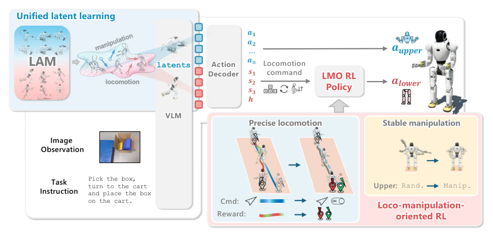

# WholeBodyVLA：面向全身移动操作控制的统一潜在VLA

多数机器人VLA默认相机和机械臂基座基本固定，人形机器人却要在大空间中一边移动一边操作。若直接让VLM从视频预测所有高频关节目标，数据规模、时序长度和稳定性都会迅速失控。WholeBodyVLA把动作压成统一潜变量，再将上层解码出的移动命令交给专门的locomotion policy，把“任务决定”与“身体稳定执行”明确分频。

> **主要方法图：** Figure 2，PDF第5页。无动作标注的人类第一视角视频先训练潜动作模型，潜变量监督VLM；运行时VLM约10 Hz解码双臂与离散移动命令，LMO强化学习策略以50 Hz执行身体移动。来源：[原论文](https://arxiv.org/abs/2512.11047)。

## 无机器人动作标签的视频怎样变成监督

作者先分别从操作视频和带移动的第一视角视频训练latent action model。LAM采用VQ-VAE式离散潜变量：根据相邻视觉片段推断导致画面变化的潜动作，并由decoder重建或预测动作相关变化。这样，人类视频不需要机器人关节标签，也能产生离散动作token，作为后续VLM的统一监督。

移动侧使用约300小时第一视角视频，操作侧利用AgiBot World等数据。两个来源的身体结构和控制频率并不相同，因此latent表示承担的是“画面变化对应什么操作/移动意图”，而不是直接复制人体关节。随后再用机器人遥操作数据微调动作decoder，把潜token落到AgiBot X2可执行的双臂关节目标和离散移动命令。

## 低层LMO为什么必须单独训练

运行时，第一视角图像与语言指令进入VLM，模型生成潜动作token；decoder约10 Hz输出双臂动作和前进、转向、蹲起、站立等离散移动命令。LMO策略以约50 Hz读取移动命令、基座角速度、投影重力、关节状态和历史动作，并输出PD关节目标。它通过强化学习学习准确启停、方向跟踪、站立稳定和扰动恢复。

这个频率与接口分工很关键：VLA负责“接下来做哪种全身动作”，LMO负责“每20毫秒怎样不摔”。若上层视觉推理短暂抖动，低层仍维持平衡；若VLA发出错误任务命令，LMO不会替它理解场景，但可将错误限制在经过训练的命令集合里。

## 统一潜动作的价值和风险

统一latent让移动视频与操作视频能共同训练VLM，也让语言条件可以在同一序列中切换走近、转身、双臂操作等能力。论文在AgiBot X2上展示大空间移动操作和真机闭环，说明上层潜动作与低层LMO接口能够工作。

但这不等于已经得到通用人形Agent。论文仍把长时规划、精细灵巧操作、记忆和主动感知列为限制；离散移动命令也牺牲了一部分连续全身意图。人类视频中的潜变量可能混入相机运动、身体差异和不可执行动作，必须依靠机器人数据微调与低层控制约束。WholeBodyVLA的主贡献是视觉语言侧的统一潜动作学习和技能调用，因此归入`世界模型VLA与Agent`，LMO则是它调用的身体接口。

截至2026-07-13，官方项目与资源仓库可访问，但仓库明确说明尚无完整代码开源时间表，不能标成“已开源可复现”。

## 原文、项目与发布状态

[论文原文](https://arxiv.org/abs/2512.11047) · [官方项目页](https://opendrivelab.com/WholeBodyVLA/) · [官方资源仓库](https://github.com/OpenDriveLab/WholebodyVLA)
