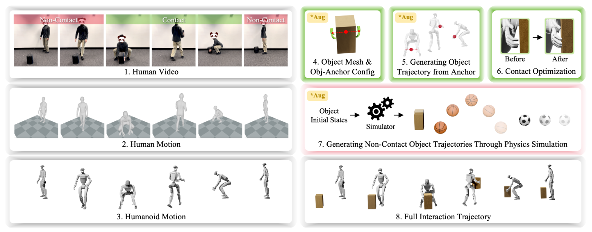

# HumanX：基于人类视频的敏捷可泛化人形交互技能

人形机器人模仿普通舞蹈时，参考里只有身体；模仿投篮、接球或搬箱时，参考还必须说明物体何时接触、接触在哪里、离手后怎样运动。HumanX的价值在于把一段单目人类视频拆成可编辑的数据生成过程，再用统一的XMimic训练交互策略。它解决的首先是交互数据入口，而不是发明一个只服务篮球的任务奖励。

> **主要方法图：** Figure 2，PDF第3页。图中XGen从人类视频恢复SMPL动作并重定向到机器人，再分别处理接触段与非接触段，最后拼出完整交互轨迹。来源：[原论文](https://arxiv.org/abs/2602.02473)。

## XGen怎样把视频变成“可训练的数据”

第一步是从单目视频恢复人体动作，再按G1形态做重定向。关键变化发生在物体侧：作者先把视频切成接触与非接触阶段。接触阶段选一个人体锚点，例如双掌中点，估计物体网格及其相对锚点的位姿；锚点随人体运动后便得到物体参考轨迹，再用force-closure/contact optimization修正机器人姿态，使手和物体的接触在几何上更可信。

非接触阶段不能简单复制视频中的抛物线，因为单目估计误差会直接污染训练。XGen把初始物体状态放入物理仿真，让重力、碰撞和初速度生成轨迹。物体尺寸、网格、初态和飞行轨迹都能增广，接触段与非接触段经过插值后组成完整样本。这样，一段示范不再只对应一条固定轨迹，而能扩成一簇保留交互结构的训练分布。

## XMimic学的是交互，不是逐帧背动作

XMimic先训练读取特权身体与物体状态的teacher，再把多个teacher蒸馏到可部署student。student只保留本体感知和可选物体观测，目标由PPO与behavior cloning共同构成。统一奖励同时约束身体、物体、身体与物体的相对关系、接触和动作正则，其中身体自然度还使用AMP项。

部署有两种边界。无需外部感知的模式只靠本体历史，适合投篮、运球等接触后可开环完成的动作，却不能可靠处理飞来物体；MoCap模式提供实时物体位姿，并在训练中模拟遮挡丢帧。论文在Unitree G1上展示10种技能、5类任务和持续传接球，但这并不等于已解决开放环境视觉感知。它证明的是：经过XGen扩增的交互分布，加上不输入phase/reference的student，能比记忆单条参考更好地泛化。

控制策略输出全身关节目标，接触是否发生、物体是否沿目标轨迹运动以及机器人是否保持稳定共同进入训练和验收。无外部物体观测时，策略只能利用接触后的本体响应和动作历史推断交互进度；球飞行期间不存在可校正反馈，所以初速度误差会直接累积。带MoCap模式能闭环修正物体位姿，但仍需处理丢帧、坐标延迟和身份切换。失败恢复应按技能定义，例如接球错失后停止追踪、搬箱滑移后卸力，而不是继续播放剩余参考。

因此本库把HumanX放在`LocoManip与物理交互`：XGen解释了视频如何被编译成物理交互数据，但论文最终形成并在G1上验收的是XMimic交互策略。若未来单独发布、维护XGen数据集或批量生成平台，可把该数据资产登记到训练数据系统，但不改变本论文的唯一主分类。

复现时应保留人体恢复、机器人重定向、接触优化、物体仿真和策略rollout五层中间结果，并分别报告接触时序误差、物体终态误差与真机成功率；否则无法判断扩增到底修复了哪一段链路。

## 原文与发布状态

[论文原文](https://arxiv.org/abs/2602.02473) · [官方项目页](https://wyhuai.github.io/human-x/)

截至2026-07-13，项目页的Code入口指向不可用地址，不能标成已开源复现。
