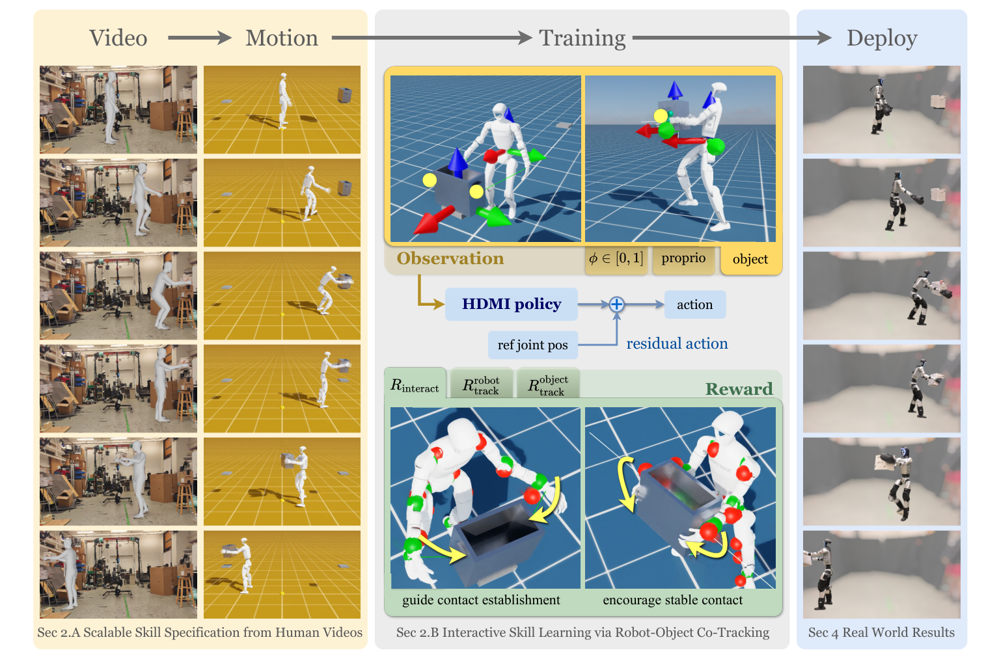

# HDMI：从人类视频学习交互式人形全身控制

把人体动作重定向到机器人，只能回答“机器人怎么动”。开门、搬箱和挪凳还要求物体按正确方式被改变。HDMI把问题改写为robot-object co-tracking：策略不只追身体参考，还要让物体状态和接触关系共同沿参考演化。

> **主要方法图：** Figure 2，PDF第3页。单目视频被处理为机器人与物体的结构化轨迹；策略读取phase、本体和物体状态，以参考关节姿态加残差动作执行，并由机器人、物体与交互奖励共同训练。来源：[原论文](https://arxiv.org/abs/2509.16757)。

## 从视频得到的不是一条“干净真值”

HDMI使用GVHMR恢复人体全局运动，再通过LocoMuJoCo重定向到目标人形；物体轨迹和预期接触点也被整理到每帧参考中。这里的数据天然有误差：人体与物体可能在画面中短暂遮挡，手与把手的估计接触点也不一定满足机器人形态。作者没有要求策略盲目贴合这些参考，而是在训练阶段同时允许初始化扰动、跟踪误差终止和交互容错。

统一物体表示把刚体位姿、速度、可动关节状态和接触标记组织成同一接口，使门、箱子、球和折叠椅不必各写一套策略输入。策略动作不是从零预测关节目标，而是在重定向参考关节姿态上输出残差。这缩小了复杂姿态的探索空间，同时保留偏离不完美参考、主动补偿接触误差的自由度。

策略还读取动作phase和机器人本体状态，因此知道当前应处于接近、建立接触还是推动物体的哪一段。训练可使用仿真真值物体状态；部署到真实任务时，相关位姿或关节量必须由任务设置、跟踪器或其他传感模块提供，论文中的统一表示并不自动完成视觉估计。残差动作经PD执行，能修正小范围几何偏差，但若视频参考把手放在错误一侧或物体模型不符，策略没有通用规划器重新选择接触点。

## 奖励为什么必须把物体放进去

HDMI的训练目标分成机器人跟踪、物体跟踪与交互关系。只追人体会出现“动作看起来像开门，但门没开”；只追物体又可能让机器人用不自然甚至碰撞的方式把物体撞到目标。交互项鼓励在指定阶段建立和维持正确接触，物体项约束位姿或关节状态，机器人项维持全身姿态与稳定性。三者共同决定策略是否学到了因果接触，而不是表演动作。

论文在Unitree G1上报告6类真实任务和14类仿真任务，并展示连续67次门穿越。这个证据强于单次剪辑，但仍是由预处理参考和任务环境支持的专用技能集合，不应写成开放世界通用操作。HDMI归入`LocoManip与物理交互`，因为其最终能力和关键方法都是让机器人改变物体状态；视频恢复与重定向是上游数据入口。

成功条件应按对象类型读取真实状态：门看铰链角与穿越，箱体看位姿，球类看轨迹和接触结果。连续演示还要统计失败后是否人工复位。训练中的终止与容错可以防止无效探索，却不等于部署时已经具备重新抓取、重新定位和技能级重试。

## 复现入口

[论文原文](https://arxiv.org/abs/2509.16757) · [官方项目页](https://hdmi-humanoid.github.io/) · [官方代码](https://github.com/LeCAR-Lab/HDMI)
