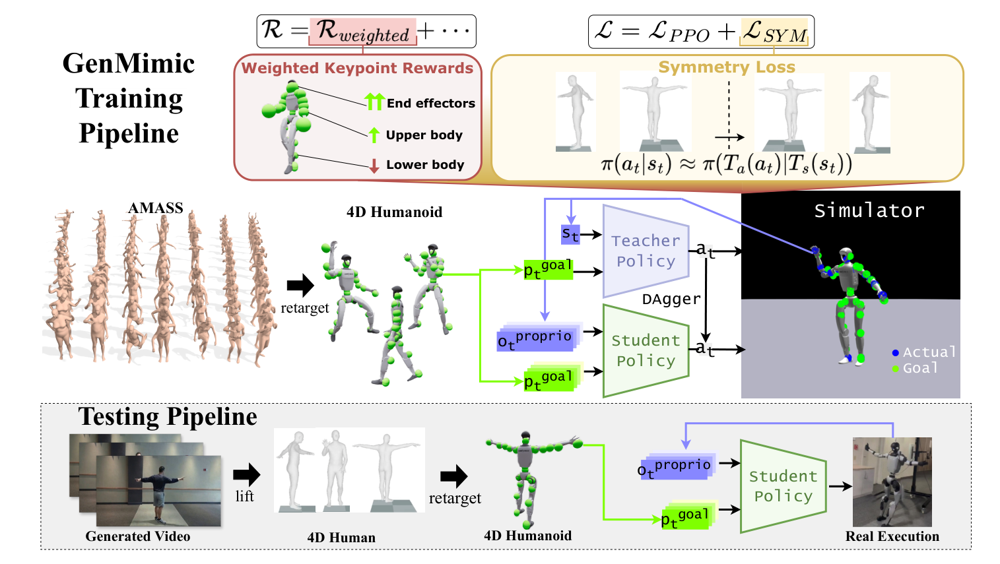

# GenMimic：从生成式人体视频到物理可行机器人轨迹

生成视频能低成本描述“人在某个场景里做什么”，却经常出现肢体形变、时序抖动和错误接触。GenMimic没有让机器人逐像素追视频，而是先把视频提升为4D人体运动、再重定向为机器人关键点目标，最后由物理策略负责把噪声参考变成稳定动作。

> **主要方法图：** Figure 3，PDF第5页。上半部分是AMASS重定向动作上的student-teacher训练，下半部分是生成视频经4D恢复、重定向后作为关键点目标输入真机策略。来源：[原论文](https://arxiv.org/abs/2512.05094)。

## 训练数据和测试输入故意不完全一致

训练阶段使用较干净的AMASS动作。人体动作先映射到G1，teacher在仿真中读取更完整状态，student学习在可部署观测下跟踪参考关键点。测试时输入换成生成视频恢复出的4D人体运动：形态、相机和动作噪声都与AMASS不同。这种设置实际上是在考验tracker能否跨越“高质量MoCap训练、低质量视频参考执行”的分布差异。

策略以3D关键点为条件，而不是要求所有机器人关节逐角度复制人体。奖励对关键点加权，手脚等端点比躯干中的非关键位置获得更高权重，因为这些位置更直接决定动作语义、接触和可观察效果。对称正则把左右镜像的状态与动作关系加入训练，给策略一个人体结构先验，降低生成视频某一侧畸变导致的偏置。

在线执行时，恢复与重定向模块给出随时间变化的机器人关键点参考，student再结合关节状态、机身姿态和历史控制输出关节位置目标。它没有把视频像素直接放进高频控制环，因此相机运动估计和人体恢复可以在上游较低频运行；但上游坐标漂移、尺度错误和错误脚接触会原样变成参考误差。tracker只能在训练扰动覆盖内做物理修正，无法判断视频里多出的一条腿或穿过物体的手究竟是视觉错误还是目标动作。

## 这条链路的真正边界

GenMimicBench用两类视频生成模型覆盖不同动作和场景，用于测试零样本动作输入。论文在仿真中比较强基线，并把多类动作直接部署到Unitree G1，说明“生成视频 → 4D人体 → 重定向 → 关键点tracker”能够闭环。但动作成功不等于视频模型已经学会物体动力学或长时任务规划：当前链路主要处理无复杂外物状态的全身动作，生成视频中的错误接触也不会自动变成可用交互监督。

真正有说服力的对比应逐段定位误差：视频人体恢复误差、人体到G1重定向误差、仿真跟踪误差和真机跟踪误差分别报告，并保留同一动作在各阶段的可视化。否则最终失败无法判断应修视频模型、重定向器还是低层策略。

这篇归入`Mimic动作跟踪与全身控制`。生成视频、4D人体恢复和重定向是参考动作的来源，论文最终训练、部署和验收的是关键点条件下的物理跟踪策略。它同时给世界模型/视频生成和低层Mimic之间提供了明确接口：上层输出可恢复的人体时空轨迹，低层策略负责可执行性。不能把生成视频直接称为robot action，也不能把tracker的鲁棒性归功于视频模型本身。

## 原文、数据与代码状态

[论文原文](https://arxiv.org/abs/2512.05094) · [官方项目页](https://genmimic.github.io/)

截至2026-07-13，官方页面已开放数据入口，代码仍标注`Coming Soon`。
