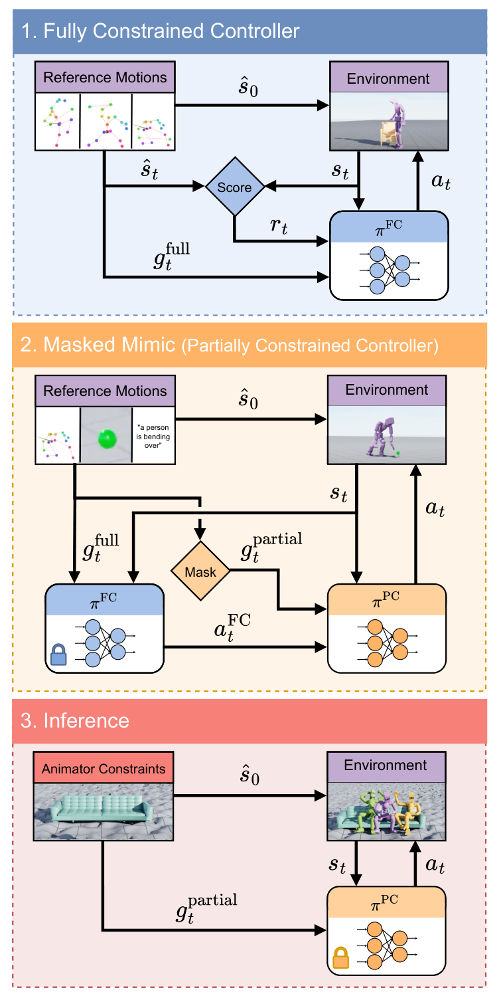

# MaskedMimic：基于遮蔽动作补全的统一物理角色控制

完整动作跟踪器要求每个时刻都有全身参考，但真实用户可能只给一条路径、几个关键帧、一只手的位置或一句文本。MaskedMimic的核心不是增加更多控制头，而是把所有条件写成同一种mask：可见部分是约束，缺失部分由物理控制器补全。

> **主要方法图：** Figure 3，PDF第5页。先用强化学习训练完整约束controller，再把它蒸馏到只看到随机遮蔽目标的部分约束controller；推理时后者执行physics-based inpainting。来源：[原论文](https://arxiv.org/abs/2409.14393)。

## 论文框架：先学完整动作，再学从不完整条件中补全动作

框架上半部分先训练完整约束控制器`πFC`。参考动作一方面用于初始化物理角色，另一方面提供未来若干帧的全身目标；角色当前的三维姿态、速度以及周围地形和物体高度图构成实时观测。目标关节特征会相对当前根节点和对应关节进行坐标归一化，这样控制器关注的是“目标相对当前身体还差多少”，而不是记住动作在世界坐标中的绝对位置。

这些输入被编码成不同token交给Transformer。当前身体状态回答机器人现在处于什么姿态，未来全身目标告诉控制器接下来要完成什么动作，地形高度图则说明动作将在什么表面上执行。Transformer用于建立这些信息之间的依赖，例如区分“手正在靠近椅子”是正常接触过程，还是身体已经偏离参考。策略最终输出PD位置控制所需的动作，仿真环境执行后返回下一时刻状态；跟踪奖励比较仿真角色与参考动作的全局关节位置、关节旋转、根高度、线速度和角速度，并加入能耗惩罚抑制抖动。价值网络只在强化学习阶段估计未来回报，部署完整控制器时不参与动作生成。

先训练这个“看得到完整答案”的控制器，是因为稀疏条件本身并不能唯一确定全身动作。只给一只手的位置时，身体可以站着伸手，也可以弯腰、跨步或转身；直接依靠稀疏奖励探索，策略很容易找到不稳定或不自然的姿态。`πFC`先从完整动作中学出平衡、接触和场景兼容关系，第二阶段再把这些关系蒸馏给部分约束控制器`πPC`。

图中间部分展示蒸馏过程。训练数据仍来自完整参考动作，但系统随机隐藏某些身体、某些未来时刻、文本或场景条件，形成`g_partial`。冻结的`πFC`读取完整目标并给出教师动作，`πPC`只能读取遮蔽后的目标和自己实际访问到的物理状态，再通过DAgger式交互学习复现教师动作。让学生在自己的状态分布中收集数据很重要：如果只对教师轨迹做离线行为克隆，学生一次小误差就可能进入训练数据没有覆盖的姿态，之后误差会连续放大。

## 部分约束控制器怎样表示多种可能动作

`πPC`内部采用条件变分自编码器。可学习先验是一个Transformer，它接收当前姿态、周围高度图、过去姿态、物体包围盒、XCLIP文本特征以及可见的未来关节目标。每种输入使用独立编码器形成token，token mask明确告诉注意力层哪些关节或模态没有被指定；否则，被置零的缺失值可能被误解成一个真实的零位置目标。Transformer输出潜变量分布，用来表示同一组稀疏条件下可能存在的不同全身解。

训练专用编码器额外读取完整未来动作，并输出相对于先验分布的修正。动作解码器接收当前物理状态、采样得到的潜变量和地形高度图，输出当前控制动作。动作似然损失让解码器逼近`πFC`给出的教师动作，KL损失则把“看完整答案的编码器”拉近“只看部分条件的先验”，从而保证推理时移除编码器后仍能从先验采到可执行动作。KL权重从0.0001逐步升到0.01，前期先保证动作模仿，后期再整理潜空间；同一回合固定采样噪声，避免每个控制步切换动作风格。

遮蔽并不是逐帧完全独立地随机采样。某个关节一旦被隐藏，通常会连续隐藏一段时间，迫使控制器真正处理信息缺失；若每帧随机暴露不同关节，跨帧拼接起来仍可能泄露接近完整的动作。文本控制还会读取从过去40个时刻中抽取的5帧历史，使“弯腰”“行走”等持续行为不会因为单帧条件变化而立即中断。

图的下半部分是实际推理闭环。用户只提供关键帧、路径、文本、物体或它们的组合，系统保留可学习先验和动作解码器，完整控制器、训练编码器、价值网络及损失计算全部退出运行。每个控制周期，先验根据当前物理状态和部分目标采样潜变量，解码器生成动作，PD控制作用于角色，新的身体状态再进入下一周期。论文控制器运行在30 Hz，物理仿真为120 Hz。

## 能力边界

MaskedMimic统一的是部分条件到物理动作的控制接口，不是已经完成Sim2Real的人形机器人基座。实验对象是Isaac Gym中的SMPL物理角色，论文没有真实电机、状态估计、通信延迟和安全保护证据。物体交互也依赖训练场景中的物体表示，不能等同于视觉感知闭环。若迁移到机器人，还需要完成目标本体重定向、可部署观测重构、执行器约束与真机安全链路。

遮蔽条件也不保证存在唯一正确答案。文本或稀疏路径会偏向训练动作库中的常见模式；目标互相冲突、关键接触被隐藏或场景几何超出训练范围时，策略可能生成动作自然但任务没有完成的结果。因此评测不能只看动画观感，还应分别检查条件满足、物理稳定、接触正确和动作多样性。

## 原文与实现

[论文原文](https://arxiv.org/abs/2409.14393) · [NVIDIA官方项目](https://research.nvidia.com/labs/par/project/maskedmimic.html) · [ProtoMotions实现](https://github.com/NVlabs/ProtoMotions)
