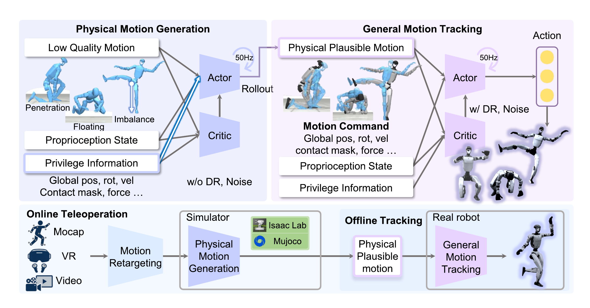

# OmniTrack：基于物理一致参考的通用动作跟踪

动作重定向只保证几何上像，不保证浮动基座、接触和惯性真正可执行。若tracker一边被奖励追随穿地、悬空的参考，一边又被惩罚摔倒，训练目标本身就在冲突。OmniTrack把这两个问题拆开：第一阶段修参考，第二阶段练部署策略。

> **主要方法图：** Figure 3，PDF第4页。左侧privileged policy把原始参考rollout成物理一致轨迹，右侧general tracker在接触状态、域随机化和可部署观测下跟踪这些rollout。来源：[原论文](https://arxiv.org/abs/2602.23832)。

## 第一阶段不是普通离线滤波

原始参考来自人体动作与重定向，常见错误包括脚底悬空、穿透、速度突变和机器人关节不可达。OmniTrack在仿真里训练一个能看到特权状态的generalist policy去追这些参考，然后实际rollout策略。输出轨迹已经经过机器人动力学、接触求解和动作限制，因此即便没有逐帧贴住原始动作，也是一条机器人确实能走过的状态序列。

这与只做IK平滑不同。IK可以修关节和足端几何，却不能回答扰动后策略会怎样恢复；privileged rollout把控制器的反馈行为也写进新参考。代价是第一阶段策略若能力不足，会把某些高动态动作“修平”或直接丢失，所以物理一致不等于忠实保留所有人体细节。

## 第二阶段才是部署tracker

general policy读取机器人本体状态、参考动作和显式接触状态，在随机动力学与噪声下学习跟踪第一阶段轨迹。接触标记帮助策略区分“脚应该落地”和“脚正处于摆动”，减少只靠姿态误差推断接触的歧义。部署时不需要第一阶段在线运行：离线得到的物理参考用于训练，最终tracker支持离线动作播放，也能接收在线遥操作流。

物理化参考至少需要保存根位姿与速度、关节状态、关键刚体轨迹和接触时序，并与最终控制频率对齐；否则第二阶段无法区分“姿态相同但支撑相反”的两个时刻。部署actor只读取可测本体量与参考窗口，输出关节位置目标，而训练critic可利用更完整的仿真状态。显式接触是命令的一部分，并不意味着真机必须准确测出所有接触力；它告诉策略参考动作期望何时支撑，实际接触偏差仍由本体反馈和随机化处理。

论文在G1上展示翻滚、侧手翻等动作以及约一小时连续跟踪，说明长期稳定性不是靠单个短片判断。不过，hour-long演示仍发生在作者选定输入与环境内，不能推出任意网络动作都可安全执行。OmniTrack在技术栈中的位置是Mimic训练管线：它位于重定向之后、真机tracker之前，用仿真rollout把“人体希望怎样动”转换成“机器人动力学允许怎样动”。

第一阶段也可能形成信息瓶颈：若privileged policy无法完成某类动作，rollout会把它改弱甚至过滤掉，第二阶段再强也学不回来。质量检查因此要同时保留原始参考、物理化参考和成功标记，比较动作语义保留率、接触修正量与最终真机成功率，而不是只统计第二阶段tracking score。

## 资料入口

[论文原文](https://arxiv.org/abs/2602.23832) · [官方项目页](https://omnitrack-humanoid.github.io/) · [官方仓库（仅README）](https://github.com/OmniTrack-Humanoid/OmniTrack)

截至2026-07-14，官方GitHub仓库仅含README，并明确说明代码仍在发布过程中；当前不能标为部分或完整开源。
