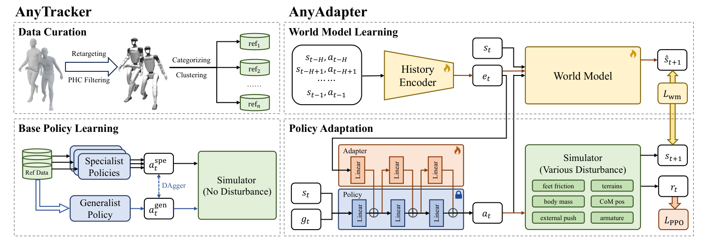

# Any2Track：任意扰动下的通用动作跟踪

通用tracker想要动作丰富，通常要在相对干净的动力学中精确拟合；Sim2Real又要求大范围随机化。把两者一次性混训，策略容易变得保守：不容易摔，但高动态动作也被抹平。Any2Track把“会做动作”和“会适应环境”分成AnyTracker与AnyAdapter两层。

> **主要方法图：** Figure 2，PDF第4页。AnyTracker先学习基础动作执行；AnyAdapter从历史中提取动力学上下文，并只对冻结base policy做适配。来源：[原论文](https://arxiv.org/abs/2509.13833)。

## 论文框架：先训练动作跟踪器，再增加动力学适应能力

图左侧是AnyTracker的数据和基座策略训练。AMASS与LAFAN1人体动作先被重定向到Unitree G1，依照PHC的规则过滤掉缺少场景而无法执行的交互动作，但保留高动态和接触丰富动作。LAFAN1直接使用已有动作类别；AMASS动作的文本动词先经CLIP编码，再聚成6个子集。每个类别或子集先训练一个专长策略，最后用DAgger把这些策略的动作蒸馏进单一通用策略。

每个控制周期，AnyTracker读取本体状态和下一帧跟踪目标。本体状态包括机身角速度、投影重力、各关节位置与速度及上一时刻动作；跟踪目标包括目标关节位置、关节速度和局部坐标中的刚体信息。策略并不直接给出绝对关节角，而是输出经过`tanh`限制并按关节独立缩放的残差，再与下一帧参考关节角相加形成PD目标。这样可以保留参考动作的大体姿态，同时避免肩、腕、髋、膝等动作范围明显不同的关节被同一输出尺度限制。PD控制器把位置误差转成关节力矩，环境返回下一时刻状态，PPO根据身体位置与旋转、速度、根高度、足端高度、控制平滑、关节限位和碰撞等奖励更新策略。

专长到通用的蒸馏解决的是动作分布之间的优化冲突。舞蹈、奔跑和倒地起身对不同关节的输出范围差异很大，直接让一个随机初始化策略同时探索全部动作，容易优先拟合简单类别。专长策略先在较窄分布中形成可靠动作标签，通用策略再在自己访问到的状态上向相应专家查询动作，降低行为克隆中的状态分布偏移。这个阶段不加入动力学随机化，目的是先把动作表达和跟踪精度学足。

## 动力学历史怎样进入冻结的基座策略

图右上角是动力学表征学习。第二阶段才加入足地摩擦、Perlin地形、躯干外力、机身质量与质心、关节摩擦、armature和默认关节偏差等变化。历史编码器读取过去79组状态与动作，得到动力学嵌入`e_t`。这个嵌入不是质量、摩擦或载荷的显式估计，而是对“当前机器人和环境怎样响应控制”的压缩表示。

为了防止编码器只记住动作类别或历史噪声，作者增加世界模型作为训练代理任务。世界模型以当前状态、后续动作和动力学嵌入为条件，自回归预测未来20帧机器人状态，并用预测状态与仿真真实状态之间的L1误差同时更新世界模型和历史编码器。训练样本因此包含79帧历史、1帧起始状态和20帧预测目标，共100组状态动作。若负载变大后相同关节目标导致躯干下沉，或低摩擦使足端产生不同状态变化，世界模型只有从`e_t`中获得这些差异才能继续准确预测。

图右下角展示动力学嵌入怎样影响动作。AnyTracker的基座参数被冻结，每一层旁边增加零初始化的线性adapter，adapter将`e_t`对应的修正逐层加到基座特征中。它不是在网络末端简单加一个“残差动作”；它改变的是冻结策略各层处理当前状态和参考目标的方式。零初始化保证第二阶段开始时动作与原基座一致，随后PPO只在有扰动环境中训练adapter，并沿用跟踪和安全奖励，让策略学会在不重写原动作分布的前提下补偿当前动力学。

训练时，世界模型损失负责让历史嵌入可辨识，PPO损失负责判断这些嵌入是否真的改善动作。实际控制链需要历史编码器、冻结的AnyTracker和adapter；世界模型负责提供训练监督，不直接生成关节动作。论文没有单独列出真机导出包中是否保留世界模型，但按方法中的动作依赖关系，部署推理不需要继续滚动预测未来状态。

## 真机证据与边界

作者在29自由度Unitree G1上进行零样本Sim2Real，测试木板、纸板、泡沫和织物地形，固定长度绳索形成的外部约束，以及背部增加5 kg载荷。关节传感器和前向运动学用于计算真机MPJPE与MPJVE。论文没有披露策略、PD和传感器循环的具体频率，因此不能从相邻工作补写。

AnyAdapter必须先从交互历史中看到足够的响应，才可能区分负载、摩擦或执行器变化。突发冲击发生的最初几步仍依赖基座策略本身，潜变量也不是具有确定物理含义的参数估计。复现时应把固定扰动、缓慢变化和回合中突然变化分开测试，并记录跟踪误差、恢复时间、adapter输出幅度以及原动作风格是否被破坏。在线适应还需要与关节、力矩和功率保护配合，论文结果不能替代真机安全状态机。

## 论文与代码

[论文原文](https://arxiv.org/abs/2509.13833) · [官方项目页](https://zzk273.github.io/Any2Track/) · [OpenTrack代码](https://github.com/GalaxyGeneralRobotics/OpenTrack)
