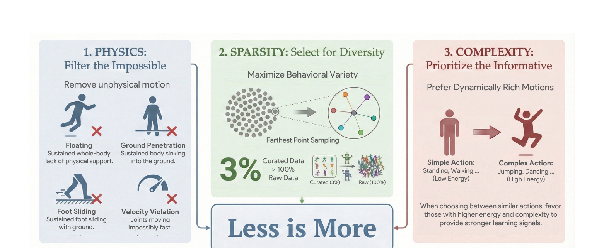

# LIMMT：面向动作跟踪的少数据高效学习

动作库扩大后，坏数据不只浪费算力，还会在训练初期把策略带到错误的优化区域。LIMMT把动作质量拆成三个不同问题：能不能由刚体机器人实现、是否提供新行为、是否足够动态而有学习信号。三者必须按顺序处理。

> **主要方法图：** Figure 1，PDF第3页。GQS先过滤不可能动作，再按语义多样性选点，最后在相近候选中偏向动态复杂动作。来源：[原论文](https://arxiv.org/abs/2606.06953)。

## 第一关：物理可行性不能留到最后

候选动作先在刚体仿真中回放，浮空、长期穿地、明显脚滑和关节速度超限被组合成feasibility score。严重且持续的错误权重大，偶发自碰撞或jerk权重较小，低于阈值的样本直接丢弃。若先在原始数据上做多样性聚类，异常动作会因为“看起来特别”占据表示空间，反而被优先选中。

## 第二关：多样性要比较行为，不是比较某一帧姿态

通过Harmonic Motion Embedding，周期自编码器把动作表示为幅值、频率、相位和偏置。全局描述主要使用幅值与频率，尽量让同一种动作的不同相位靠近，让跑、跳、舞蹈等节律结构真正拉开。随后全局farthest-point sampling优先覆盖尚未覆盖的行为区域。

复杂度只作为最后的小偏置：当两个候选在语义距离上相近时，动能和加速度更高的动作获得优先。若一开始就按能量选，爆炸、抖动和穿模也会被误当成“高价值动态动作”。因此流程必须先做物理过滤和稀疏去重，最后再用复杂度排序，三步不能换序。

筛选结果不是只输出一个文件名列表。为了让下游tracker复现采样分布，应保存每段动作的来源、重定向版本、可行性分项、embedding、被选原因和最终权重；同一原始序列切出的相邻片段还要按源动作去重。这样训练失败时才能判断是物理过滤过严、语义覆盖不足，还是复杂度偏置把课程推得太快。不同机器人必须重新计算与关节限位、足底几何和质量分布相关的可行性，不能直接复制G1上的筛选结论。

## 怎样正确理解“3%超过全量”

论文在AMASS上报告GQS筛出的约3%数据可以超过全量训练，并在Any2Track、TWIST2以及PHUMA迁移上验证。结论不是所有任务固定取3%，更不是大数据无用，而是当前物理Mimic中重复和不可行样本会污染早期梯度。比例会随本体、tracker、动作分布和筛选指标变化。

LIMMT不输出机器人动作，也不替代tracker。它位于动作恢复/重定向之后、Mimic训练之前，是数据课程与质量门。真机G1实验说明筛选收益能传到部署端，但仍需单独处理动力学误差、安全和在线扰动。

它也没有解决参考窗口、观测、动作空间和跟踪奖励的设计；相同子集换一个较弱tracker，最优比例可能完全不同。因此更合理的验收不是“是否复现3%”，而是在固定训练预算下比较全量、随机等量、只做可行性过滤和完整GQS四组的收敛速度、未见动作误差及真机稳定性。

## 论文与实现

[论文原文](https://arxiv.org/abs/2606.06953) · [官方项目页](https://giraffeguan.github.io/limmt/) · [GQS代码入口](https://github.com/GalaxyGeneralRobotics/Humanoid-GPT)
