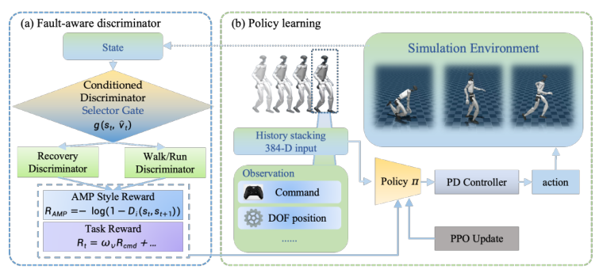

# State-Dependent AMP：基于状态相关对抗运动先验的统一行走、跑步与恢复

走路、跑步和倒地恢复的状态分布差异极大。普通AMP把所有transition送进同一个判别器，容易让“站着自然”和“躺着恢复自然”互相冲突。本文保留一个shared actor，只在训练时根据机器人状态选择不同运动先验。

> **主要方法图：** Figure 1，PDF第1页。shared policy接收任务奖励与AMP奖励；projected gravity门控样本进入recovery discriminator或速度条件locomotion discriminator。来源：[原论文](https://arxiv.org/abs/2605.18611)。

## 论文框架：训练时按身体状态选择运动先验

每个控制周期，单一actor读取机身角速度、投影重力、速度指令、相对关节位置、关节速度和上一时刻动作。每帧观测为96维，连续4帧拼成384维输入；三层MLP输出29维目标关节位置，低层PD控制器计算执行器力矩，机器人新的姿态和关节状态再进入下一周期。PPO任务奖励负责速度跟踪、动作平滑、身体姿态、能耗和跌倒惩罚，对抗奖励则约束当前状态下的动作风格。

普通AMP会把走路、跑步和起身都交给同一个参考分布。这里的问题不是网络不知道三种动作名称，而是它们的状态转移相互矛盾：直立行走希望身体保持竖直和周期支撑，倒地恢复必须允许多点接触和大幅姿态变化。本文在训练侧放置两个判别器，恢复判别器只学习倒地起身参考，locomotion判别器共同学习走路和跑步，并使用归一化前向速度命令作为条件。

低速时，locomotion判别器更多采样walk参考；速度升高后，run参考的采样概率随归一化命令连续增加。因此走到跑不是三个actor之间的切换，而是共享actor接收到连续速度任务，同时接受速度条件的风格奖励。训练参考只使用LAFAN1中的walk、run和fall-and-get-up三段动作，说明贡献重点是先验如何按状态组织，不是动作库规模。

### 为什么用投影重力门控

机器人直立时，机身坐标中的重力z分量约为-1；倾倒后接近0或变正。作者用`|gz + 1| > 0.6`作为恢复分支阈值，对应相对竖直约37度倾角。这个信号在数据中呈明显双峰，阈值落在低占用区域，因此没有再训练一个gating network。

倾倒状态进入recovery discriminator，直立状态进入locomotion discriminator。后者再以归一化前向速度命令为条件，在低速走路与高速跑步参考之间形成连续风格约束。参考库只需三条LAFAN1片段：walk、run和recovery。论文要表达的重点是，先把不相容的先验结构分开，可能比继续堆参考动作更重要。

## 部署时保留一个actor，而不是保留判别器状态机

AMP奖励以0.5权重加入总回报。PPO根据环境执行结果和奖励更新actor；论文没有披露critic是否读取额外特权地形或动力学参数，因此不能按其他Isaac Lab项目补写。训练结束后只导出一个ONNX actor，以50 Hz运行；两个判别器、参考动作和gravity gate都不参与推理。

这一点容易被误读：系统不是跌倒后再切换另一个恢复policy，而是同一policy在训练中见过两类风格监督。论文真机展示俯卧/仰卧恢复和走跑过渡，但操作员仍显式启用更高速度范围，说明部署安全边界没有因为“统一策略”而消失。

这篇应归入`AMP运动先验与Locomotion`。它给出的可复用思想是状态条件的对抗先验，而不是特定阈值本身；换本体、传感器或恢复定义后，37度不能直接照搬。

## 训练证据与安全边界

直立分支的正样本来自走路或跑步参考转移并以速度命令条件化，恢复分支的正样本来自恢复动作；策略当前rollout产生供判别器区分的生成转移。投影重力只决定训练样本送到哪一个先验，不作为一个显式模式变量输入已导出的actor。

部署只运行50 Hz actor并输出29维PD目标，因此走跑恢复切换完全由观测反馈产生，没有可单独调试的推理gate。工程系统仍需跌倒检测、急停、关节限位和允许高速命令的操作员权限；训练阈值不能代替安全状态机。复现应分别统计两类判别器准确率、各状态样本占比、走跑过渡、恢复时间和误触发行为，尤其要检查阈值附近是否因训练数据稀少出现不连续动作。

还应在不同地面和外力下检查门控两侧的状态覆盖，而不是只在原始参考动作附近评估。

## 原文与开源状态

[论文原文](https://arxiv.org/abs/2605.18611)

截至2026-07-26，论文及可检索的作者官方材料均未提供代码入口，当前按“未开源”记录。
