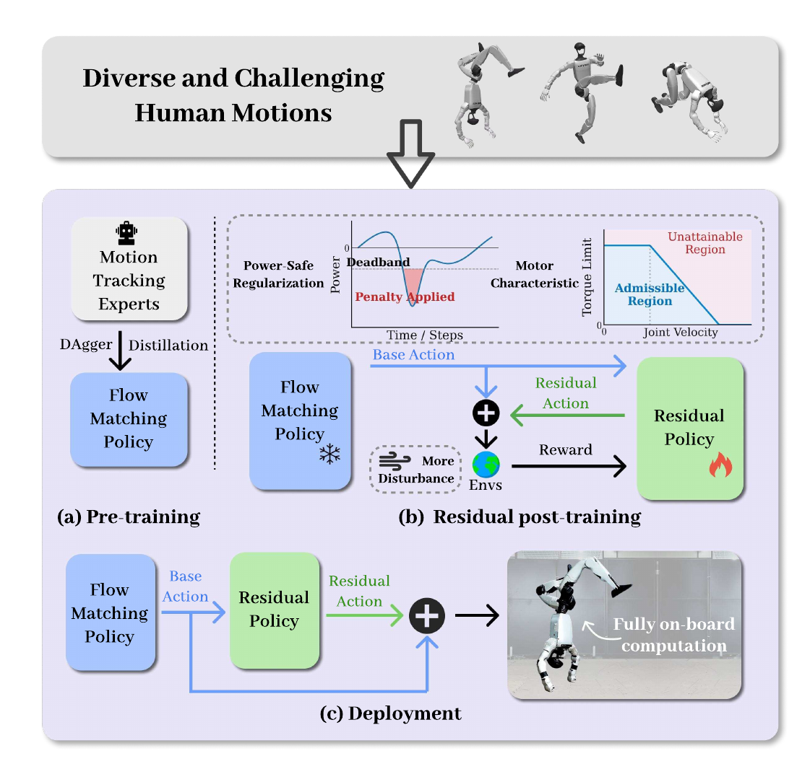

# OmniXtreme：突破高动态人形控制的通用性瓶颈

高动态动作的“泛化瓶颈”有两层：大量动作放进一个RL策略后会互相干扰；即便仿真跟得上，真实电机的扭矩、速度、功率和延迟也可能让动作不可执行。OmniXtreme用flow-matching蒸馏处理第一层，用冻结基座后的residual post-training处理第二层。

> **主要方法图：** Figure 2，PDF第4页。多个tracking expert通过DAgger向统一flow policy提供动作监督；随后冻结base，训练满足电机与功率约束的residual policy，最终整条推理链在机载端运行。来源：[原论文](https://arxiv.org/abs/2602.23843)。

## 为什么不直接让一个大PPO吃掉所有动作

作者先按运动分布训练多个specialist tracker。DAgger在统一策略自身访问到的状态上查询相应expert动作，减少只在专家轨迹上行为克隆造成的covariate shift。flow matching学习从噪声动作分布逐步流向expert action distribution，比单一确定性回归保留更多多模态动作选择，也把高容量模型训练从“所有动作共同争夺一个RL目标”改成“聚合已会做动作的专家”。

这一步得到的base policy已能覆盖多种极端动作，但仍主要反映仿真执行能力。适量噪声与随机化被刻意控制，避免为鲁棒性牺牲动作保真度。

统一策略仍以参考运动和当前本体状态为条件，flow模块从初始噪声动作经过若干积分步得到当前关节目标分布。多模态输出的意义是：在相近状态和参考下，不必把多个专家的不同恢复动作平均成一个无力姿态；但控制频率内的积分步数会直接决定时延。论文中的“通用性”应同时看专家覆盖、未见动作和机载推理预算，不能只看总参数量。

## 真机阶段为什么只学残差

后训练阶段冻结base，再加一个residual policy修正动作。训练环境加入更严格的电机限制、域随机化与功率安全正则，使残差专门吸收执行器饱和和Sim2Real误差。如果解冻整个base，硬件约束会重新改写已蒸馏的动作分布，可能再次出现高动态细节坍缩。

最终推理包含flow policy与residual补偿，全部在机器人端实时执行。论文展示多个高难动作真机执行，支持“容量扩展与执行器精炼可以解耦”的判断；但并没有证明对任意新动作或任意人形本体都成立，且训练依赖多个高质量expert。

residual阶段接收base动作与当前状态，重点处理电机饱和、功率限制和模型误差。安全正则会牺牲一部分参考精度，所以应报告哪些动作被修正、峰值功率下降多少以及动作成功率是否变化。若base已给出远超硬件能力的连续目标，小残差没有能力把整段动作重新规划为可行版本；这与OmniTrack的离线参考物理化、Heracles的在线参考重写属于不同层级。

flow采样还应固定随机种子并测量多次输出方差，确认动作多模态不会在真机上表现为不可控抖动。

截至核验日，官方仓库公开了checkpoint和sim-to-sim代码；flow-matching训练、residual后训练及C++真机部署仍列为后续内容。因此可运行发布不能等同于完整可复现。

## 入口

[论文原文](https://arxiv.org/abs/2602.23843) · [官方项目页](https://extreme-humanoid.github.io/) · [部分开源仓库](https://github.com/Perkins729/OmniXtreme)
