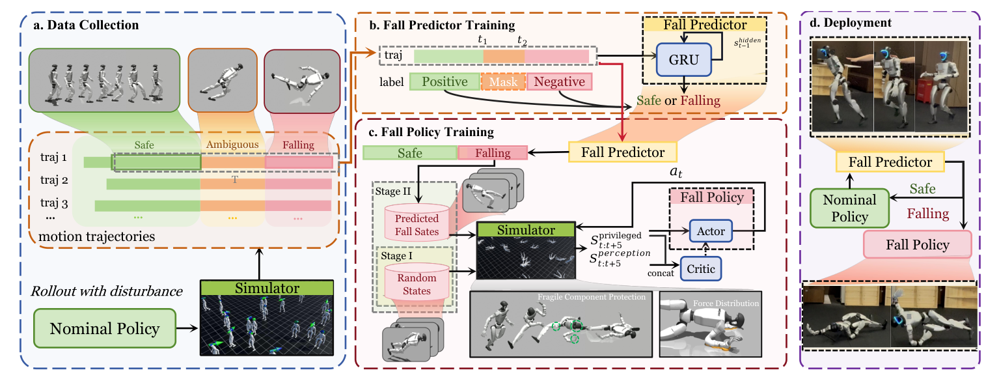

# SafeFall：人形机器人的保护性跌倒控制学习

大多数locomotion策略把跌倒当episode终止，训练中不关心倒地过程；真实机器人却可能在这几百毫秒里撞坏头部、手部或电机。SafeFall不承诺挽救每次失稳，而是在判断跌倒已不可避免后，让保护策略接管并重新分配冲击。

> **主要方法图：** Figure 2，PDF第4页。扰动nominal policy采集跌倒数据，GRU预测器区分安全、模糊和跌倒阶段；保护策略从随机倒姿逐步训练，部署时只在预测不可恢复后接管。来源：[原论文](https://arxiv.org/abs/2511.18509)。

## 预测器和保护策略为什么必须分开

若保护策略一直运行，它会为了减少潜在冲击而让正常走路变得保守。SafeFall让轻量GRU持续读取机器人状态历史，输出是否即将进入不可恢复跌倒。训练数据来自nominal locomotion在不同扰动下的rollout，并按时间切成safe、ambiguous和falling阶段，使预测器学习跌倒前兆而不是只识别已经躺地的姿态。

只有触发后，damage-mitigation policy才获得控制权。课程从随机跌倒状态开始，让策略先学会保护脆弱部件，再逐渐收紧到真实预测器触发时的状态分布。奖励不仅惩罚峰值接触力和关节扭矩，还对头、手等脆弱部位碰撞设置更高代价，允许更结实的身体部位吸收能量。

## 数据说明了什么，又没说明什么

论文在全尺寸G1上报告，相对无保护跌倒，峰值接触力降低68.3%，峰值关节扭矩降低78.4%，脆弱部件碰撞减少99.3%。这些结果支持“保护动作能改变损伤分布”，但不能直接换算为长期硬件寿命，也不等于预测器没有漏检和误触发。

工程上最有价值的是接口位置：SafeFall应作为nominal controller外侧的supervisor，明确触发阈值、接管时机、退出条件和急停优先级。它归入`AMP运动先验与Locomotion`，因为服务的是站立/行走失败后的安全边界；它不是新的通用动作tracker，也不能替代跌倒恢复策略。

## 观测、动作与安全状态机

跌倒预测器读取本体状态历史，关注基座姿态与速度、关节运动以及nominal action造成的短时响应；它输出风险阶段或触发概率，而不是新的关节命令。保护策略接管后仍通过关节控制接口改变全身姿态，奖励按脆弱部件接触、峰值冲击、关节扭矩和动作可执行性分配代价。训练从广泛随机倒姿开始，再收敛到nominal locomotion真正会进入的失稳分布，避免只学会一类标准侧倒。

部署必须把预测窗口、触发阈值、连续确认帧数、控制权切换和退出条件写成显式状态机。阈值过早会频繁打断可恢复的正常步态，过晚则来不及改变碰撞姿态；通信中断、传感器异常和硬件急停应拥有比学习策略更高优先级。论文报告的是受控实验中的冲击和扭矩下降，未公开代码也意味着目前无法完整复现训练分布、损伤权重和控制切换实现，相关参数不能从演示视频推测。

## 资料

[论文原文](https://arxiv.org/abs/2511.18509) · [官方项目页](https://safefall.github.io/)

截至2026-07-14，官方项目页明确标注`Code coming soon`，当前尚未开源。
