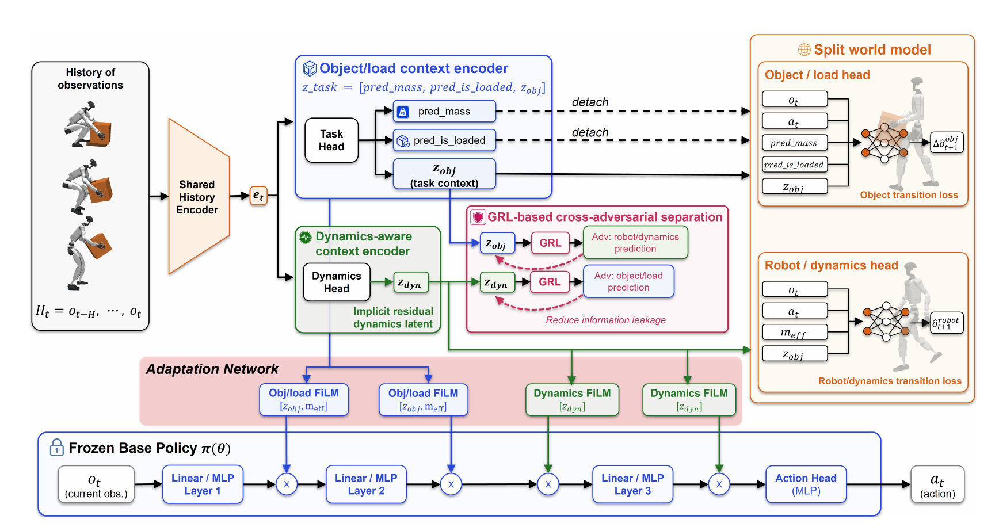

# SplitAdapter：基于因子化适配的负载感知人形移动操作

历史编码器常把负载、摩擦、电机和机器人姿态压进一个latent。它或许能提高成功率，却很难保证“物体变重”和“机器人变钝”不会互相混淆。SplitAdapter把上下文拆成object/load与robot dynamics两支，再分别约束它们应该预测什么。

> **主要方法图：** Figure 2，PDF第4页。冻结的基础操作策略外接两条历史编码分支；分解world-model loss和gradient reversal促使隐变量分工，再通过分层FiLM调制策略。来源：[原论文](https://arxiv.org/abs/2606.03297)。

## 为什么一个RMA式latent不够

带箱行走时，箱子质量和是否已抓牢会改变外物运动；地面、执行器和机器人参数则改变本体响应。若单一encoder只靠下一状态预测训练，它可能用任何相关特征完成任务，导致latent纠缠。换物体时，策略也许错误地把变化解释为机器人动力学，从而在腿部和手臂上做出不合适补偿。

object/load encoder除了历史，还显式预测物体质量与loaded state；对应world model预测物体位置和姿态增量。dynamics encoder负责预测机器人状态转移。gradient-reversal separation让一支难以恢复另一支负责的信息，稀疏正则限制latent无约束膨胀。这里的world model是表示学习辅助任务，不是在线生成未来视频。

历史包含机器人状态、已执行动作以及交互过程中可获得的物体或负载线索。只有抓起、加速或改变支撑后，质量差异才会在身体响应里显现；接触前模型不能凭空知道箱子多重。loaded state的监督帮助区分“手靠近箱子”和“箱子已经随机器人运动”，物体增量预测则检查object branch是否保留了交互结果。部署时两支latent持续更新并调制冻结策略，最终输出仍是全身关节目标。

## FiLM把两类信息注入到不同层级

基础策略来自已有AMP/PhysHSI式箱体操作训练，并保持冻结。两类context通过hierarchical FiLM调制中间特征，而不是直接覆盖动作；object branch更关注负载与交互状态，dynamics branch更关注本体响应。冻结基座可以保留已有动作能力，也使实验更能说明增益来自适配，而不是重新训练了一个更大policy。

论文在不同箱体高度与2、4、6 kg负载上训练/测试，并部署到G1，说明分解上下文能改善负载变化下的稳定性。但两个latent的语义仍由监督目标和数据相关性决定，不是严格系统辨识；若质量、摩擦和电机退化总是一起变化，模型仍可能学到捷径。

系统还需要负载突变与抓取失败的保护。当loaded state置信不足、预测误差突然上升或残差调制过大时，应限幅并退回稳定搬运/放下动作。验收应报告质量预测、物体状态预测、足端滑移、跟踪误差和任务成功率，而不能只用一个最终回报证明表示已经解耦。

训练集还应打散质量与机器人参数的相关性，防止两支编码器借环境编号走捷径。

SplitAdapter归入`LocoManip与物理交互`。它解决的是操作中外物负载与本体动力学的在线适配，World Model只保留为方法标签。

## 资料入口

[论文原文](https://arxiv.org/abs/2606.03297) · [官方项目页](https://splitadapter.github.io/)

截至2026-07-14，作者官方项目页未提供代码入口，当前按“未开源”记录。
