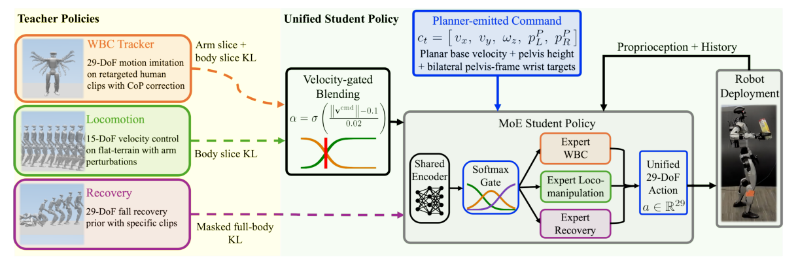

# HANDOFF：基于互补教师蒸馏的人形智能体任务空间全身控制

上层规划器擅长目标、路点和语义，低层tracker擅长追完整动作。两者之间缺的是一个既低维又保留全身表达力的command space。HANDOFF把接口压成10维：平面速度3维、root高度1维、左右腕在pelvis frame中的目标各3维。

> **主要方法图：** Figure 3，PDF第4页。WBC、locomotion与fall-recovery三个teacher被context-conditioned、action-sliced KL蒸馏到MoE student；student读取10维命令与11帧本体历史，输出29维动作。来源：[原论文](https://arxiv.org/abs/2606.06493)。

## 10维为什么足以产生全身动作

速度命令对应移动，root height对应蹲起，双腕目标对应操作空间。组合这些量就能产生“边走边伸手”“蹲下双手拿取”等行为，而上层无需给出脚步、腰姿和每个关节角。命令在pelvis frame表达，随身体移动保持局部一致，几何规划器、人类遥操作或VLM都能产生。

接口低维并不意味着student凭空学会所有身体协调。它继承三个teacher：29-DoF WBC teacher在经过CoP安全过滤的重定向片段上学动作，15-DoF locomotion teacher负责速度与腿部稳定，29-DoF recovery teacher通过AMP风格跌倒/恢复数据学习起身。

student还读取11帧本体历史，以判断命令变化、接触后的身体响应和当前是否正在失稳，输出29维全身动作交给低层执行。腕目标只描述几何，不包含抓取力和物体质量；上层视觉模块必须把物体位姿转换到pelvis frame，手部硬件或任务状态机负责开合与成功判定。接口的优势是所有调用者共享同一种身体命令，风险是错误坐标会被低层当成合法目标执行。

## action-sliced KL怎样避免teacher打架

手臂动作主要向WBC teacher蒸馏；身体slice根据速度上下文在WBC和locomotion之间加权；进入恢复状态时，recovery teacher对全身动作施加约束。MoE gate连续融合专家，而不是运行时硬切三个策略。load-balancing与recovery loss约束routing，避免某个expert长期失活。

部署时，VLM把语言任务拆成原子步骤，视觉模块给出pelvis-frame路点，skill selector填充root和手腕命令，低层以50 Hz执行。论文在G1展示拿取、搬运、递交和跌倒后续做任务。这里的Agent只是调用者，技术核心仍是身体接口；若感知给错物体位姿，HANDOFF不会自动纠正任务语义。

恢复teacher解决的是身体跌倒后的重新起身，不等于物体任务恢复。机器人摔倒时物体可能已经掉落或场景改变，高层必须重新感知、更新步骤并决定重抓还是放弃。完整评测应把命令跟踪、跌倒恢复、物体终态和Agent重新规划分别统计，避免把低层能起身误写成长任务已自动恢复。

工程价值在于可替换边界：上层可以换VLM、经典规划或手柄，低层保持同一命令契约。官方仓库已包含teacher/student训练、CoP处理、ONNX checkpoint、sim-to-sim和sim-to-real脚本，在同类工作中提供了较完整的复现链路。

复现时还应验证teacher切片与MoE路由：速度命令、腕目标和恢复状态冲突时，哪个teacher约束哪些关节、gate是否过度偏向单一专家。只跑正常拿取任务无法验证这套互补蒸馏真正优于硬切策略。

同时应测试命令突跳、腕目标不可达和视觉坐标短暂失效时的安全退化行为。

## 论文与实现

[论文原文](https://arxiv.org/abs/2606.06493) · [官方项目页](https://lzyang2000.github.io/HANDOFF/) · [官方代码](https://github.com/lzyang2000/HANDOFF)
