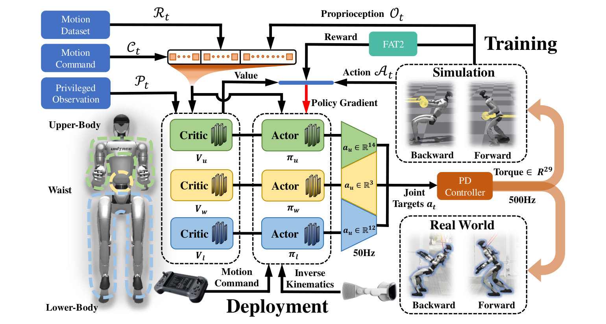

# Thor：面向强接触环境的人类级全身反应

推开重门、移动货架或承受人的持续推力时，固定躯干会把负载集中到手臂和脚底。人会主动倾斜躯干、调整腰腿并移动支撑。Thor把上肢、腰和下肢分别建模，同时用全局力信息训练它们形成协调反应。

> **主要方法图：** Figure 2，PDF第2页。上肢、腰、下肢各有Actor-Critic，critic在训练时读取末端受力等特权信息；FAT2奖励塑造躯干随力方向与大小变化的反应，部署actor接收VR/遥操作目标并经PD执行。来源：[原论文](https://arxiv.org/abs/2510.26280)。

## 为什么要拆Actor-Critic，又不能把身体真的拆开

三个子策略面对不同控制重点：上肢追踪人类动作或VR目标，腰部调节躯干，腿部负责支撑和移动。critic拥有全局状态及末端外力方向、幅值等特权信息，使训练能评价整机稳定和接触结果；部署actor只使用可获得观测。虽然网络分支解耦，奖励和全局状态仍把它们耦合在同一物理系统中。

这种结构降低单个网络同时拟合精细手臂动作和大幅腿部反应的难度，但也存在接口风险：若各分支输出频率、目标或正则不一致，腰部会成为冲突汇合点。论文的价值不只是“分三个网络”，而是给全身力反应设计了共同训练信号。

## FAT2奖励在教什么

Force-Adaptive Torso Tilt让机器人根据外力方向和强度改变躯干倾角：受向后推力时，身体主动前倾建立抗力矩；力消失后再回到自然姿态。上肢跟踪项保留操作意图，下肢和腰部通过稳定、能耗与力反应奖励配合。训练critic可见的真实仿真外力，部署时actor从本体与交互响应中隐式执行策略。

部署输入仍是上肢或VR目标加全身本体观测，三个actor分别输出对应关节位置目标并由PD执行。门、货架等物体几何与期望末端轨迹由上层提供；真实外力通过关节误差、速度和机身变化进入闭环，而不是由策略直接读取一个精确六维力传感器。FAT2塑造的是“受力时身体朝什么方向、以多大幅度倾斜”，物体是否已经打开或移动到位仍需外部任务状态判断。

论文在G1上报告可承受较大前后向力，并展示重门、载荷货架等真机任务。这证明FAT2与全身分支能产生强接触反应，但不等于具备严格force limit或人机协作安全认证；外力估计、接触位置变化和柔顺上限仍需单独验证。

强接触解除时，躯干恢复速度和足端余量同样关键；过快回正可能造成二次冲击。复现应扫描外力方向、作用点、持续时间与大小，记录接触力、关节饱和、CoP/足端滑移、物体终态和恢复时间，并设置超出训练范围后的卸力或停止条件。

Thor归入`LocoManip与物理交互`，因为最终能力是与门、货架和人产生持续物理作用。它与SoftMimic、CHIP的区别在于强调大外力下的主动全身反应，而不是一般末端柔顺。

## 原文与项目

[论文原文](https://arxiv.org/abs/2510.26280) · [官方项目页](https://baai-aether.github.io/baai-thor/)

截至2026-07-14，官方项目页明确标注`Code Coming Soon`，当前尚未开源。
