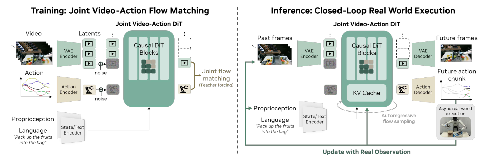

# DreamZero：作为零样本策略的世界动作模型

很多机器人世界模型能预测“接下来可能看到什么”，但执行动作时仍要另接规划器或逆动力学模型。DreamZero更激进：它让同一个14B视频扩散主干同时生成未来画面和机器人动作，因此世界预测不再只是辅助表征，而是直接参与闭环控制。

> **主要方法图：** Figure 4，PDF第6页。视觉历史经VAE编码，语言和本体状态分别编码后进入自回归DiT；视频与动作使用独立解码头，但共享主干和联合flow-matching目标。真机执行完一个action chunk后，真实观测会替换KV cache中的预测画面。来源：[原论文](https://arxiv.org/abs/2602.15922)。

## 它不是“先生成视频，再从视频反推动作”

输入包括当前及历史视觉、语言指令和本体状态，输出是固定时间窗内的未来视频与连续动作。视频latent和归一化action都被加噪，模型在同一去噪时间步上学习二者的联合速度场。两个模态有各自的编码/解码接口，但在共享DiT内部相互影响：未来画面相当于隐式视觉计划，动作头从同一时空演化中读出控制量。

这种端到端联合训练与串联的“视频模型 + IDM”有本质区别。串联方案的视频目标可能正确，但IDM不一定能从视觉变化中恢复唯一动作；DreamZero把视频—动作对齐直接写进训练目标。不过，联合预测仍不能证明模型形成了显式、可解释的物理状态，画面看起来合理与动作可执行之间仍可能有偏差。

## 自回归为什么没有一路把错误滚下去

模型按chunk自回归预测视频，训练时使用teacher forcing：当前噪声chunk可以关注前面干净的真实chunk。部署时机器人异步执行最近生成的动作，同时模型处理新观测；一段动作执行后，真实相机图像会回填KV cache，替换相应的预测帧。这样既保留视频历史记忆，又利用闭环观测定期纠正滚动误差。

动作头输出的是目标平台连续控制块，仍要经过动作反归一化、机器人接口和低层伺服。未来视频提供隐式计划，但模型没有显式接触力或关节安全约束；预测中的手看似抓住物体，并不保证对应动作在真实摩擦下成立。接入人形时，更合理的是输出末端、根或motion token，再由全身控制器维持平衡，而不是让7 Hz高层直接承担关节反射。

实时性是这条路线能否成立的硬门槛。论文把朴素实现约5.7秒一次推理，通过异步执行、CFG并行、DiT cache、编译与CUDA Graph、量化和专用kernel等组合优化，报告约38倍加速、7 Hz闭环控制。这里的7 Hz是高层action chunk更新，不等于人形机器人关节伺服频率；底层控制器仍负责高频执行。

真实观测回填只能纠正可见画面漂移；若物体已经滑落但被手臂遮挡，KV cache仍可能支持错误后续。完整系统需要任务成功检测、动作超时和重新生成条件，并保存预测视频与真实回填差异作为失败回流数据。

## 为什么归入世界模型，而不是普通VLA

DreamZero的关键增量不是多了一个动作头，而是用未来视频作为密集动力学监督，并展示陌生任务零样本执行、跨本体视频迁移和少样本新本体适配。论文报告的是机械臂与移动操作平台，不是人形低层平衡、接触稳定或跌倒恢复。对运控知识栈而言，它更适合作为上层任务与动作接口的参照：若未来接入人形机器人，仍需说明输出动作如何连接全身跟踪器、碰撞约束和安全控制。

复现应同时报告视频预测、动作误差、闭环任务成功、每chunk延迟、真实回填频率和跨本体适配数据量，避免把视觉生成质量直接当作零样本策略能力。

## 原文与项目

[论文原文](https://arxiv.org/abs/2602.15922) · [官方项目页](https://dreamzero0.github.io/) · [官方代码](https://github.com/dreamzero0/dreamzero)
