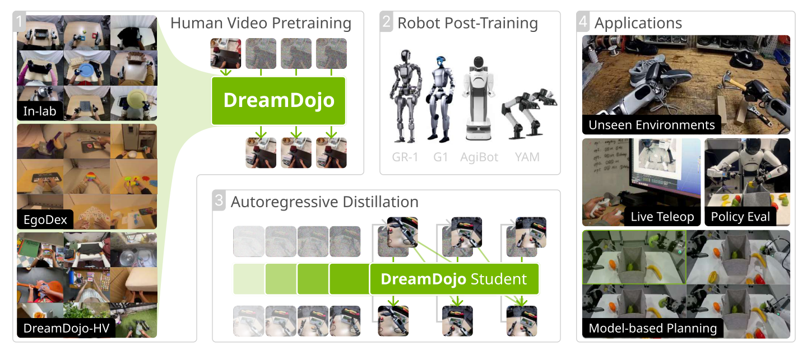

# DreamDojo：基于大规模人类视频的通用机器人世界模型

机器人世界模型的数据矛盾很直接：真实机器人轨迹昂贵且场景窄，人类第一视角视频海量却没有统一动作标签。DreamDojo用连续潜动作把无标签视频变成可条件控制的预训练数据，再用少量目标机器人数据把潜动作接口换成真实控制空间。

> **主要方法图：** Figure 1，PDF第3页。流程分为人类视频预训练、目标机器人后训练和自回归蒸馏；最终模型输出动作条件下的未来画面，服务实时遥操作、策略评估和模型规划。来源：[原论文](https://arxiv.org/abs/2602.06949)。

## 潜动作解决的不是姿态重定向，而是监督缺失

DreamDojo-HV汇集约4.4万小时第一视角人类视频。相邻帧之间没有机械臂关节命令，因此论文训练一个带信息瓶颈的时空Transformer/VAE，从帧对中提取32维连续潜动作，并用前向动力学重建约束它保留“什么操作导致了这个变化”。同一种潜动作可以跨不同视频表示相似交互，成为人类视频的统一代理动作标签。

这与传统动作重定向不同：它不恢复人的骨骼姿态，也不直接输出目标机器人关节轨迹，而是在视觉变化层面学习可控交互因素。到了具体机器人，模型会重置动作条件层，用该机器人少量带动作数据做post-training，把抽象的交互先验接到新的动作空间。

## 三阶段训练各自解决什么

第一阶段基于Cosmos-Predict2.5视频扩散主干，用人类视频、文本、条件帧和潜动作训练flow matching，扩大物体、场景和接触行为覆盖。第二阶段在GR-1、G1、AgiBot等目标本体数据上后训练，使未来画面对连续机器人动作敏感。第三阶段用自回归蒸馏把多步扩散教师压成少步学生，同时改善长时间滚动的一致性；论文报告640×480下10.81 FPS。

最终输出仍是未来视频，不是可直接下发的低层关节命令。实时遥操作可用它预演操作者动作后果；策略评估把它当环境代理；模型规划则需要候选动作、价值判断或外部规划逻辑。把这三个场景统称“世界模型控制机器人”会掩盖不同接口，阅读实验时应分别看预测准确性、策略排序相关性和真实任务成功率。

用于规划时，当前图像和机器人动作候选进入模型，生成后续画面，再由目标图像距离、VLM或价值函数选动作；只执行前缀后应以真实相机重新更新历史。用于策略评估时，则关心模型中不同策略的排序是否与真环境一致。两种场景都依赖目标本体低层控制器把动作条件执行出来，DreamDojo本身不输出人形关节保护或接触反射。

## 它给人形运动控制什么启发

DreamDojo证明大规模人类视频可以先学习接触和物体变化，但从手部操作视频迁移到人形全身控制还缺少身体动力学、支撑接触、平衡和高频反馈。它适合放在`世界模型VLA与Agent`，并与动作重定向形成上下游关系：前者学习环境转移，后者把人体动作变成机器人可执行参考，二者不能互相替代。

验证人类视频预训练价值时应固定机器人数据和规划器，比较无预训练、通用视频预训练、潜动作预训练和目标本体后训练；并报告长时滚动误差、动作敏感度、策略排序与真机成功。公开视频规模也不等于许可自动适用于机器人训练，数据来源和使用边界需随发布说明核验。

## 原文与项目

[论文原文](https://arxiv.org/abs/2602.06949) · [官方项目页](https://dreamdojo-world.github.io/) · [官方代码](https://github.com/NVIDIA/DreamDojo)
