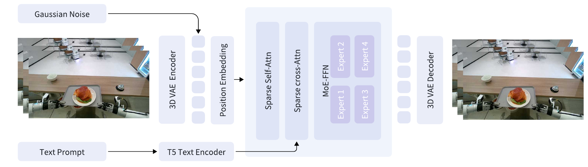

# GigaWorld-0：作为具身智能数据引擎的世界模型

如果只生成一段“像机器人操作”的视频，它很难直接用于训练：视角可能不一致、手臂外观不匹配、几何可能漂移，动作也未必满足碰撞和动力学约束。GigaWorld-0把世界模型定位为数据引擎，用Video与3D两条链路分别扩展视觉分布和物理可执行性。

> **主要方法图：** Figure 2，PDF第4页。GigaWorld-0-Video-Dreamer把多视角首帧编码为3D-VAE latent，以文本为条件，在稀疏自注意力、稀疏交叉注意力和MoE-FFN组成的生成主干中完成flow matching，再解码未来视频。来源：[原论文](https://arxiv.org/abs/2511.19861)。

论文没有一张图把Video与3D的八个组件串成单一训练框架，公开总览图主要用于展示能力。因此这里选择视频数据引擎的基础生成主干作为主要方法图，3D链路则按论文的FG、BG、Phys和Act四个模块分别解释。

## Video链路不是一个模型包办所有事情

`Video-Dreamer`根据多视角首帧和文本生成操作过程，主干采用3D-VAE、位置编码、稀疏注意力与MoE-FFN；`AppearanceTransfer`改变材质、颜色和光照；`ViewTransfer`按相机外参改变观察视角；`MimicTransfer`把第一视角人类示范中的手臂外观与动作转换成机器人形态。四个组件对应不同的数据增广轴，避免把“画面更多样”和“动作跨本体可用”混成同一个指标。

其中MimicTransfer与动作重定向有交集，但输出载体主要是训练视频/轨迹数据，整套系统的最终作用仍是扩大VLA训练分布，因此主分类放在世界模型数据引擎，而不是动作重定向。训练基础设施GigaTrain通过FP8和稀疏注意力支撑大规模视频模型训练，这解决的是工程成本，不直接保证生成样本的物理真实性。

## 3D链路补的是视频生成最容易露出的短板

`3D-FG`生成可操作前景资产，`3D-BG`用Gaussian Splatting重建背景，`3D-Phys`通过可微系统辨识估计物体物理属性，`3D-Act`生成满足碰撞和动力学约束的机械臂运动。这样同一条样本同时拥有多视角几何、可调整物理参数和可执行动作，而不是只有像素序列。

这条路线的关键价值是把“合成数据质量”拆成三个层次：视频是否自然、轨迹是否物理可执行、加入这些数据后下游策略是否真的提高。论文展示GigaBrain-0等VLA使用合成数据后的真机泛化增益；这属于下游策略证据，不等于GigaWorld-0本身是一个真机控制器。

进入训练集的样本应保留文本条件、多视角视频、3D资产、物理参数、动作轨迹、生成组件版本、筛选分数和许可来源。Video链路扩外观与视角，3D-Act才提供明确动作；两者若时间轴或相机不一致，会形成看似完整却不可监督的样本。下游VLA仍需将动作映射到目标本体控制器，并由真实执行反馈检验物理参数是否可信。

## 阅读时最该防止的误判

视觉指标领先不代表接触动力学正确，单次真机成功也不能证明数据引擎在不同本体和任务上稳定增益。更有价值的复现应固定下游策略与真实数据量，只改变合成数据来源，再比较陌生纹理、物体位置、视角及接触任务成功率。截至2026-07-14，官方仓库已公开训练与推理代码，并采用Apache-2.0许可证；复现时仍要区分已发布模块与论文描述的完整数据生产规模。

还应加入“真实回流”环节：把合成样本对应的真机成功、碰撞、抓取滑移和视觉偏差写回数据表，按失败类型调整生成与筛选。没有这一步，数据引擎只能扩大分布，不能持续判断哪些新增数据真正改善策略。

## 原文与项目

[论文原文](https://arxiv.org/abs/2511.19861) · [官方项目页](https://giga-world-0.github.io/) · [官方代码（Apache-2.0）](https://github.com/open-gigaai/giga-world-0)
