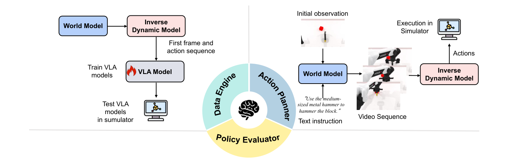

# WorldArena：具身世界模型感知与功能效用统一评测基准

世界模型长期依赖清晰度、时序一致性和文本对齐等视频指标，但机器人真正关心的是：生成数据能否提高策略，模拟结果能否正确区分强弱策略，预测未来能否导出可执行动作。WorldArena把这三种功能单独做成闭环测试，专门检查感知质量与系统价值之间的缺口。

> **主要方法图：** Figure 3，PDF第6页。左侧把世界模型生成的数据交给VLA训练；中间让策略在世界模型中rollout并与模拟器真实结果比较；右侧用世界模型加逆动力学模型生成动作并回到RoboTwin执行。来源：[原论文](https://arxiv.org/abs/2602.08971)。

## 第一层：16个指标只回答“生成得怎么样”

WorldArena从视觉质量、运动质量、内容一致性、物理遵循、3D准确性和可控性六个维度汇总16项指标，并加入人工评分与两两偏好。EWMScore将归一化后的指标做综合，便于模型横向比较。这一层仍是开放环视频评价，即使包含接触合理性和轨迹准确性，也不能替代真实任务执行。

## 第二层：把世界模型放进三个实际岗位

**数据引擎：** 世界模型在RoboTwin 2.0数据上适配后生成视频，再由IDM恢复动作，形成视频—动作对用于训练π0.5策略；最终看下游策略成功率提升，而不是只看合成视频分数。

**策略评估器：** 多个能力不同的策略在可动作控制的世界模型中rollout，用VLM判断成功，再与RoboTwin中的真实评测排序和成功率比较。高相关性说明这个世界模型有资格充当低成本环境代理。

**动作规划器：** 世界模型从初始观测和指令生成未来序列，IDM将预测转成动作，动作进入RoboTwin闭环执行。最终以任务成功率判断“预测未来”是否真的产生了可执行计划。

三项测试对应三种不同接口：数据引擎离线产生视频—动作对；策略评估器在线接收策略动作并预测结果；动作规划器输出未来视觉，再由IDM转成机器人动作。世界模型本身通常不直接输出关节控制，IDM质量、动作schema和底层模拟器共同决定闭环结果，因此榜单必须同时保留各组件版本。

## 这个Benchmark真正揭示了什么

论文在50个RoboTwin 2.0任务、2500段视频上评测14类代表模型，结果显示视觉质量与功能能力存在明显缺口。通用视频模型可能更清晰，却不一定正确响应动作；机器人专用模型也可能在某一功能角色强、另一角色弱。因此以后看到“某世界模型SOTA”，必须继续问它是在生成指标、数据增益、策略排序还是闭环规划上领先。

功能评测仍应检查环境反馈与重规划：规划器只执行动作前缀后是否用新观测更新，模型滚动多长会失真，VLM成功判定与真实状态是否一致。对长任务还要保存对象与阶段记忆，否则短视频规划成功不能外推为Agent能力。

WorldArena应放在`世界模型VLA与Agent`的评测层，而不是当作新的控制方法。当前功能实验主要在RoboTwin仿真中完成，VLM判定和IDM质量也会影响分数；它尚不能替代真实机器人上的接触安全、延迟和故障评测。

迁移到人形评测时，应新增低层控制器、平衡、接触力、动作频率和跌倒恢复维度，并将末端计划成功与全身执行成功分开。否则机械臂世界模型排名无法直接说明人形loco-manip价值。

## WorldArena 2.0增加了什么

截至2026年7月17日，官方已发布WorldArena 2.0入口。它没有改写原论文的三类功能问题，而是沿三个方向扩展评测：模态从纯视觉增加视觉—触觉预测，功能从离线打分增加把世界模型作为在线强化学习环境，平台从RoboTwin 2.0扩展到LIBERO和真实AgileX ALOHA。真实任务包括倒水、擦桌等操作，因此新版开始直接暴露跨平台和Sim2Real差距。

这仍不等于“世界模型已经成为可靠真机仿真器”。在线RL结果取决于奖励构造，动作规划依赖IDM，任务判定可能依赖VLM，真实ALOHA也不是人形全身系统。使用榜单时应同时记录世界模型版本、环境、动作接口、低层策略和判定器，不能只引用一个总分。

## 原文与项目

[论文原文](https://arxiv.org/abs/2602.08971) · [官方榜单](https://world-arena.ai/) · [WorldArena 2.0](https://worldarena2.github.io/) · [官方代码](https://github.com/tsinghua-fib-lab/WorldArena)
