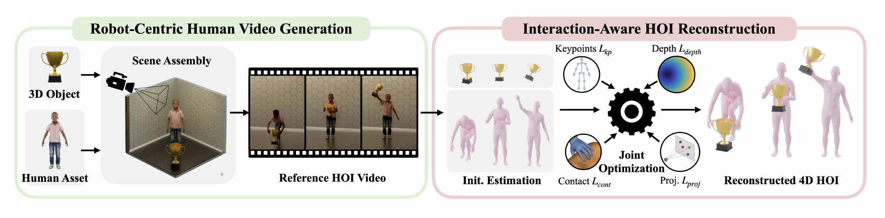

# GRAIL：基于三维资产与视频先验的人形移动操作生成

直接从互联网视频恢复人形交互，最难的不只是人体姿态。物体尺寸、相机参数、场景深度和接触关系都可能是错的，错误还会在重定向和RL中继续放大。GRAIL反过来做：先放入已知的3D物体、场景、相机和按目标机器人比例拟合的人体，再让视频基础模型生成交互，最后利用这些已知真值把视频恢复成可重定向、可在仿真中执行的数据。

> **主要方法图：** Figure 2，PDF第4页。左侧先组装带已知相机和尺度的3D场景并生成交互视频，右侧再用关键点、深度、接触和投影约束联合优化人体与物体轨迹。来源：[原论文](https://arxiv.org/abs/2606.05160)。

## 为什么不是直接生成机器人视频

现阶段视频模型对人的外观和动作先验强于对具体机器人本体的先验，人体姿态和手部恢复工具也更成熟。GRAIL因此使用一个预先按G1比例拟合的人体角色：3D物体先在刚体仿真中落到稳定初态，Blender给出已知内外参和场景深度，VLM根据初始画面生成交互提示，VFM再生成静态相机下的人物交互视频。

这个设计的关键不是让视频更好看，而是提前固定尺度、相机和几何。后面做4D恢复时，系统不必从一段像素同时猜测所有变量，生成模型只负责提供“人可能怎样与物体互动”的运动先验。

## 从视频到4D交互轨迹

人体侧先恢复逐帧SMPL-X姿态，手部使用独立手模型补细节；物体侧利用已知几何、纹理和首帧位姿做6DoF跟踪。两条初始轨迹直接拼接仍会出现悬空接触、穿透和深度漂移，因此作者对人体和物体残差做跨帧联合优化。

优化目标同时约束四件事：二维人体关键点不能偏离视频；物体投影要保持图像对齐；预测深度要与已知3D场景提供的度量深度对齐；VLM识别到接触的帧中，手部与物体的深度关系要真正闭合。脚接触、骨盆速度和时序平滑项继续压制脚滑与抖动。输出不是一张姿态图，而是人体世界坐标运动、物体6DoF轨迹和接触时段组成的4D HOI序列。

## 物理执行是数据质检的一部分

恢复的人体运动经GMR映射到Unitree G1，再由基于SONIC的任务通用跟踪器在Isaac Lab中执行。物体操作使用object-aware adaptor读取本体状态、物体参考、手物相对位姿、形状编码和接触信息；地形与坐下动作则加入局部高度图并微调scene-aware tracker。两者都用参考运动误差和动作正则，物体任务额外加入物体位姿与接触阶段抓取奖励。

这里的tracker不是主产物，而是物理过滤器和数据转换器。官方数据集保存的是仿真G1与物体真正rollout出的轨迹，而不只是IK结果。因此一条样本可以同时包含源合成视频、SMPL-X与物体4D重建、G1关节轨迹、物体物理轨迹、接触标记和USD资产。

## 这套数据能证明到哪里

论文生成2万余条序列，覆盖桌面和地面拾取、全身搬运、坐下、坡面、台阶和楼梯。作者进一步用这些数据训练第一视角策略，并在G1上做物体拾取和爬楼梯验证。真机结果说明生成数据具备下游价值，但不能推出所有序列都可直接零样本部署：发布数据目前以G1为主，视觉仍有合成到真实的差距，也不包含完整触觉或接触力标签。

发布样本的价值在于多层结果可追溯：源合成视频、已知相机与场景资产、人体SMPL-X和物体6DoF恢复、接触时段，以及经过仿真tracker执行后的G1和物体轨迹可以相互核对。清洗不能只按视频外观做，至少要同时过滤人体/物体重投影异常、接触未闭合、穿透、脚滑、tracker终止和任务失败。用于策略训练时还应固定数据版本与任务划分，避免同一资产、相机或运动变体同时落入训练与测试造成泄漏。

官方已经发布代码和生成数据，但“代码开源”不等于全部素材具有同一许可：GRAIL实现、视频生成权重、人体模型、3D资产、机器人mesh和数据包可能分别受不同条款约束。下载或再分发前应逐项核对仓库许可证、Hugging Face数据卡以及第三方资产来源；公开文章可以链接官方入口，不应把整套样本重新打包分发。

GRAIL在本库中属于`人形训练数据构建`。它的核心交付是可批量运行的数据生成管线和数据集；GMR、SONIC、PPO与视觉策略是把数据转成可执行轨迹并验证有效性的下游组件。

## 原文、代码与数据

[论文原文](https://arxiv.org/abs/2606.05160) · [官方项目页](https://research.nvidia.com/labs/dair/grail/) · [官方代码](https://github.com/NVlabs/GRAIL) · [官方数据集](https://huggingface.co/datasets/nvidia/PhysicalAI-Robotics-Locomanipulation-GRAIL)
