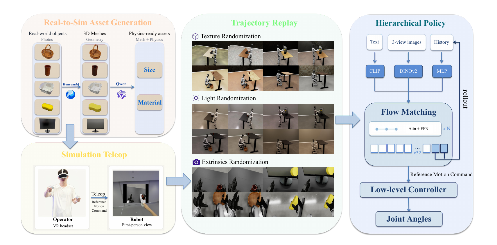

# OASIS：从仿真数据采集到真实人形移动操作

真机遥操作数据质量高，但每次失败都要扶机器人、摆物体、检查硬件，接触任务还可能损坏环境。OASIS把本体对齐的示范采集放进仿真，同时避免用实时低质量画面直接训练视觉策略：操作者先以高帧率完成动作，轨迹录完后再用路径追踪和域随机化离线渲染。

> **主要方法图：** Figure 3，PDF第4页。四个部分依次是实物照片到物理仿真资产、仿真VR遥操作、轨迹离线回放与视觉随机化、分层视觉策略。来源：[原论文](https://arxiv.org/abs/2606.08548)。

## 第一步先解决仿真场景为什么难搭

单张实物照片经Hunyuan3D生成带纹理网格，但网格本身没有可信的尺寸、密度、摩擦和恢复系数。OASIS再让Qwen3-VL估计物体尺寸和材料类别，由材料表补充密度、摩擦与恢复系数，并计算质量和惯量。由于这些估计仍可能有误，采集时继续在预测值附近随机化物理参数。

这一步的输出是可以碰撞和参与动力学的资产，不只是视觉模型。它降低了批量搭建杯子、篮子、海绵和显示器等任务场景的成本，但对复杂几何、软体和精细接触的物理属性仍可能估错。

## 第二步只采轨迹，不追求照片级画面

操作者通过PICO 4 Ultra控制仿真人形，并实时看到机器人头部第一视角。人体动作由GMR转成全身参考，再交给Teleopit低层策略执行。系统记录两组信息：机器人与场景刚体的运动学状态，用于之后复放；GMR输出的参考动作，用于训练高层策略。

采集阶段使用Isaac Sim实时渲染，目标是低延迟和稳定操控。动作结束后，同一条轨迹以Path Tracing离线回放，并随机改变背景纹理、灯光强度与色温、相机外参。这样一次人工示范可以扩成多组视觉观测，而不会要求操作者重复二十次相同动作。

## 数据怎样进入控制闭环

高层策略读取文本、三个相机视图和最近两帧历史。CLIP编码语言，DINOv2编码图像，MLP编码历史，Flow Matching一次预测未来32帧、每帧67维的参考运动命令。这个命令包含根部滚转/俯仰编码、偏航变化、局部位移、根高度、29维关节位置及其增量。Teleopit再以50 Hz把参考命令转成29自由度身体和14自由度手部关节目标；高层在真机上以25 Hz运行。

训练时不仅喂真实历史。作者逐步提高rollout历史比例，让模型看到自己预测误差积累后的输入，减少长时自回归部署时突然发散。这里没有单独的RL奖励设计，高层核心损失是Flow Matching速度场回归；低层控制器沿用已训练的全身跟踪接口。

## 为什么主分类是Loco-Manip

论文在G1上验证放杯、搬篮、擦显示器和跪姿擦桌底，并报告相同轨迹预算下，仿真数据训练的策略可达到与真机数据相当或更高的零样本成功率。它最终形成、部署和验收的是视觉条件下改变外部物体状态的真机Loco-Manip能力，因此主分类放在`LocoManip与物理交互`。仿真采集、离线视觉扩增和Flow Matching分别是数据手段与策略模块，不应只凭其中任何一个名词把论文归到数据入口或VLA。

边界也很明确：现有扩增主要改变视觉，不能随意扰动全身轨迹，否则平衡和接触会破坏；运动多样性仍受操作者示范限制；自动生成资产的物理参数不一定准确。需要把“每条轨迹渲染了多少视觉环境”与“真正增加了多少动作覆盖”分开统计。

## 原文、项目与代码

[论文原文](https://arxiv.org/abs/2606.08548) · [官方项目页](https://oasis-humanoid.github.io/) · [官方代码](https://github.com/TeleHuman/OASIS)
