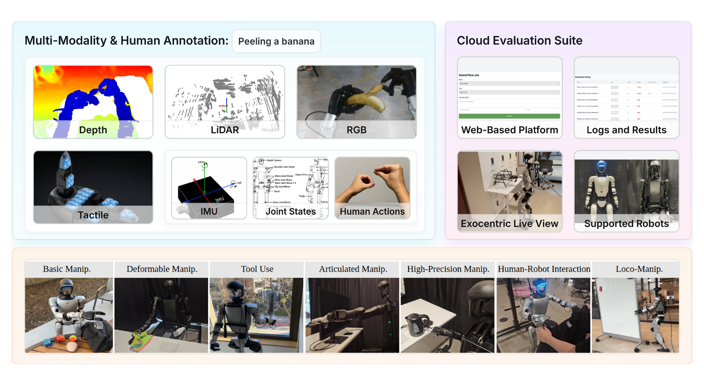

# Humanoid Everyday：面向开放世界人形操作的综合机器人数据集

很多机器人数据集要么只有固定机械臂，要么只有上肢操作；即使换成人形，也常把腿当成不动的支架。Humanoid Everyday的核心产物不是新控制器，而是一套真实G1/H1示范数据：任务同时覆盖移动、双臂、灵巧手、人机交互和复杂物体，并把视觉、本体、触觉与语言放在同一时间轴上。

> **主要总览图：** Figure 2，PDF第2页。上半部分展示RGB、深度、LiDAR、触觉、IMU、关节状态和人类动作等模态以及远程评测入口；下半部分是七类任务。来源：[原论文](https://arxiv.org/abs/2510.08807)。

## 数据到底包含什么

论文报告10.3k条轨迹、300万余帧、260项任务和7个大类，采样频率为30 Hz。七类分别是基础操作、柔性物体、工具使用、关节物体、高精度操作、人机交互和Loco-Manipulation。每个任务采集40个episode，场景既有室内也有室外，并包含需要下肢移动的任务。

每个episode可包含第一视角RGB、深度图、LiDAR点云、触觉、IMU、关节状态、关节动作和自然语言任务描述。G1使用29自由度身体与Dex3-1手，H1使用27自由度身体与INSPIRE手；两种机器人都配RGB-D和LiDAR，触觉主要来自G1手部。不同本体的字段和维度不能不加区分地拼成一个动作张量，训练前必须按机器人型号读取数据卡。

## 采集系统怎样保证同步与操控

操作者使用Apple Vision Pro获得手腕和手指关键点。手指经dex-retargeting映射到灵巧手，手腕位姿通过基于Pinocchio的IK变成手臂命令。团队重构了Unitree遥操作脚本，把数据流、写盘、IK和机器人控制拆到不同进程与线程，通过共享内存交换数据，避免相机或磁盘IO阻塞控制回路。

论文报告相较原脚本，采集时间约减半，控制延迟由500 ms降到2 ms，并实现亚毫秒级多模态同步。这里仍要区分“系统时间戳对齐”和“所有传感器物理延迟完全相同”：相机曝光、LiDAR扫描、触觉与机器人总线各自还有设备延迟，做高精度接触学习时仍需检查原始时间戳和插值方式。

## 数据集不是只看规模，还要看任务和动作协议

作者用DP、DP3、ACT、OpenVLA、动作token方法和GR00T N1.5做基线。公开结果显示，28维高频人形动作对现有端到端策略仍很困难；点云方法在移动时会受到坐标变化影响，部分序列模型容易机械复现轨迹，高精度插花等任务几乎全部失败。这些负结果比单纯说“有一万条数据”更重要：数据已经覆盖问题，不等于模型已经解决问题。

论文还提出远程真机评测平台，让用户本地运行策略、接收G1/H1的视觉和状态并返回动作。项目页曾把云评测标为Coming Soon，因此现阶段只能确认论文中的平台设计，不能把它视为随时可用的稳定公共服务。

## 使用时最容易踩的三个坑

第一，论文、GitHub加载代码和Hugging Face数据卡可能采用不同许可，下载前应分别核对，不能把代码许可自动套给数据。第二，260个任务并不等于每个任务都有相同本体、模态和有效episode，训练前需要做字段完整度和成功片段审计。第三，这是真机示范数据而不是安全策略，示范中的碰撞、低效动作和人类接管都需要单独标记。

Humanoid Everyday在本库中属于`工程基础与工具`。它是可被Mimic、Loco-Manip和VLA共同调用的横向数据集、加载工具和评测接口，而不是一篇提出人形训练数据生成方法的论文；各种策略只是用于说明这份数据能训练什么、目前还难在哪里。

## 原文、项目、代码与数据

[论文原文](https://arxiv.org/abs/2510.08807) · [官方项目页](https://humanoideveryday.github.io/) · [加载代码](https://github.com/physical-superintelligence-lab/Humanoid-Everyday) · [Hugging Face数据](https://huggingface.co/datasets/USC-PSI-Lab/humanoid-everyday)
