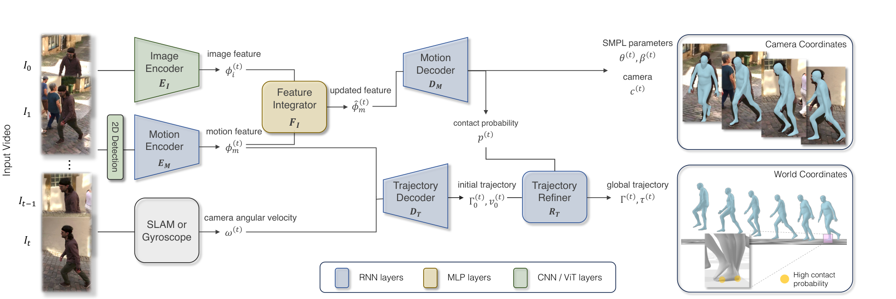

# WHAM：世界坐标下的高精度三维人体运动恢复

单目视频里的人体运动看起来很直观，但只要相机也在移动，像素变化就同时包含人体位移和相机位移。很多方法能给出相机坐标系里的SMPL姿态，却无法回答这个人在世界里究竟走了多远，结果常见的就是全局漂移、脚底打滑和上下楼时轨迹贴错地面。WHAM解决的是**视频到世界坐标人体运动**，不是人体到机器人的重定向。

> **主要方法图：** Figure 2，PDF第4页。2D关键点与图像特征先恢复局部SMPL运动，SLAM或陀螺仪提供相机角速度，轨迹解码器和接触修正器再恢复世界坐标根轨迹。来源：[原论文](https://arxiv.org/abs/2312.07531)。

## 输入和输出到底是什么

输入是一段可能由移动相机拍摄的单目视频。预训练关键点检测器给出逐帧2D人体关键点，图像编码器提供像素级外观特征；相机角速度可以来自DPVO、DROID-SLAM一类SLAM系统，也可以直接来自相机陀螺仪。输出包含SMPL姿态与体型、弱透视相机参数、足地接触概率，以及世界坐标下的根部朝向、速度和全局平移轨迹。

这组输出适合继续交给GMR、NMR或其他机器人重定向器，但它本身没有机器人关节、力矩限制、足底尺寸和执行器动力学。把WHAM输出直接称为“机器人动作”会跳过最关键的一层本体转换。

## 为什么同时需要关键点和图像

WHAM先用AMASS合成大量“2D关键点序列到3D运动”的训练对，让单向RNN学习连续运动结构。关键点对遮挡和背景变化较稳，但相同2D投影可能对应多个3D姿态；图像特征能补充肢体朝向、深度和体型线索。Feature Integrator以残差方式把图像证据写回运动特征，Motion Decoder据此输出相机坐标下的SMPL运动和足地接触概率。

全局轨迹走另一条分支。Trajectory Decoder读取运动特征与相机角速度，递归估计根部朝向和自中心速度；Trajectory Refiner再利用脚接触和脚速度修正根轨迹。这个修正不是简单把脚钉在固定平面上，因此对楼梯和非平地比“平地假设 + 去脚滑”更合理。

## 训练数据、损失和可用边界

训练分两阶段：先在AMASS合成投影上学习2D到3D运动和轨迹，再用3DPW、Human3.6M、MPI-INF-3DHP、InstaVariety等视频数据微调图像融合。监督项覆盖SMPL参数、顶点、2D/3D关键点、根轨迹、相机、接触和脚滑。官方实现已经公开，并提供训练、评测与自定义视频入口。

论文证据集中在人体运动恢复Benchmark，没有真实机器人实验。方法仍依赖可靠的人体检测和相机运动估计，默认人体大部分时间在画面内；接触建模主要关注脚，骑车、滑板、手撑地或复杂人-物交互可能产生错误全局轨迹。因此本库把WHAM放在`视频人体运动恢复`：它把互联网视频变成可继续加工的人体时空轨迹，但后面仍需要目标本体重定向和物理控制。

## 从人体序列到机器人参考还要补什么

保存WHAM结果时，至少要保留原视频帧率、人物裁剪与track ID、SMPL参数、世界根位姿、相机角速度来源、足地接触概率和前端置信度。世界根轨迹与局部姿态必须使用同一时间轴；如果只导出关节旋转而丢掉相机来源和坐标约定，后续很难判断漂移来自WHAM、视频前端还是重定向。WHAM输出仍是人体比例，接入机器人时还需处理rest pose、关节轴、比例缩放、关节限位、足底几何以及接触修复。

它的误差并非一个总MPJPE能够概括。二维关键点错误会改变肢体姿态，图像特征失效会放大深度歧义，相机角速度误差会污染全局方向，速度积分会产生长时平移漂移，错误接触概率则会让轨迹修正器把本应移动的脚错误钉住。用于构造训练数据时，应在人体恢复后、机器人重定向后和物理跟踪后各做一次质量检查，避免最后只把失败归因于控制策略。

## 原文、项目与代码

[论文原文](https://arxiv.org/abs/2312.07531) · [官方项目页](https://wham.is.tue.mpg.de/) · [官方代码](https://github.com/yohanshin/WHAM)
