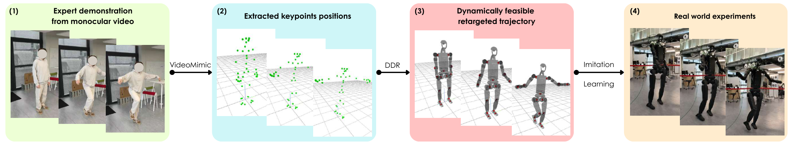

# DDR：面向视频模仿学习的直接动力学重定向

传统链路通常是“人体关键点 → IK机器人姿态 → 物理仿真修正”。问题在于IK只看几何相似，不看质量分布、力矩、平衡和接触；一旦IK把轨迹推到动力学可行域之外，后面的控制器只能围绕一个有偏的中间答案补救。DDR的核心主张是：**直接在物理仿真里寻找最接近人体关键点、同时能被机器人动力学执行的轨迹**。

> **主要方法图：** Figure 1，PDF第1页。单目视频经VideoMimic得到人体关键点，DDR直接生成动力学可行的机器人参考，随后用RL跟踪并零样本部署到Unitree H1-2。来源：[原论文](https://arxiv.org/abs/2605.23762)。

## 论文框架：直接在动力学仿真中把人体关键点变成机器人参考

DDR的输入来自单目视频。前端沿用VideoMimic中的人体恢复流程，把视频人物转换为SMPL运动，再提取躯干、肩、双手和双脚等任务空间关键点。传统几何重定向会先用逆运动学寻找与这些关键点最接近的机器人姿态，但这个中间结果只满足几何误差，可能包含无法维持平衡的质心运动、错误接触或超出关节力矩能力的加速度。

DDR不先生成一条固定IK轨迹，而是直接在物理仿真器中优化机器人控制序列。Cross-Entropy Method在一个有限时域内采样多组候选控制，仿真器真实计算每组控制产生的关节运动、惯性和接触，再根据机器人关键点与人体关键点的差异以及可行性代价给候选排序。表现较好的样本更新下一轮控制分布，反复收缩到更优解；只执行当前时域的前一部分后继续向前滚动，形成采样式MPC。

选择CEM而不是直接对整段接触动力学求梯度，是因为单目视频不会提供可靠的机器人接触时序，脚何时落地、身体何时依靠支撑都存在歧义。采样候选可以让物理仿真自行检验不同接触结果，不必预先写死完整接触序列，也能避开接触切换处不连续梯度带来的优化困难。DDR因此直接比较“仿真机器人实际执行后的关键点”和“视频人体关键点”，避免先接受一个有偏的IK机器人参考再做动力学修补。

优化结束得到的是离线机器人参考轨迹，不是可以直接部署的在线控制器。作者针对每段参考在Isaac Lab中训练一个PPO跟踪策略。Actor读取关节位置与速度、上一时刻动作、基座线速度与角速度、身体高度、投影重力和动作相位，输出21个目标关节位置；目标在机器人默认姿态附近缩放后交给PD控制器。机器人执行后的状态与参考轨迹重新计算跟踪误差，形成下一周期观测和奖励。

跟踪奖励沿DeepMimic思路分别约束关节姿态、速度、关键点和根部运动。关节位置、速度和力矩等硬件边界通过Constraints-as-Terminations处理：一旦策略持续进入不安全状态，回合提前结束，而不是只依靠一个幅值较小的软惩罚等待策略自行恢复。参考状态初始化让训练从动作不同阶段开始，提前终止则避免大量样本浪费在已经无法追回参考的状态。价值网络与仿真完整状态用于PPO训练，部署时只保留Tracker、运行时状态输入和PD控制。

这套系统把两个问题明确分开：DDR负责生成动力学上更合理的机器人参考，RL Tracker负责在初值误差、模型偏差和外部扰动下闭环执行。论文报告DDR参考能加快后续策略收敛，并在Unitree H1-2上验证深蹲、功夫姿态、单脚平衡、手枪蹲和持棍平衡等动作。

## 结果边界与开源状态

当前流程仍是离线重定向，并且为每段动作单独训练跟踪策略，不是一个接收任意视频后立即在线执行的通用Tracker。视频人体恢复误差、关键点选择、机器人模型精度和CEM计算成本都会传到最终参考。真机控制还使用外部动作捕捉提供部分状态，不能视为完全板载部署；论文也没有披露统一策略频率。

本库将DDR归入`目标本体动作重定向`，因为它的核心产物是可供训练和执行的机器人参考轨迹，PPO用于验证和部署该参考。截至2026-07-26，论文仍只说明代码将公开，尚未发现作者发布的官方核心实现。

## 原文与开源状态

[论文原文](https://arxiv.org/abs/2605.23762) · 截至2026-07-26，论文说明代码将公开，但尚无作者官方代码仓库
