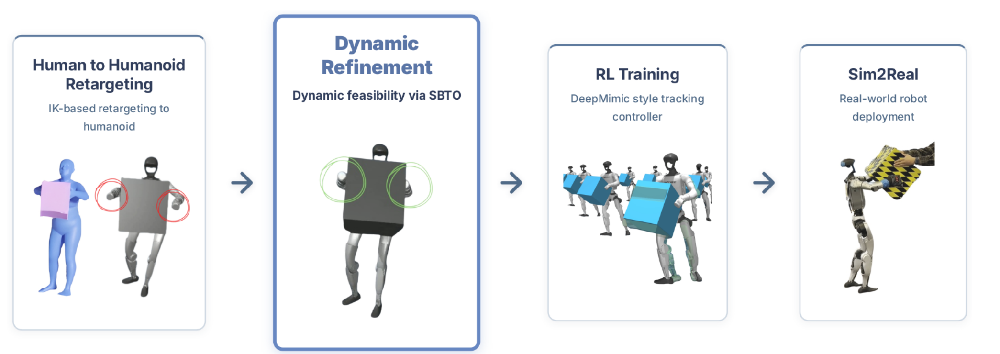

# DynaRetarget：基于采样轨迹优化的动力学可行重定向

人-物交互重定向最怕短视。机器人一开始站位偏一点、抓箱子的时机晚一点，几秒后就可能因为手物接触丢失而失败；普通短时域MPC执行完早期动作后便不能回头修改。DynaRetarget先接受一条运动学重定向轨迹，再用Sampling-Based Trajectory Optimization（SBTO）把整段机器人与物体运动修成动力学可行参考。

> **主要方法图：** Figure 2，PDF第2页。IK先给出可能缺接触的机器人-物体参考，SBTO进行长时动力学修正，结果用于RL跟踪和真机Sim2Real。来源：[原论文](https://arxiv.org/abs/2602.06827)。

## SBTO不是把MPC窗口简单拉长

直接从头优化完整长轨迹，采样维度太高，容易掉进局部最优；短窗口滚动又无法让未来失败影响过去动作。SBTO把控制序列参数化为若干control knots，先优化较短前缀，再逐步加入后续knots。每次扩展都继承上一次CEM得到的均值和协方差，相当于用短问题给长问题持续热启动，同时仍允许早期控制量在后续轮次继续变化。

`SBTO skip`进一步缓存已经收敛的早期rollout片段，减少每轮都从零模拟的开销。论文在MuJoCo中对OmniRetarget的285段人-物动作做修正，代价同时覆盖机器人构型与速度、关键部位、物体位姿及其动态一致性。这样手和箱子没有真正接触、物体翻转或脚下支撑不成立时，优化器看到的是物理失败，而不只是关节角误差。

## 输出怎样进入动作跟踪

SBTO输出机器人与物体同步的物理轨迹，并可从同一仿真rollout中直接读取接触时段。下游PPO采用残差动作空间，除一步机器人参考外，还观察目标物体位姿误差以及机器人坐标系下的物体位姿；奖励同时跟踪身体和物体，并鼓励正确末端接触，对超过阈值的接触力逐步惩罚。由于参考本身已经物理一致，策略不必一边学习跟踪，一边猜测原轨迹中缺失的接触。

论文报告SBTO skip在重定向成功率上明显高于短时域SPIDER基线，并在下游策略上提高物体跟踪成功率；作者还用同一目标处理不同质量、尺寸和几何的物体，并展示真机迁移。这说明它不只是把轨迹“平滑一点”，而是在数据进入RL之前修复会导致任务失败的物理因果链。

## 边界与分类位置

DynaRetarget仍依赖一条初始IK轨迹和可计算的稠密任务代价，SBTO也有较高离线计算成本；对于接触极稀疏、很晚才出现有效反馈的任务，逐步增长时域未必容易收敛。论文明确给出Unitree G1真机实验。作者官方`Atarilab/sbto`仓库已公开SBTO核心实现，但截至2026-07-14仓库未提供许可证文件；代码可读不等于已经获得明确的再利用许可。

本库把它放在`目标本体动作重定向`，因为核心产物是可供Mimic或Loco-Manip策略学习的动力学可行机器人参考。人-物交互是它重点处理的数据形态，不改变其在完整栈中的上游重定向位置。

## 原文与项目

[论文原文](https://arxiv.org/abs/2602.06827) · [官方项目页](https://atarilab.github.io/dynaretarget.io/) · [SBTO官方代码（未声明许可证）](https://github.com/Atarilab/sbto)
